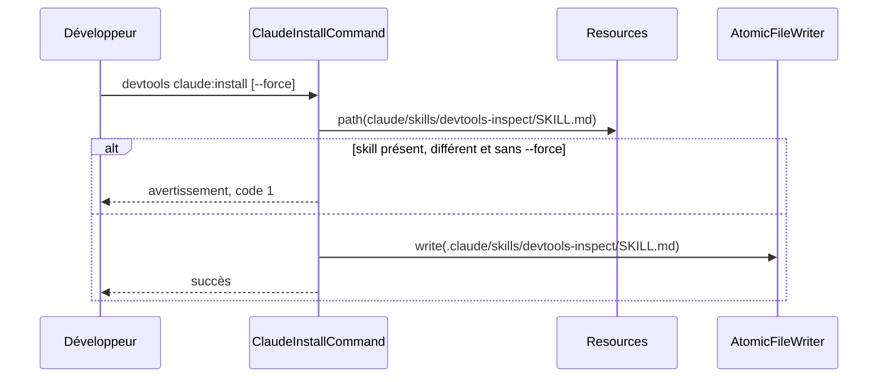

# claude:install
`command.claude.install` · type : commands · dernière mise à jour : 2026-09-17 · commit : a3b1c1b

## Résumé

`devtools claude:install [path]` copie dans le projet le skill Claude Code `devtools-inspect`, qui enchaîne
inspection, rédaction des brouillons et application. Un skill modifié par l'équipe n'est remplacé qu'avec
`--force`.

## Déclencheur

| Élément | Valeur |
|---|---|
| Point d'entrée | `claude:install` (command) |
| Sécurité | — |
| Préconditions | Le chemin donné, ou le dossier courant, est un dossier existant. |

## Parcours

## Navigation / états

—

## Composants impliqués

| Rôle | Fichier | Notes |
|---|---|---|
| Autre | `src/Command/ClaudeInstallCommand.php` | point d'entrée |
| Autre | `src/Inspection/Model/FileRef.php` |  |
| Autre | `src/Inspection/Model/FileRole.php` |  |
| Autre | `src/Inspection/Model/InvalidModel.php` |  |
| Autre | `src/Project/PathOutsideProject.php` |  |
| Autre | `src/Project/ProjectRoot.php` |  |
| Autre | `src/Resources.php` |  |
| Autre | `src/Tracking/AtomicFileWriter.php` |  |

Paquets : `symfony/console` 8.1.7, `symfony/filesystem` 8.1.6

## Données

Lit le skill livré dans `resources/` ; écrit .claude/skills/devtools-inspect/SKILL.md dans le projet.

## Mécanismes transverses

`ProjectRoot` borne l'écriture au projet ; `AtomicFileWriter` écrit de façon atomique.

## Points d'attention

Un skill identique à la version livrée est remplacé sans `--force` : une mise à jour de DevTools se propage
donc tant que l'équipe ne l'a pas modifié, puis plus jamais sans intervention.

## Tests existants

| Test | Fichier | Couvre |
|---|---|---|
| ClaudeInstallTest | `tests/Ai/ClaudeInstallTest.php` | — |
| PageRedactionTest | `tests/Ai/PageRedactionTest.php` | — |
| XmlConfigReaderTest | `tests/Config/XmlConfigReaderTest.php` | — |
| ClaudeDrivenTest | `tests/Inspection/Adapter/Claude/ClaudeDrivenTest.php` | — |
| GenericPhpAdapterTest | `tests/Inspection/Adapter/GenericPhp/GenericPhpAdapterTest.php` | — |
| GraphFixture | `tests/Inspection/Graph/GraphFixture.php` | — |
| FakeAdapter | `tests/Inspection/Pipeline/FakeAdapter.php` | — |
| ProjectRootTest | `tests/Project/ProjectRootTest.php` | — |
| KnowledgeTest | `tests/Stack/Knowledge/KnowledgeTest.php` | — |
| StackDetectorTest | `tests/Stack/StackDetectorTest.php` | — |
| AtomicFileWriterTest | `tests/Tracking/AtomicFileWriterTest.php` | — |
| InitializerTest | `tests/Tracking/InitializerTest.php` | — |

## Workflows liés

—

## Historique

| Date | Commit | Changement |
|---|---|---|
| 2026-09-17 | a3b1c1b | rédaction initiale |
