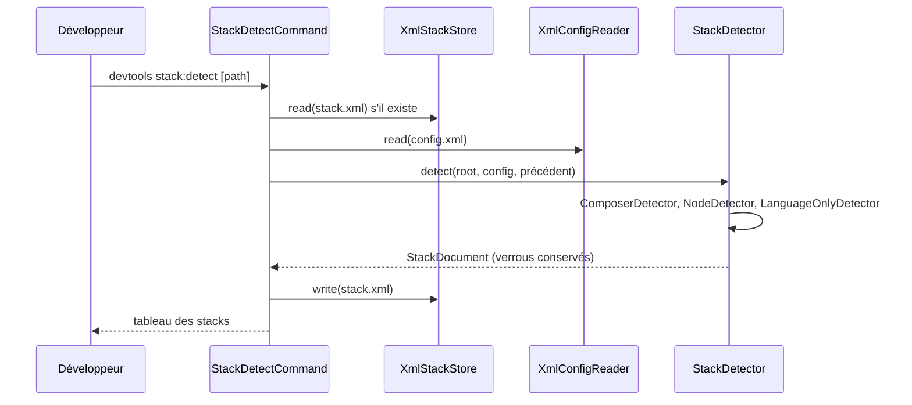

# stack:detect
`command.stack.detect` · type : commands · dernière mise à jour : 2026-09-17 · commit : 98d3d2d

## Résumé

`devtools stack:detect [path]` détecte les stacks du projet à partir de ses manifestes (`composer.json`,
`package.json`…, à la racine et dans les sous-dossiers immédiats), puis écrit .devtools/stack.xml et
affiche une ligne par stack : racine, langage, framework, adaptateur, connaissance, sources.

## Déclencheur

| Élément | Valeur |
|---|---|
| Point d'entrée | `stack:detect` (command) |
| Sécurité | — |
| Préconditions | Le chemin donné, ou le dossier courant, est un dossier existant. |

## Parcours

## Navigation / états

—

## Composants impliqués

| Rôle | Fichier | Notes |
|---|---|---|
| Autre | `src/Command/StackDetectCommand.php` | point d'entrée |
| Autre | `src/Config/Config.php` |  |
| Autre | `src/Config/ConfigReaderInterface.php` |  |
| Autre | `src/Config/InvalidConfig.php` |  |
| Autre | `src/Config/XmlConfigReader.php` |  |
| Autre | `src/Inspection/Model/FileRef.php` |  |
| Autre | `src/Inspection/Model/FileRole.php` |  |
| Autre | `src/Inspection/Model/InvalidModel.php` |  |
| Autre | `src/Inspection/Model/NonEmpty.php` |  |
| Autre | `src/Inspection/Model/WorkflowId.php` |  |
| Autre | `src/Inspection/Model/WorkflowType.php` |  |
| Autre | `src/Project/PathOutsideProject.php` |  |
| Autre | `src/Project/ProjectRoot.php` |  |
| Autre | `src/Resources.php` |  |
| Autre | `src/Stack/Detector/ComposerDetector.php` |  |
| Autre | `src/Stack/Detector/LanguageOnlyDetector.php` |  |
| Autre | `src/Stack/Detector/NodeDetector.php` |  |
| Autre | `src/Stack/Detector/ReadsManifests.php` |  |
| Autre | `src/Stack/Detector/StackDetectorInterface.php` |  |
| Autre | `src/Stack/StackDetector.php` |  |
| Autre | `src/Stack/StackDocument.php` |  |
| Autre | `src/Stack/StackProfile.php` |  |
| Autre | `src/Stack/XmlStackStore.php` |  |
| Autre | `src/Tracking/AtomicFileWriter.php` |  |
| Autre | `src/Tracking/DevToolsDirectory.php` |  |
| Autre | `src/Xml/DomBuilder.php` |  |
| Autre | `src/Xml/InvalidXml.php` |  |
| Autre | `src/Xml/SafeXmlLoader.php` |  |

Paquets : `symfony/console` 8.1.7, `symfony/filesystem` 8.1.6

## Données

Lit les manifestes et lockfiles du projet, `config.xml` et l'ancien `stack.xml` ; écrit `stack.xml`.

## Mécanismes transverses

Tout XML est lu par `SafeXmlLoader` (pas de DOCTYPE, pas de réseau) et validé par son XSD ; les éléments
marqués `locked="true"` dans l'ancien `stack.xml` sont repris tels quels.

## Points d'attention

Un `stack.xml` invalide fait échouer la commande au lieu d'être écrasé : une correction manuelle mal formée
n'est jamais perdue silencieusement, mais bloque la détection jusqu'à réparation.

## Tests existants

| Test | Fichier | Couvre |
|---|---|---|
| PageRedactionTest | `tests/Ai/PageRedactionTest.php` | — |
| StackDetectCommandTest | `tests/Command/StackDetectCommandTest.php` | — |
| XmlConfigReaderTest | `tests/Config/XmlConfigReaderTest.php` | — |
| ClaudeDrivenTest | `tests/Inspection/Adapter/Claude/ClaudeDrivenTest.php` | — |
| GenericPhpAdapterTest | `tests/Inspection/Adapter/GenericPhp/GenericPhpAdapterTest.php` | — |
| ProjectRootTest | `tests/Project/ProjectRootTest.php` | — |
| MenuRendererTest | `tests/Rendering/MenuRendererTest.php` | — |
| KnowledgeTest | `tests/Stack/Knowledge/KnowledgeTest.php` | — |
| StackDetectorTest | `tests/Stack/StackDetectorTest.php` | — |
| InitializerTest | `tests/Tracking/InitializerTest.php` | — |

## Workflows liés

—

## Historique

| Date | Commit | Changement |
|---|---|---|
| 2026-09-17 | a3b1c1b | rédaction initiale |
| 2026-09-17 | 8f7ea01 | files changed: src/Config/Config.php, src/Config/XmlConfigReader.php; files removed: tests/Inspection/Graph/GraphFixture.php, tests/Inspection/Pipeline/FakeAdapter.php |
| 2026-09-17 | 98d3d2d | files changed: src/Xml/SafeXmlLoader.php |
