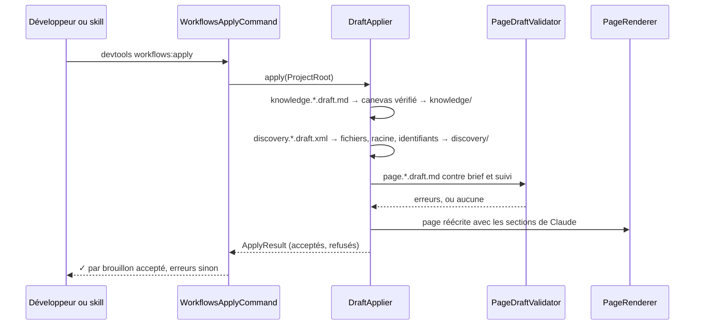

# workflows:apply
`command.workflows.apply` · type : commands · dernière mise à jour : 2026-09-17 · commit : e6f9993

## Résumé

`devtools workflows:apply [path]` valide les brouillons écrits par Claude dans `.devtools/pending/` et
applique ceux qui respectent les règles : fiches de connaissance d'abord, puis découvertes, puis pages. Chaque
brouillon accepté est affiché, chaque refus liste ses règles enfreintes avec la ligne ; le code de sortie vaut
1 dès qu'un brouillon est refusé.

## Déclencheur

| Élément | Valeur |
|---|---|
| Point d'entrée | `workflows:apply` (command) |
| Sécurité | — |
| Préconditions | Une inspection a écrit des briefs, et Claude a déposé les brouillons correspondants. |

## Parcours

## Navigation / états

—

## Composants impliqués

| Rôle | Fichier | Notes |
|---|---|---|
| Autre | `src/Ai/ApplyResult.php` |  |
| Autre | `src/Ai/DraftApplier.php` |  |
| Autre | `src/Ai/PageBrief.php` |  |
| Autre | `src/Ai/PageDraft.php` |  |
| Autre | `src/Ai/PageDraftValidator.php` |  |
| Autre | `src/Ai/XmlPageBriefStore.php` |  |
| Autre | `src/Clock/Clock.php` |  |
| Autre | `src/Clock/SystemClock.php` |  |
| Autre | `src/Command/WorkflowsApplyCommand.php` | point d'entrée |
| Autre | `src/Config/Config.php` |  |
| Autre | `src/Config/ConfigReaderInterface.php` |  |
| Autre | `src/Config/XmlConfigReader.php` |  |
| Autre | `src/Inspection/Adapter/Claude/Discovery.php` |  |
| Autre | `src/Inspection/Adapter/Claude/DiscoveryBrief.php` |  |
| Autre | `src/Inspection/Adapter/Claude/XmlDiscoveryBriefStore.php` |  |
| Autre | `src/Inspection/Model/Confidence.php` |  |
| Autre | `src/Inspection/Model/Edge.php` |  |
| Autre | `src/Inspection/Model/EntryPoint.php` |  |
| Autre | `src/Inspection/Model/FileRef.php` |  |
| Autre | `src/Inspection/Model/FileRole.php` |  |
| Autre | `src/Inspection/Model/InspectionResult.php` |  |
| Autre | `src/Inspection/Model/InvalidModel.php` |  |
| Autre | `src/Inspection/Model/NonEmpty.php` |  |
| Autre | `src/Inspection/Model/PackageRef.php` |  |
| Autre | `src/Inspection/Model/Serialization/EntryPointXml.php` |  |
| Autre | `src/Inspection/Model/Serialization/ModelXmlSerializer.php` |  |
| Autre | `src/Inspection/Model/SortedList.php` |  |
| Autre | `src/Inspection/Model/StateMachine.php` |  |
| Autre | `src/Inspection/Model/Transition.php` |  |
| Autre | `src/Inspection/Model/Workflow.php` |  |
| Autre | `src/Inspection/Model/WorkflowId.php` |  |
| Autre | `src/Inspection/Model/WorkflowIdAssigner.php` |  |
| Autre | `src/Inspection/Model/WorkflowIdCollision.php` |  |
| Autre | `src/Inspection/Model/WorkflowIdDeriver.php` |  |
| Autre | `src/Inspection/Model/WorkflowSource.php` |  |
| Autre | `src/Inspection/Model/WorkflowType.php` |  |
| Autre | `src/Inspection/Model/WorkflowTypeRegistry.php` |  |
| Autre | `src/Project/PathOutsideProject.php` |  |
| Autre | `src/Project/ProjectRoot.php` |  |
| Autre | `src/Rendering/Labels.php` |  |
| Autre | `src/Rendering/MarkdownWriter.php` |  |
| Autre | `src/Rendering/MermaidWriter.php` |  |
| Autre | `src/Rendering/PageRenderer.php` |  |
| Autre | `src/Rendering/PageSection.php` |  |
| Autre | `src/Rendering/ParsedPage.php` |  |
| Autre | `src/Rendering/RenderingContext.php` |  |
| Autre | `src/Resources.php` |  |
| Autre | `src/Stack/Knowledge/KnowledgeBrief.php` |  |
| Autre | `src/Stack/Knowledge/KnowledgeCanvas.php` |  |
| Autre | `src/Stack/Knowledge/XmlKnowledgeBriefStore.php` |  |
| Autre | `src/Stack/StackProfile.php` |  |
| Autre | `src/Tracking/AtomicFileWriter.php` |  |
| Autre | `src/Tracking/DevToolsDirectory.php` |  |
| Autre | `src/Tracking/Generation.php` |  |
| Autre | `src/Tracking/GenerationMode.php` |  |
| Autre | `src/Tracking/Index.php` |  |
| Autre | `src/Tracking/IndexEntry.php` |  |
| Autre | `src/Tracking/IndexReaderInterface.php` |  |
| Autre | `src/Tracking/IndexWriterInterface.php` |  |
| Autre | `src/Tracking/ReadsDocumentFiles.php` |  |
| Autre | `src/Tracking/Revision.php` |  |
| Autre | `src/Tracking/TrackedFile.php` |  |
| Autre | `src/Tracking/TrackingDocument.php` |  |
| Autre | `src/Tracking/TrackingReaderInterface.php` |  |
| Autre | `src/Tracking/TrackingStatus.php` |  |
| Autre | `src/Tracking/TrackingWriterInterface.php` |  |
| Autre | `src/Tracking/VcsState.php` |  |
| Autre | `src/Tracking/VcsXml.php` |  |
| Autre | `src/Tracking/XmlIndexStore.php` |  |
| Autre | `src/Tracking/XmlTrackingStore.php` |  |
| Autre | `src/Version.php` |  |
| Autre | `src/Xml/DomBuilder.php` |  |
| Autre | `src/Xml/InvalidXml.php` |  |
| Autre | `src/Xml/SafeXmlLoader.php` |  |

Paquets : `symfony/console` 8.1.7, `symfony/filesystem` 8.1.6

## Données

Lit les briefs, brouillons et modèles de `pending/`, les fichiers de suivi workflows/*/*.xml ; écrit les
pages, le suivi (mode `claude`), `knowledge/` et `discovery/`, puis retire les brouillons acceptés.

## Mécanismes transverses

Un brouillon est une donnée non fiable : sept sections exactes, un seul diagramme Mermaid dans « Parcours »,
aucun chemin hors du modèle, révision identique à celle du brief et du suivi. Une découverte re-dérive ses
identifiants et est ramenée à la confiance `medium`.

## Points d'attention

Un brouillon refusé reste dans `pending/` pour correction ; un brouillon répondant à un brief dépassé (code
changé depuis) est refusé comme obsolète, et c'est la prochaine inspection qui redemande la page.

## Tests existants

| Test | Fichier | Couvre |
|---|---|---|
| ClaudeInstallTest | `tests/Ai/ClaudeInstallTest.php` | — |
| PageRedactionTest | `tests/Ai/PageRedactionTest.php` | — |
| ClaudeDrivenTest | `tests/Inspection/Adapter/Claude/ClaudeDrivenTest.php` | — |
| GenericPhpAdapterTest | `tests/Inspection/Adapter/GenericPhp/GenericPhpAdapterTest.php` | — |
| ProjectRootTest | `tests/Project/ProjectRootTest.php` | — |
| KnowledgeTest | `tests/Stack/Knowledge/KnowledgeTest.php` | — |
| StackDetectorTest | `tests/Stack/StackDetectorTest.php` | — |
| InitializerTest | `tests/Tracking/InitializerTest.php` | — |

## Workflows liés

—

## Historique

| Date | Commit | Changement |
|---|---|---|
| 2026-09-17 | a3b1c1b | rédaction initiale |
| 2026-09-17 | 8f7ea01 | files changed: src/Ai/PageBrief.php, src/Ai/XmlPageBriefStore.php, src/Config/Config.php, src/Config/XmlConfigReader.php; files removed: tests/Inspection/Graph/GraphFixture.php, tests/Inspection/Pipeline/FakeAdapter.php |
| 2026-09-17 | 98d3d2d | files changed: src/Ai/DraftApplier.php, src/Clock/SystemClock.php, src/Xml/SafeXmlLoader.php |
| 2026-09-17 | e6f9993 | files changed: src/Config/Config.php |
