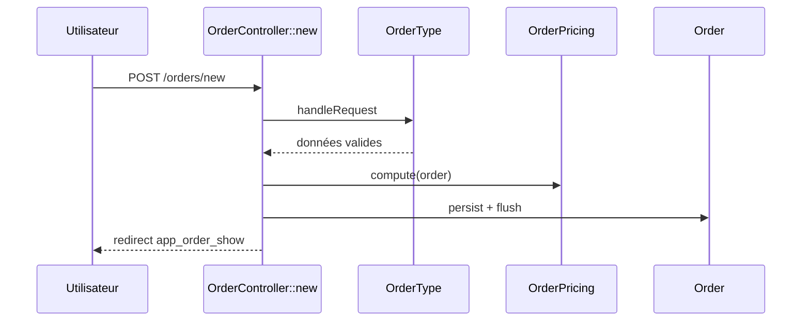
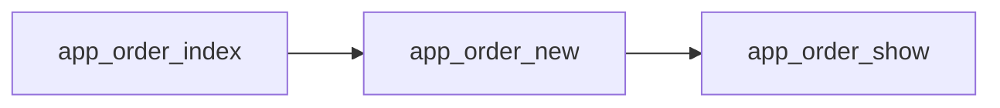

# DevTools — Spécifications fonctionnelles et techniques

**Version** : 0.2 (brouillon)
**Date** : 16 septembre 2026
**Auteur du besoin** : Jul6art — La Provençale Sàrl
**Statut** : à valider

> Nom retenu : **DevTools** (sans suffixe « bundle », même si la distribution Symfony est techniquement un bundle). Dossier généré : **`.devtools/`** à la racine du projet analysé.

---

## 1. Contexte et problème

### 1.1 Situation actuelle

- Développement Symfony/PHP avec un grand nombre de bundles internes ; d'autres stacks existent aussi en interne (Angular notamment).
- Le code est très largement généré par **Claude Code**.
- La vérification visuelle est réalisée par Claude via le **MCP Chrome pour Claude**.
- L'équipe a déjà mis en place : agents, ADR, checklists, fichiers de logs que Claude relit.

### 1.2 Constat

La génération d'IA actuelle produit du très bon code, **mais** :

- On perd du temps à tester.
- On refait souvent les mêmes types de remontées que Claude doit ensuite retraiter.
- Quand Claude annonce « le code est fait, j'ai vérifié avec le MCP Chrome », **un humain doit encore vérifier** et signaler : « le filtre là ne fonctionne pas », « il faut un select2 », etc.
- **Les mêmes erreurs reviennent**, malgré agents, ADR, checklists et logs.
- Il manque un **système d'historique des retours** conçu pour qu'ils diminuent dans le temps.

### 1.3 Diagnostic

Les retours sont stockés sous forme de **texte narratif** que Claude doit relire, interpréter et appliquer de mémoire dans un contexte déjà chargé. Tant qu'un retour reste une phrase, il se dilue. De plus, quand Claude vérifie son propre code, il a le **biais de l'auteur** : son « j'ai vérifié » n'est ni reproductible ni vérifiable.

Avant même de traiter les retours, une brique fondatrice manque : une **connaissance structurée, à jour et peu coûteuse à maintenir des workflows du projet**. Sans elle, ni Claude ni l'humain ne savent précisément ce qu'un changement impacte.

---

## 2. Besoins exprimés

Le besoin est qualifié de **très grand**. Trois problématiques :

### P1 — Inspection du code et documentation des workflows (première étape, prioritaire)
- Demander à DevTools d'analyser le code pour identifier les workflows et produire une **documentation Markdown normée, avec schémas**.
- Fonctionne sur le projet courant (racine) **ou sur un chemin passé en argument** à la commande.
- **Indépendant du langage** : c'est à Claude d'analyser la stack et de **se renseigner sur son fonctionnement** (par exemple pour Symfony : listeners, cycle de la Request, kernel events, DI, Messenger…).
- Génère et **maintient** : un `workflows.md` qui sert de page d'accueil et de menu ; une page par workflow, référencée dans le menu sous des **sous-menus** (routes, commandes, asynchrone, …).
- **Très important** : un **fichier XML lié à chaque workflow** (date, fichiers impliqués, commit…) pour que la commande, relancée, **ne réécrive pas les workflows dont on sait qu'ils n'ont pas changé**, en s'appuyant sur les commits survenus depuis.
- Doit tourner en **standalone** (analyser un projet non Symfony) **ou en `require-dev`** dans un projet Symfony, de manière indépendante.
- Une **armée de tests PhpUnit** dans le bundle.

### P2 — Test visuel et mémoire des retours
- Automatiser la phase de test visuel après que Claude a déclaré le code terminé.
- Historique des retours structuré, exploité pour que les mêmes erreurs ne reviennent plus.

### P3 — Un outil qui change la vie
Au même niveau d'impact que Claude sur l'écriture de code.

### Piste retenue
Un dossier `.devtools/` à la racine, analogue à `.git`, qui permet à Claude de **piloter ses propres développements et d'améliorer ses résultats** dans le temps.

### Contraintes
Stack existante : Symfony, PHP, PhpUnit, Claude / Claude Code, MCP Chrome. Voir large : outil généralisable, potentiellement open source.

---

## 3. Vision et architecture générale

**DevTools** est composé de :

1. un **cœur PHP autonome** (`provencale/devtools`, Symfony Console) exécutable en standalone (`vendor/bin/devtools` ou phar) et intégrable comme bundle via `require-dev` ;
2. un **dossier versionné `.devtools/`** à la racine du projet analysé ;
3. des **adaptateurs de stack** (Symfony, Laravel, générique piloté par Claude…) ;
4. une **couche Claude** (API ou Claude Code) pour l'analyse sémantique, la découverte de stacks inconnues et la rédaction ;
5. un **serveur MCP `devtools`**, des **hooks et skills Claude Code** ;
6. les modules ultérieurs : scénarios, retours, règles, gate (P2).

### 3.1 Modules

| Module | Rôle | Phase |
|---|---|---|
| **Workflows** | Inspection, cartographie, documentation normée, suivi de fraîcheur par XML | 0 (fondation) |
| **Scenarios** | Scénarios reproductibles dérivés des workflows, runner, captures | 1 |
| **Feedback & Rules** | Retours typés, promotion en règles, assertions mécaniques | 1–2 |
| **Gate** | Point d'entrée unique qui bloque la fin de tâche de Claude | 1 |
| **Review** | Interface de revue humaine | 2 |
| **Retro** | Rétrospective et métriques | 2 |

### 3.2 Deux modes d'exécution

```
# Standalone : analyse n'importe quel projet, quel que soit le langage
devtools workflows:inspect /chemin/vers/projet
devtools workflows:inspect            # projet courant

# Intégré : require-dev dans un projet Symfony
bin/console devtools:workflows:inspect [path]
```

Le bundle Symfony n'est qu'un **wrapper** : il enregistre les commandes dans `bin/console`, fournit l'adaptateur Symfony avec accès au kernel compilé (introspection plus riche), et rien d'autre. Toute la logique vit dans le cœur, testable sans Symfony.

---

## 4. Module Workflows — inspection et documentation

### 4.1 Objectif

Produire et maintenir, à moindre coût, une documentation exacte de tous les workflows d'un projet : ce qui déclenche quoi, par quels composants, sur quelles données, avec quels effets.

### 4.2 Définition d'un workflow

Un **workflow** est un parcours d'exécution cohérent, déclenché par un point d'entrée identifiable, traversant un ensemble de fichiers et produisant un effet observable. Types de déclencheurs (= sous-menus du `workflows.md`) :

| Type | Exemples Symfony | Exemples autres stacks |
|---|---|---|
| `routes` | contrôleurs, routes HTTP | Express routes, Laravel routes, Angular routes/pages |
| `commands` | commandes Console | scripts npm, Artisan, Makefile |
| `async` | Messenger handlers, jobs, crons | queues, workers, schedulers |
| `events` | listeners, subscribers, kernel events | hooks, observers, signaux |
| `ui` | formulaires, composants Twig/Live | composants front, écrans |
| `integrations` | appels API sortants, webhooks | idem |
| `data` | migrations, fixtures, imports | idem |

La liste est extensible par configuration ; l'adaptateur ou Claude peut proposer de nouveaux types.

### 4.3 Pipeline d'inspection

```
1. Détection de la stack        → .devtools/stack.xml
2. Acquisition des connaissances → .devtools/knowledge/<stack>.md
3. Extraction des points d'entrée (adaptateur ou Claude)
4. Résolution des dépendances par point d'entrée → graphe de fichiers
5. Regroupement en workflows, identifiants stables
6. Détection de fraîcheur (XML + git + hash)     → liste des workflows à (ré)écrire
7. Rédaction/mise à jour des pages Markdown normées (Claude)
8. Écriture des XML de suivi
9. Régénération du menu workflows.md (toujours)
10. Rapport : créés / mis à jour / inchangés / orphelins
```

#### Étape 1 — Détection de la stack
Heuristiques sur la racine : `composer.json` (paquets `symfony/*`, `laravel/*`), `package.json` (`@angular/core`, `next`, `express`…), `go.mod`, `pyproject.toml`, `Cargo.toml`, `pom.xml`… Résultat : langage(s), framework(s), versions, gestionnaire de paquets, dossiers sources probables, dossiers exclus (`vendor/`, `node_modules/`, `var/`, `dist/`…). Écrit dans `stack.xml`. Modifiable à la main ; relu à chaque exécution.

#### Étape 2 — Acquisition des connaissances de la stack
C'est le point qui rend l'outil indépendant du langage. Pour chaque stack détectée, Claude produit (ou réutilise) un fichier `knowledge/<stack>.md` répondant à un canevas fixe :
- Comment une requête / une commande / un message entre et traverse le système (ex. Symfony : `Kernel::handle`, `RequestEvent`, résolution du contrôleur, `ControllerEvent`, arguments, `ResponseEvent`, `TerminateEvent`).
- Mécanismes d'extension : listeners, subscribers, middlewares, décorateurs, hooks.
- Injection de dépendances et conventions de nommage.
- Où sont déclarés les points d'entrée de chaque type (§4.2).
- Où vivent les tests et comment ils s'exécutent.
- Pièges connus.

Ces fichiers sont **génériques par stack et version**, donc partageables entre projets : le cœur embarque des connaissances pré-rédigées pour les stacks courantes (`resources/knowledge/symfony-7.md`, `laravel-11.md`, `angular-18.md`…) et ne fait appel à Claude (avec recherche web) que pour une stack absente ou une version majeure inconnue. Le fichier généré est ensuite committé dans le projet et peut remonter dans le cœur.

#### Étape 3 — Extraction des points d'entrée
- **Adaptateur natif** disponible (Symfony intégré, Laravel, générique PHP) : analyse déterministe par introspection (routeur, container compilé, `symfony/workflow`, Messenger, Twig `path()/url()`, attributs `#[AsEventListener]`, `#[AsCommand]`, `#[AsMessageHandler]`…) et `nikic/php-parser`.
- **Sans adaptateur** : Claude, guidé par `knowledge/<stack>.md`, parcourt les dossiers sources et produit la même structure de sortie (JSON normé), validée par schéma. Un adaptateur natif peut être écrit plus tard à partir de ce que Claude a trouvé.

Les deux voies produisent le même modèle intermédiaire ; c'est ce qui garantit un rendu identique quelle que soit la stack.

#### Étape 4 — Résolution des dépendances
À partir de chaque point d'entrée, construction du graphe des fichiers impliqués : imports/`use`, services injectés, templates, entités, messages, fichiers de configuration pertinents. Profondeur configurable ; les fichiers `vendor/` sont référencés par paquet, pas par fichier.

#### Étape 5 — Regroupement et identifiants
Un workflow = un point d'entrée principal + ses points d'entrée satellites (ex. la route de liste et sa route d'export). Identifiant **stable et lisible** dérivé du point d'entrée (`route.order.create`, `command.app.import-catalog`, `async.order-created`), jamais d'un numéro séquentiel, afin de survivre aux re-scans.

#### Étape 6 — Détection de fraîcheur
Voir §4.6, cœur de la demande.

#### Étape 7 — Rédaction
Claude reçoit le modèle intermédiaire du workflow, le `knowledge` de la stack, l'ancienne page si elle existe et le gabarit normé (§4.5). Il produit la page. Toute donnée factuelle (fichiers, routes, méthodes) vient du modèle ; Claude apporte la description, les schémas et les points d'attention. En mode `--no-ai`, une page factuelle minimale est générée sans Claude (utile en CI).

### 4.4 Structure du dossier `.devtools/`

```
.devtools/
├── config.xml                 # options, exclusions, types de workflows, seuils
├── stack.xml                  # stack(s) détectée(s), versions, dossiers sources
├── knowledge/
│   └── symfony-7.md           # comment fonctionne la stack (canevas fixe)
├── workflows.md               # page d'accueil + menu par sous-menu
├── workflows/
│   ├── routes/
│   │   ├── order.create.md
│   │   └── order.create.xml   # suivi de fraîcheur (§4.6)
│   ├── commands/
│   │   ├── app.import-catalog.md
│   │   └── app.import-catalog.xml
│   ├── async/
│   ├── events/
│   ├── ui/
│   ├── integrations/
│   └── data/
├── index.xml                  # index global : tous les workflows, dernier scan, commit
├── graph/
│   ├── files-to-workflows.xml # fichier → workflows (inverse, pour l'impact)
│   └── workflows.mermaid      # vue d'ensemble
├── schemas/
│   ├── workflow-tracking.xsd
│   ├── index.xsd
│   └── stack.xsd
└── reports/
    └── inspect-<date>.md      # rapport de chaque exécution (ignoré par git)
```

Committé : tout sauf `reports/`.

### 4.5 Format normé d'une page de workflow

Chaque `workflows/<type>/<id>.md` respecte **strictement** ce gabarit (les sections vides restent présentes avec `—`) :

```markdown
# Création d'une commande
`route.order.create` · type : routes · dernière mise à jour : 2026-09-16 · commit : a1b2c3d

## Résumé
Deux à cinq phrases : à quoi sert le workflow, pour qui, effet produit.

## Déclencheur
| Élément | Valeur |
|---|---|
| Point d'entrée | `GET/POST /orders/new` (`app_order_new`) |
| Sécurité | `ROLE_OPERATOR` |
| Préconditions | catalogue chargé |

## Parcours


## Navigation / états

(`stateDiagram` si un workflow d'états est impliqué.)

## Composants impliqués
| Rôle | Fichier | Notes |
|---|---|---|
| Contrôleur | `src/Controller/OrderController.php` | méthode `new` |
| Formulaire | `src/Form/OrderType.php` | |
| Service | `src/Service/OrderPricing.php` | |
| Template | `templates/order/new.html.twig` | |
| Entité | `src/Entity/Order.php` | |

## Données
Entités lues / écrites, messages émis, appels externes.

## Mécanismes transverses
Listeners, middlewares, voters, événements interceptant ce parcours (issus du `knowledge`).

## Points d'attention
Risques, dettes, comportements surprenants repérés par l'analyse.

## Tests existants
| Test | Fichier | Couvre |
|---|---|---|

## Workflows liés
Liens vers les pages amont/aval.

## Historique
| Date | Commit | Changement |
|---|---|---|
| 2026-09-16 | a1b2c3d | ajout du service de pricing |
```

Règles :
- Titres et ordre des sections fixes → parsables et diffables.
- Aucun chemin de fichier inventé : tous proviennent du modèle intermédiaire.
- Schémas Mermaid obligatoires pour « Parcours » ; « Navigation / états » si applicable.
- L'« Historique » est **cumulé** par DevTools à chaque réécriture (Claude ne le réécrit pas, il ajoute une ligne).

### 4.6 Suivi de fraîcheur — le fichier XML par workflow

#### 4.6.1 Contenu

```xml
<?xml version="1.0" encoding="UTF-8"?>
<workflow xmlns="https://devtools.provencale.lu/schema/workflow-tracking/1"
          id="route.order.create" type="routes" schema-version="1">
  <generated at="2026-09-16T14:22:31+02:00" tool="devtools 0.2" model="claude-…" mode="ai"/>
  <source vcs="git" commit="a1b2c3d4…" branch="main" dirty="false"/>
  <entrypoints>
    <entrypoint kind="route" name="app_order_new" path="/orders/new" methods="GET,POST"/>
  </entrypoints>
  <files>
    <file path="src/Controller/OrderController.php" sha256="…" role="controller"/>
    <file path="src/Form/OrderType.php" sha256="…" role="form"/>
    <file path="src/Service/OrderPricing.php" sha256="…" role="service"/>
    <file path="templates/order/new.html.twig" sha256="…" role="template"/>
    <file path="src/Entity/Order.php" sha256="…" role="entity"/>
    <file path="config/routes.yaml" sha256="…" role="config"/>
  </files>
  <packages>
    <package name="symfony/form" version="7.1.3"/>
  </packages>
  <depends-on>
    <workflow ref="route.order.show"/>
  </depends-on>
  <status>fresh</status> <!-- fresh | stale | orphaned | manual -->
  <history>
    <revision at="2026-08-02T10:01:00+02:00" commit="9f8e7d…" reason="initial"/>
    <revision at="2026-09-16T14:22:31+02:00" commit="a1b2c3d…" reason="files changed: OrderPricing.php"/>
  </history>
</workflow>
```

Validé par `schemas/workflow-tracking.xsd` à la lecture et à l'écriture.

#### 4.6.2 Algorithme de détection

Pour chaque workflow existant :

1. **Git (rapide)** — si `git` est disponible et que `<source commit>` existe dans l'historique : `git diff --name-only <commit>..HEAD` ∪ fichiers modifiés/non suivis du working tree. Intersection avec `<files>` non vide → **candidat à réécriture**. Avantage : une seule commande git pour tous les workflows.
2. **Hash (fiable)** — recalcul du `sha256` de chaque fichier listé et comparaison. Couvre les cas hors git (copie de projet, rebase, commit absent, working tree sale). Si aucun hash ne diffère, le workflow est **inchangé même si git signalait un candidat** (ex. reformatage annulé, commit vide).
3. **Fichiers supprimés** — un `<file>` absent du disque → statut `stale` ; si le point d'entrée lui-même a disparu → `orphaned` (page conservée, marquée, listée dans une section « À supprimer » du menu ; suppression seulement avec `--prune`).
4. **Fichiers nouveaux** — tout fichier source non référencé dans `graph/files-to-workflows.xml` déclenche une **passe de découverte** limitée à ces fichiers : nouveaux points d'entrée → nouveaux workflows ; sinon rattachement au workflow le plus proche (le fichier est importé par un fichier déjà couvert).
5. **Paquets** — changement de version majeure d'un `<package>` référencé → candidat à réécriture (le comportement du framework peut avoir changé).
6. **Statut `manual`** — un workflow marqué à la main n'est jamais réécrit ; seul son XML est mis à jour et une alerte est émise s'il est périmé.

Sortie : ensemble minimal de workflows à réécrire. Le menu `workflows.md` et `index.xml` sont toujours régénérés (opération purement mécanique et peu coûteuse).

Options : `--dry-run` (montre ce qui serait réécrit et pourquoi), `--force[=id]`, `--since=<commit>`, `--only=<type>`, `--no-ai`, `--prune`.

#### 4.6.3 Pourquoi XML

Choix du demandeur, cohérent avec les objectifs : validation stricte par XSD, commentaires possibles, tooling universel, diff lisible en revue de code, indépendance vis-à-vis du langage du projet analysé. Le cœur expose une abstraction de sérialisation pour qu'un backend JSON puisse être ajouté sans toucher à la logique.

### 4.7 `workflows.md` — accueil et menu

Régénéré à chaque exécution :

```markdown
# Workflows — <nom du projet>
Stack : Symfony 7.1 / PHP 8.3 · 42 workflows · dernier scan : 2026-09-16 (commit a1b2c3d)
[Vue d'ensemble](graph/workflows.mermaid) · [Stack](stack.xml) · [Connaissances](knowledge/symfony-7.md)

## Routes (18)
- [Création d'une commande](workflows/routes/order.create.md) — `route.order.create` · MAJ 2026-09-16
- …

## Commandes (7)
## Asynchrone (5)
## Événements (6)
## Interface (4)
## Intégrations (2)
## Données (0)

## À vérifier
- ⚠ `route.legacy.export` — périmé (fichier supprimé : `src/Controller/LegacyExportController.php`)

## Non couvert
- `src/Util/StringHelper.php` — aucun workflow ne référence ce fichier
```

Les compteurs, statuts et la section « Non couvert » sont des garde-fous : ils rendent visible ce que l'analyse n'a pas compris.

### 4.8 Idées complémentaires pour ce premier module

- **Carte d'impact** — `devtools workflows:impact <fichier|commit>` : liste les workflows touchés par un fichier ou un commit, via `graph/files-to-workflows.xml`. Immédiatement utile à Claude Code (hook `PreToolUse`) et en revue de PR.
- **Changelog par workflow** — à chaque réécriture, Claude reçoit l'ancienne et la nouvelle version et rédige la ligne d'« Historique » (« ajout du service de pricing »), ce qui construit gratuitement une documentation d'évolution.
- **Contrôle de fraîcheur en CI** — `devtools workflows:check` retourne un code ≠ 0 si des workflows sont périmés : la documentation ne peut plus dériver silencieusement.
- **Hook `pre-commit` / `post-merge` optionnel** — met à jour les XML et le menu ; la rédaction Claude peut être différée à une exécution asynchrone.
- **Score de confiance** par workflow (`<confidence>` dans le XML) : élevé quand un adaptateur natif a produit le modèle, moyen quand Claude l'a fait, faible quand la découverte n'a trouvé qu'un fragment. Affiché dans le menu.
- **Glossaire métier** — `glossary.md` alimenté par Claude à partir des noms d'entités, de routes et de messages, réutilisé dans les pages pour un vocabulaire cohérent.
- **Export** — génération d'un site statique (Docsify/MkDocs) depuis `.devtools/` pour la lecture hors IDE.
- **Multi-projets** — `devtools workflows:inspect ../api ../front --link` relie les intégrations d'un projet aux routes de l'autre (utile Angular ↔ Symfony).
- **Mode question** — `devtools ask "que se passe-t-il quand un opérateur valide une commande ?"` répond à partir des pages, sans relire le code.
- **Serveur MCP `devtools`** dès la phase 0 : `list_workflows`, `get_workflow(id)`, `impact(files)`, `get_knowledge(stack)`. C'est ce qui fait de la documentation un contexte **ciblé** pour Claude Code plutôt qu'un dossier à lire en entier.

---

## 5. Modules ultérieurs (P2) — rappel adapté

Les modules ci-dessous s'appuient directement sur `.devtools/workflows/` et son graphe d'impact.

### 5.1 Principe : feedback → règle → assertion → gate

1. **Retour typé** dans `.devtools/feedback/` : workflow, sélecteur DOM ou fichier, catégorie, occurrences, statut.
2. **Promotion en règle** dès la 2e occurrence dans `.devtools/rules/` : skill court injecté à Claude Code **uniquement quand les fichiers touchés sont concernés**, et, dès que possible, **assertion mécanique** (règle PHPStan, lint Twig, assertion Panther).
3. **Gate** : hook `Stop` de Claude Code → `devtools gate --changed`. Tant qu'elle échoue, Claude ne peut pas déclarer le travail terminé. L'IA se corrige **avant** que l'humain n'ouvre le navigateur.

### 5.2 Scénarios et runner
Scénarios YAML dérivés des workflows (`goto`, `fill`, `click`, `assert`, `screenshot`, actions métier comme `select2`), exécutés par **Symfony Panther** (compatible PhpUnit et `dama/doctrine-test-bundle`) ou Playwright ; captures, snapshot DOM, diff visuel contre baseline. Le MCP Chrome reste l'outil d'exploration de Claude ; la régression passe par le runner reproductible.

### 5.3 Sous-agent `verifier`
Contexte vierge, sans accès au raisonnement de l'agent auteur : scénario, captures, DOM, règles applicables → verdict structuré. Systématique via le hook `Stop` pour tout changement touchant une template ou un formulaire.

### 5.4 Interface de revue humaine
Page locale (ou extension du MCP Chrome) : capture / baseline / diff, clic sur un élément → sélecteur résolu, catégorie fermée, une ligne, détection de récurrence, proposition de promotion. **Plus aucun retour en prose libre dans le chat.**

### 5.5 Rétrospective
`devtools retro` : catégories récurrentes, règles ayant bloqué la gate, règles inactives à archiver, retours non promus, tendance des retours humains par tâche livrée.

Schémas détaillés des entrées `feedback`, `rule`, `scenario` : conservés de la version 0.1 et à réviser une fois le module Workflows livré.

---

## 6. Architecture logicielle du cœur

```
provencale/devtools
├── bin/devtools                      # Symfony Console standalone
├── src/
│   ├── Command/                      # workflows:inspect, :check, :impact, gate…
│   ├── Stack/                        # détection, StackProfile, KnowledgeProvider
│   ├── Inspection/
│   │   ├── Model/                    # modèle intermédiaire (EntryPoint, Workflow, FileRef)
│   │   ├── Adapter/                  # AdapterInterface + Symfony, Laravel, GenericPhp, ClaudeDriven
│   │   ├── Graph/                    # résolution de dépendances, regroupement
│   │   └── Freshness/               # GitProvider, Hasher, FreshnessResolver
│   ├── Rendering/                    # gabarit Markdown, Mermaid, menu, historique
│   ├── Tracking/                     # lecture/écriture XML, validation XSD, index
│   ├── Ai/                           # client Claude, prompts versionnés, mode --no-ai
│   ├── Mcp/                          # serveur MCP
│   └── Bridge/Symfony/               # DevToolsBundle (wrapper require-dev)
├── resources/
│   ├── knowledge/                    # symfony-7.md, laravel-11.md, angular-18.md…
│   ├── prompts/                      # gabarits de prompts, versionnés
│   ├── schemas/                      # XSD
│   └── templates/                    # gabarit de page, menu
└── tests/
```

Dépendances du cœur limitées à : `symfony/console`, `symfony/filesystem`, `symfony/process`, `nikic/php-parser`, `ext-dom`/`ext-libxml`. Aucune dépendance au `HttpKernel` hors `Bridge/Symfony`.

---

## 7. Stratégie de tests — « une armée de tests PhpUnit »

### 7.1 Projets-fixtures
`tests/Fixtures/projects/` contient des mini-projets réels, versionnés, chacun avec un `.devtools/` attendu :
- `symfony-minimal` (routes, commande, handler Messenger, listener, form, Twig) ;
- `symfony-legacy-yaml` (routes YAML, services XML) ;
- `laravel-minimal` ;
- `plain-php` (sans framework) ;
- `node-express`, `angular-minimal` (stack non PHP, voie Claude simulée) ;
- `monorepo` (deux stacks).

### 7.2 Familles de tests

| Famille | Contenu | Outil |
|---|---|---|
| Unitaires | chaque classe de `Stack/`, `Inspection/`, `Freshness/`, `Tracking/`, `Rendering/` | PhpUnit |
| Détection de stack | chaque fixture → `stack.xml` attendu | PhpUnit + snapshots |
| Adaptateurs | points d'entrée extraits = liste attendue, pour chaque fixture | PhpUnit |
| Graphe | dépendances résolues, regroupement, stabilité des identifiants entre deux scans | PhpUnit |
| Fraîcheur | dépôts git temporaires créés dans le test : commit, modification, suppression, ajout, rebase, working tree sale, absence de git → décisions attendues | PhpUnit + `symfony/process` |
| XML | écriture puis relecture (round-trip), validation XSD, rejet de documents invalides, migration de `schema-version` | PhpUnit |
| Rendu | pages Markdown générées en `--no-ai` comparées à des snapshots ; conformité au gabarit (sections présentes, ordre, Mermaid valide) ; menu et compteurs | PhpUnit + snapshots |
| IA | client Claude mocké : prompts envoyés conformes aux gabarits, réponses parsées, gestion des erreurs, fallback `--no-ai` | PhpUnit + mocks |
| Idempotence | deux exécutions consécutives sans changement → zéro fichier modifié (hors `reports/`) | PhpUnit |
| Bout en bout | `bin/devtools workflows:inspect <fixture>` en processus séparé, en standalone et via `bin/console` du fixture Symfony | PhpUnit |
| Mutation | `infection/infection` sur `Freshness/` et `Tracking/` (logique critique) | Infection |
| Statique | PHPStan niveau max, Psalm optionnel | CI |

Cible : couverture > 90 % sur le cœur, 100 % sur `Freshness/` et `Tracking/`. Les tests sont eux-mêmes un cas d'usage : DevTools documente ses propres workflows (`.devtools/` du dépôt).

---

## 8. Métriques de succès

| Métrique | Cible |
|---|---|
| Workflows détectés / points d'entrée réels sur les fixtures | 100 % |
| Temps d'un re-scan sans changement sur un projet de 300 routes | < 10 s (sans IA) |
| Part des workflows réécrits inutilement lors d'un re-scan | 0 % |
| Pages conformes au gabarit | 100 % |
| Stacks couvertes par un `knowledge` embarqué | Symfony, Laravel, Angular, Node/Express au lancement |
| (P2) Retours humains par tâche livrée | −50 % à 3 mois |

---

## 9. Feuille de route

### Phase 0 — Module Workflows (fondation, 4 à 6 semaines)
- Cœur standalone, détection de stack, `knowledge` Symfony embarqué.
- Adaptateur Symfony (introspection kernel) et adaptateur générique PHP.
- Modèle intermédiaire, graphe, identifiants stables.
- XML de suivi + XSD, fraîcheur git + hash, `--dry-run`, `--force`, `--prune`.
- Rendu normé, menu, historique cumulé, mode `--no-ai`.
- Voie Claude pour stacks sans adaptateur ; acquisition de `knowledge` avec recherche.
- Bundle wrapper `require-dev`, intégration à `provencale/symfony-skeleton-generator`.
- Armée de tests (§7), CI.

### Phase 1 — Impact, MCP et gate
- `workflows:impact`, `workflows:check`, serveur MCP, hooks Claude Code.
- Scénarios dérivés, runner Panther, gate.

### Phase 2 — Retours, règles, revue, rétro
- Feedback typé, promotion, assertions mécaniques, UI de revue, `retro`.

### Phase 3 — Généralisation
- Adaptateurs Laravel, Angular, Node natifs ; publication open source ; site de documentation.

---

## 10. Positionnement

Les outils existants documentent le code (PHPDoc, Compodoc, Swagger) ou testent (Panther, Playwright) ou fournissent du contexte à l'IA (`CLAUDE.md`, skills). Aucun ne produit une **cartographie des workflows indépendante du langage, maintenue incrémentalement avec preuve de fraîcheur**, servant à la fois d'outil de compréhension humaine et de contexte ciblé pour l'IA — puis de socle à une boucle retour → règle → gate.

---

## 11. Risques et points d'attention

- **Coût IA** : la rédaction des pages est la partie coûteuse ; la fraîcheur fine et le mode `--no-ai` en CI sont indispensables.
- **Non-déterminisme de Claude** : deux rédactions du même workflow diffèrent ; l'historique cumulé et les données factuelles hors IA limitent le bruit. Température basse, prompts versionnés.
- **Stabilité des identifiants** : un renommage de route change l'identifiant ; prévoir `devtools workflows:rename old new` qui déplace page + XML + historique.
- **Faux « inchangé »** : un comportement peut changer par un fichier non listé (config globale, listener transverse). Les fichiers de configuration et le `knowledge` des mécanismes transverses doivent être inclus dans `<files>` des workflows concernés ; les listeners globaux sont eux-mêmes des workflows de type `events`, liés par `<depends-on>`.
- **Gros dépôts** : parallélisation du hash, cache d'AST, exclusions par défaut.
- **Stacks exotiques** : la voie Claude produit un résultat de confiance moyenne ; l'afficher honnêtement.

---

## 12. Questions ouvertes

1. Rédaction via API Claude (clé dans la CI) ou uniquement via Claude Code (skill `/devtools:inspect`) ? Les deux sont prévus ; laquelle par défaut ?
2. Profondeur par défaut du graphe de dépendances (2 niveaux ? jusqu'aux entités ?) ?
3. Le `knowledge` généré doit-il remonter automatiquement dans le cœur (PR ouverte par l'outil) ?
4. Gabarit de page : une seule version pour toutes les stacks, ou variantes par type de workflow ?
5. Distribution standalone : phar, `composer global`, ou image Docker ?

---

## 13. Glossaire

- **Workflow** : parcours d'exécution cohérent, d'un point d'entrée à un effet observable.
- **Point d'entrée** : route, commande, handler, listener, composant… qui déclenche un workflow.
- **Modèle intermédiaire** : structure normée produite par tout adaptateur, indépendante de la stack.
- **Adaptateur** : implémentation d'extraction pour une stack donnée ; l'adaptateur « piloté par Claude » couvre les stacks sans implémentation native.
- **Knowledge** : fiche décrivant le fonctionnement d'une stack, préalable à toute analyse.
- **Fraîcheur** : état d'un workflow par rapport au code (`fresh`, `stale`, `orphaned`, `manual`).
- **Gate** : exécution combinée des assertions et scénarios impactés, bloquant la fin de tâche de Claude (P2).
