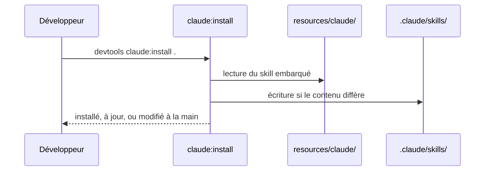
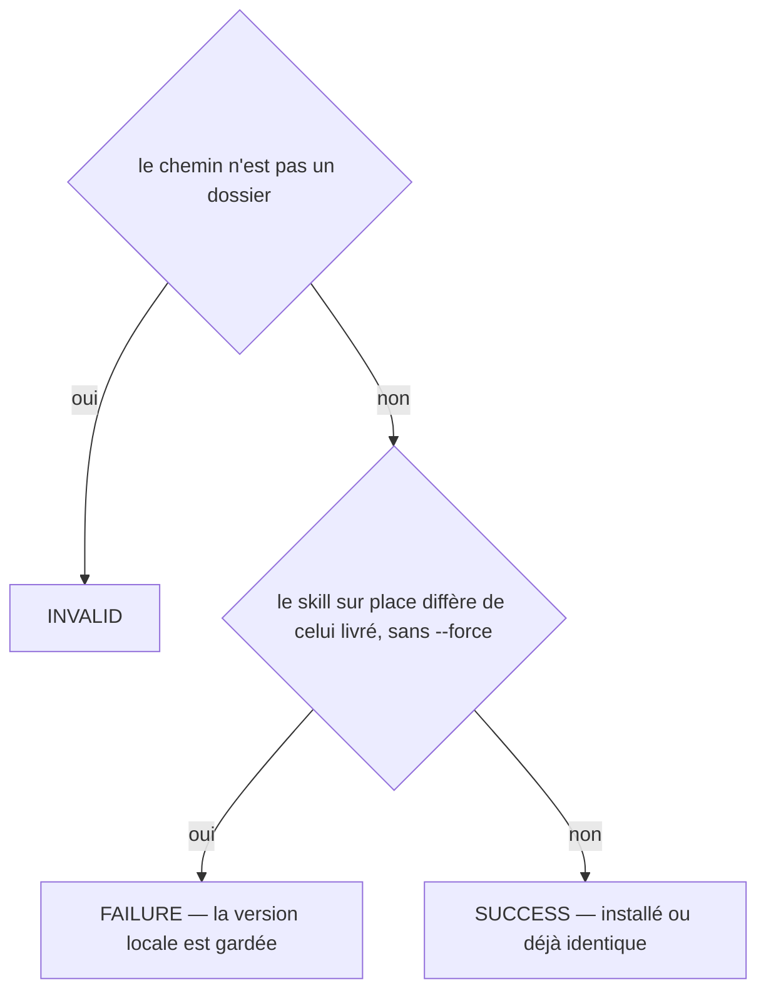

# claude:install
`command.claude.install` · type : commands · dernière mise à jour : 2026-09-18 · commit : b8049a4

## Résumé

Copie dans le projet le skill Claude Code que DevTools embarque, `.claude/skills/devtools-inspect/` : la boucle inspecter → rédiger → appliquer que Claude suit pour documenter les workflows. Le fichier se committe ; l'installer une seconde fois ne change rien tant qu'il n'a pas été modifié à la main.

## Déclencheur

| Élément | Valeur |
|---|---|
| Point d'entrée | `claude:install` (command) |
| Sécurité | — |
| Préconditions | Le chemin donné est un dossier existant. |

## Parcours

## Navigation / états

—

## Décisions

**`Jul6Art\DevTools\Command\ClaudeInstallCommand::execute`**

## Données

Lit le skill embarqué, écrit son homologue dans le projet.

## Mécanismes transverses

Aucun.

## Points d'attention

Un skill modifié à la main n'est jamais écrasé sans `--force` : c'est le fichier de l'équipe, comme une fiche de connaissance.

## Workflows liés

—

## Historique

| Date | Commit | Changement |
|---|---|---|
| 2026-09-18 | b8049a4 | rédaction initiale |
