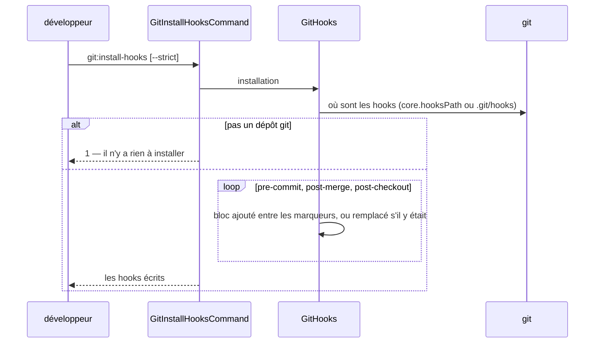
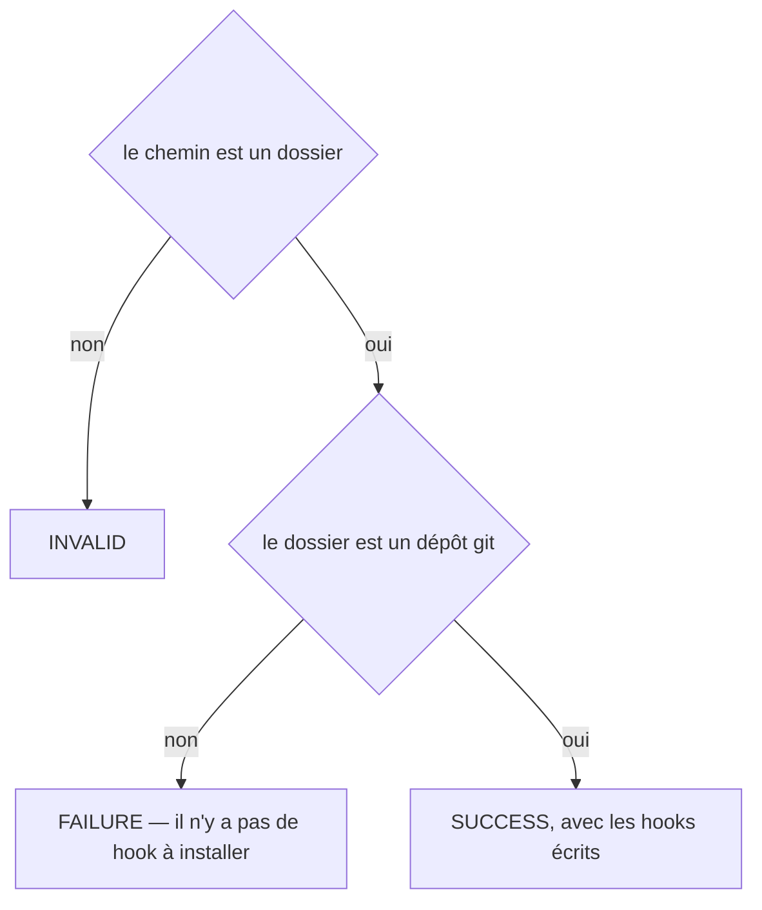

# git:install-hooks
`command.git.install-hooks` · type : commands · dernière mise à jour : 2026-09-19 · commit : d9d6b8f

## Résumé

Installe les hooks git du projet : le contrôle sur `pre-commit`, les faits rafraîchis sur `post-merge` et `post-checkout`. **Un hook existant n'est jamais écrasé** — le bloc s'ajoute entre deux marqueurs — et aucun hook ne bloque un commit pour une raison technique.

## Déclencheur

| Élément | Valeur |
|---|---|
| Point d'entrée | `git:install-hooks` (command) |
| Sécurité | — |
| Préconditions | Le chemin est un dépôt git ; `core.hooksPath` est respecté quand le projet en configure un. |

## Parcours

## Navigation / états

—

## Décisions

**`Jul6Art\DevTools\Command\GitInstallHooksCommand::execute`**

## Données

Écriture : les trois fichiers de hooks, rendus exécutables.

## Mécanismes transverses

—

## Points d'attention

- **Le hook laisse passer le commit quand DevTools n'est pas là**, ou quand le projet n'a pas de `.devtools/` : une gate qui bloque le travail à cause d'elle-même est une gate qu'on désinstalle, et avec elle la seule chose qui tenait la documentation à jour.
- **`--strict` refuse le commit** au lieu d'avertir : c'est un choix d'équipe, pas le défaut.
- **Installer deux fois remplace le bloc** au lieu de l'empiler.

## Workflows liés

—

## Historique

| Date | Commit | Changement |
|---|---|---|
| 2026-09-19 | d9d6b8f | Rédaction initiale. |
