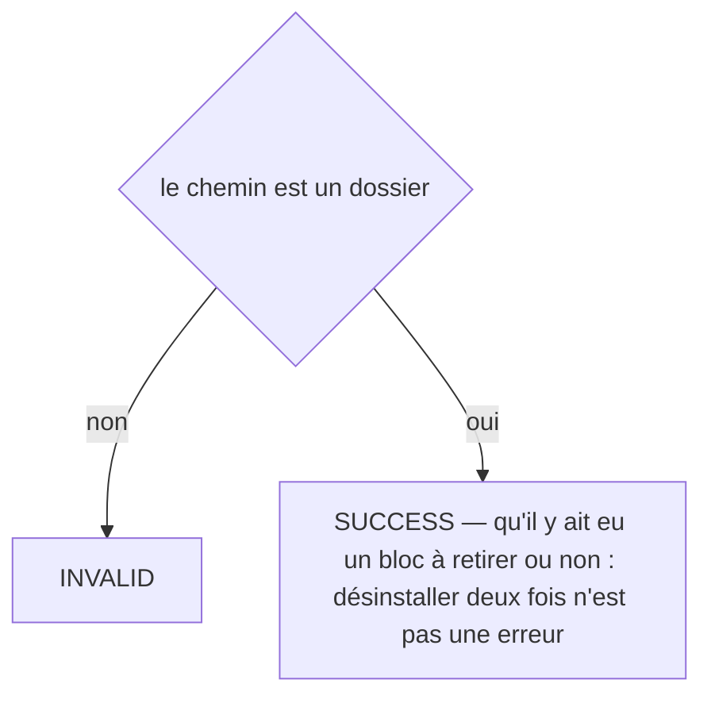

# git:uninstall-hooks
`command.git.uninstall-hooks` · type: commands · last updated: 2026-09-21 · commit: e5a6438

## Summary

Retire exactement ce que l'installation a ajouté, à l'octet : le bloc entre les deux marqueurs. Un hook qui ne contenait que ce bloc est supprimé ; un hook qui portait autre chose retrouve son contenu d'origine.

## Trigger

| Element | Value |
|---|---|
| Entry point | `git:uninstall-hooks` (command) |
| Security | — |
| Preconditions | Le chemin est un dossier ; il n'a pas besoin d'être un dépôt git pour que la commande réponde. |

## Journey

```mermaid
sequenceDiagram
  participant U as développeur
  participant C as GitUninstallHooksCommand
  participant H as GitHooks

  U->>C: git:uninstall-hooks
  loop pre-commit, post-merge, post-checkout
    alt le fichier ne porte pas le bloc
      H->>H: laissé intact
    else
      H->>H: bloc retiré ; fichier supprimé s'il ne restait que lui
    end
  end
  C-->>U: les hooks nettoyés, ou « rien à retirer »
```

## Navigation / states

—

## Decisions

**`Jul6Art\DevTools\Command\GitUninstallHooksCommand::execute`**



## Data

Écriture : les fichiers de hooks dont le bloc est retiré, ou leur suppression.

## Cross-cutting mechanisms

—

## Points of attention

- **Désinstaller deux fois n'est pas une erreur** : la commande réussit en disant qu'il n'y avait rien à retirer.
- **Le hook d'un autre outil est rendu à l'octet** : c'est ce que vérifie le test dédié, parce qu'un `pre-commit` partagé appartient à l'équipe, pas à DevTools.

## Related workflows

—

## History

| Date | Commit | Change |
|---|---|---|
| 2026-09-19 | d9d6b8f | Rédaction initiale. |
| 2026-09-20 | 9e40da9 | Aucun changement de fond : seul un test s'est ajouté au périmètre du workflow. La prose a été relue contre le code et tient. (added test tests/Inspection/Adapter/Symfony/DoctrineListenersTest.php) |
| 2026-09-21 | e5a6438 | l'outil passe en anglais : ce que la commande écrit, et les titres des pages qu'elle produit (files changed: src/Project/GitHooks.php) |
