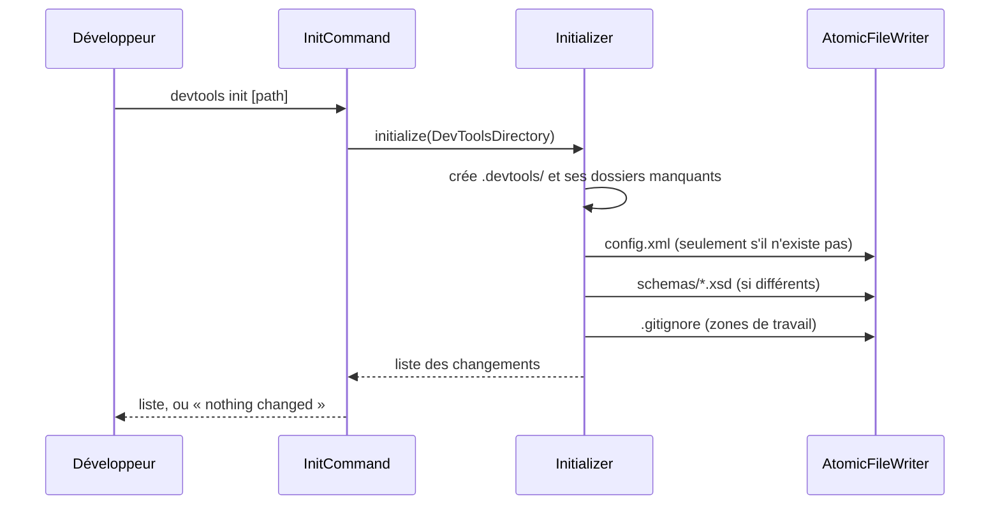

# init
`command.init` · type : commands · dernière mise à jour : 2026-09-17 · commit : 66f5ede

## Résumé

`devtools init [path]` prépare le dossier `.devtools/` d'un projet : les dossiers de travail, le
`config.xml` par défaut, une copie des schémas XSD et l'exclusion des zones de travail dans `.gitignore`.
La commande est idempotente et liste ce qu'elle a changé.

## Déclencheur

| Élément | Valeur |
|---|---|
| Point d'entrée | `init` (command) |
| Sécurité | — |
| Préconditions | Le chemin donné, ou le dossier courant, est un dossier existant. |

## Parcours

## Navigation / états

—

## Composants impliqués

| Rôle | Fichier | Notes |
|---|---|---|
| Autre | `src/Command/InitCommand.php` | point d'entrée |
| Autre | `src/Inspection/Model/FileRef.php` |  |
| Autre | `src/Inspection/Model/FileRole.php` |  |
| Autre | `src/Inspection/Model/InvalidModel.php` |  |
| Autre | `src/Inspection/Model/NonEmpty.php` |  |
| Autre | `src/Inspection/Model/WorkflowId.php` |  |
| Autre | `src/Inspection/Model/WorkflowType.php` |  |
| Autre | `src/Project/PathOutsideProject.php` |  |
| Autre | `src/Project/ProjectRoot.php` |  |
| Autre | `src/Resources.php` |  |
| Autre | `src/Tracking/AtomicFileWriter.php` |  |
| Autre | `src/Tracking/DevToolsDirectory.php` |  |
| Autre | `src/Tracking/Initializer.php` |  |

Paquets : `symfony/console` 8.1.7, `symfony/filesystem` 8.1.6

## Données

Écrit dans le projet analysé : .devtools/config.xml, `.devtools/schemas/`, `.gitignore`. Rien n'est lu
du code du projet.

## Mécanismes transverses

`ProjectRoot` refuse tout chemin hors du projet, liens symboliques compris ; `AtomicFileWriter` écrit
par fichier temporaire puis renommage, et n'écrit pas un contenu identique.

## Points d'attention

Le `config.xml` d'un projet n'est jamais réécrit, même s'il diffère du modèle livré : une nouvelle option
n'y apparaît pas d'elle-même. Les schémas, eux, sont toujours remis à jour.

## Tests existants

| Test | Fichier | Couvre |
|---|---|---|
| PageRedactionTest | `tests/Ai/PageRedactionTest.php` | — |
| ClaudeDrivenTest | `tests/Inspection/Adapter/Claude/ClaudeDrivenTest.php` | — |
| GenericPhpAdapterTest | `tests/Inspection/Adapter/GenericPhp/GenericPhpAdapterTest.php` | — |
| ProjectRootTest | `tests/Project/ProjectRootTest.php` | — |
| KnowledgeTest | `tests/Stack/Knowledge/KnowledgeTest.php` | — |
| StackDetectorTest | `tests/Stack/StackDetectorTest.php` | — |
| InitializerTest | `tests/Tracking/InitializerTest.php` | — |

## Workflows liés

—

## Historique

| Date | Commit | Changement |
|---|---|---|
| 2026-09-17 | a3b1c1b | rédaction initiale |
| 2026-09-17 | 8f7ea01 | files removed: tests/Inspection/Graph/GraphFixture.php, tests/Inspection/Pipeline/FakeAdapter.php |
| 2026-09-17 | 66f5ede | files changed: src/Tracking/DevToolsDirectory.php |
| 2026-09-17 | 66f5ede | forced |
