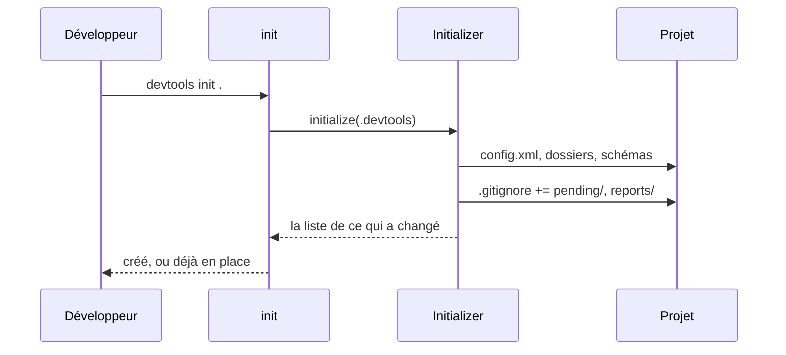
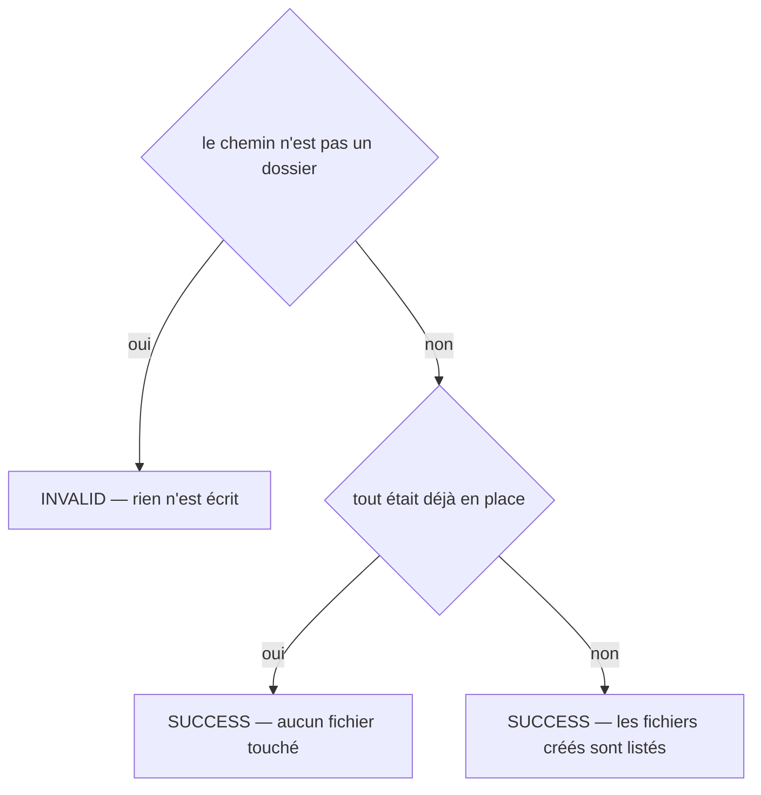

# init
`command.init` · type : commands · dernière mise à jour : 2026-09-20 · commit : 9e40da9

## Résumé

Crée le dossier `.devtools/` d'un projet et le prépare à être inspecté : la configuration commentée, les six sous-dossiers, la copie des XSD, et la ligne du `.gitignore` qui exclut les zones de travail. La commande est idempotente — elle n'écrase aucun fichier existant — et `workflows:inspect` l'appelle d'elle-même, si bien qu'on ne la lance à la main que pour lire la configuration avant le premier scan.

## Déclencheur

| Élément | Valeur |
|---|---|
| Point d'entrée | `init` (command) |
| Sécurité | — |
| Préconditions | Le chemin donné est un dossier existant. |

## Parcours

## Navigation / états

—

## Décisions

**`Jul6Art\DevTools\Command\InitCommand::execute`**

## Données

Écrit la configuration du projet, `.devtools/schemas/`, les dossiers du § 4.4 et le `.gitignore` du projet. Ne lit rien du code.

## Mécanismes transverses

Aucun : la commande ne traverse pas le projet, elle le prépare.

## Points d'attention

Le `.gitignore` appartient au projet : `init` y ajoute deux lignes et ne le réécrit jamais. Après la première inspection, le dépôt est donc « sale » pour git, et c'est exact.

## Workflows liés

—

## Historique

| Date | Commit | Changement |
|---|---|---|
| 2026-09-18 | b8049a4 | rédaction initiale |
| 2026-09-19 | d9d6b8f | added test tests/Project/GitHooksTest.php |
| 2026-09-20 | 9e40da9 | Aucun changement de fond : seul un test s'est ajouté au périmètre du workflow. La prose a été relue contre le code et tient. (added test tests/Inspection/Adapter/Symfony/DoctrineListenersTest.php) |
