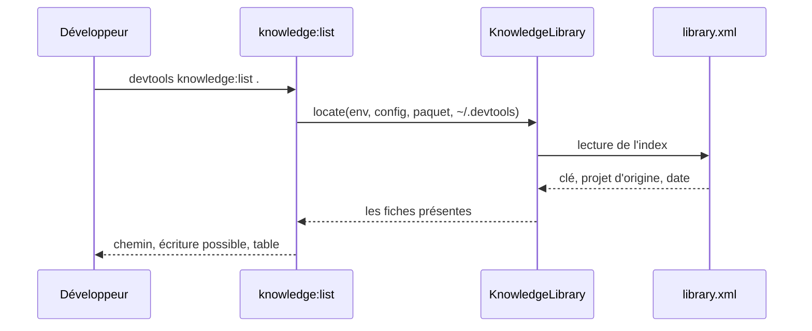
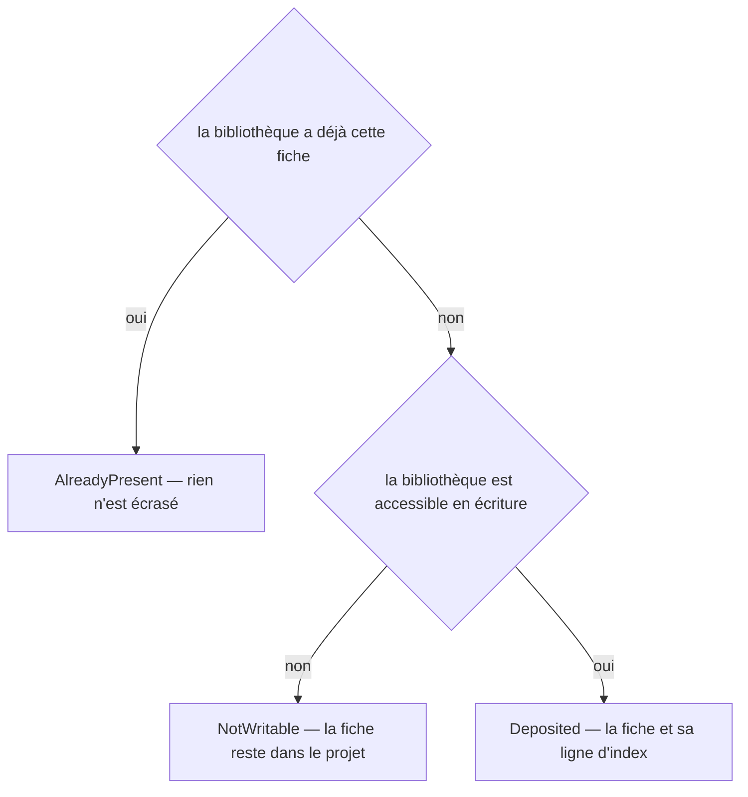
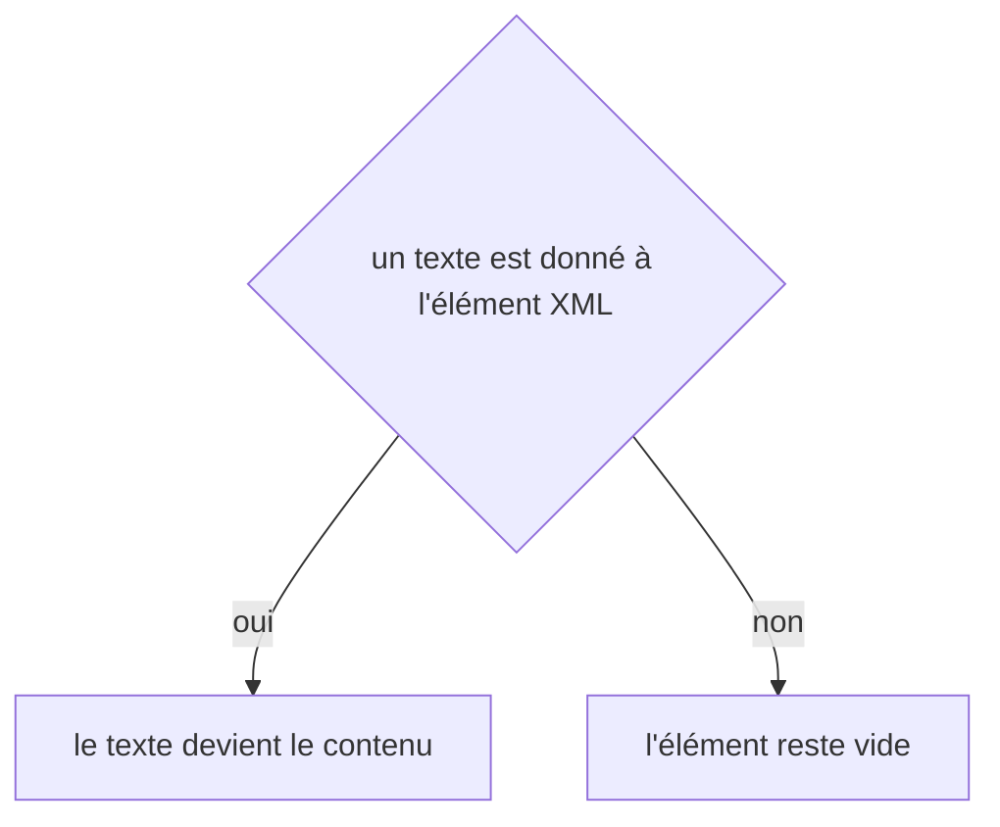

# knowledge:list
`command.knowledge.list` · type : commands · dernière mise à jour : 2026-09-18 · commit : b8049a4

## Résumé

Dit où vit la bibliothèque de connaissances de stack partagée par tous les projets de la machine, si elle est accessible en écriture, ce qu'elle contient et d'où chaque fiche vient. Les fiches que DevTools embarque et que la bibliothèque ne couvre pas sont nommées à la suite : on voit d'un coup ce qui sera demandé à Claude au prochain projet.

## Déclencheur

| Élément | Valeur |
|---|---|
| Point d'entrée | `knowledge:list` (command) |
| Sécurité | — |
| Préconditions | Aucune : sans projet ni configuration, la bibliothèque par défaut est listée. |

## Parcours

## Navigation / états

—

## Décisions

**`Jul6Art\DevTools\Stack\Knowledge\KnowledgeLibrary::deposit`**

**`element::textContent`**

## Données

Lit `library.xml` de la bibliothèque et les fiches présentes sur le disque ; lit la configuration du projet quand un chemin est donné. N'écrit rien.

## Mécanismes transverses

Aucun.

## Points d'attention

Une fiche déposée à la main dans le dossier est listée même si `library.xml` l'ignore : le disque fait foi sur ce qui existe, l'index sur ce qui vient d'où.

## Workflows liés

—

## Historique

| Date | Commit | Changement |
|---|---|---|
| 2026-09-18 | b8049a4 | rédaction initiale |
