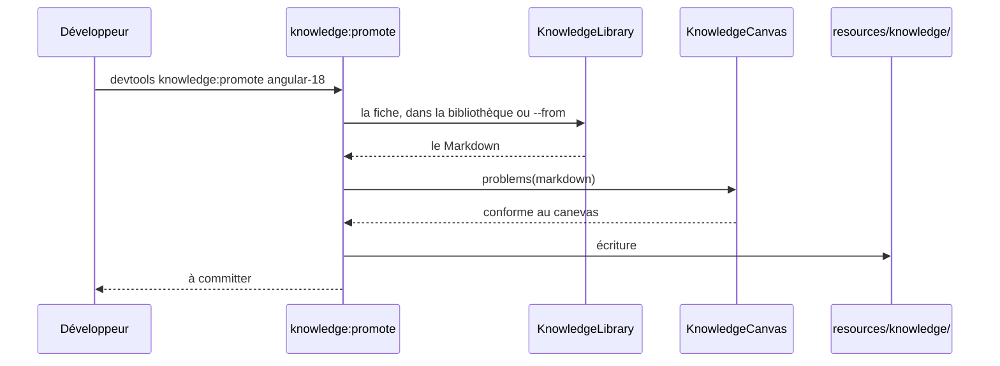
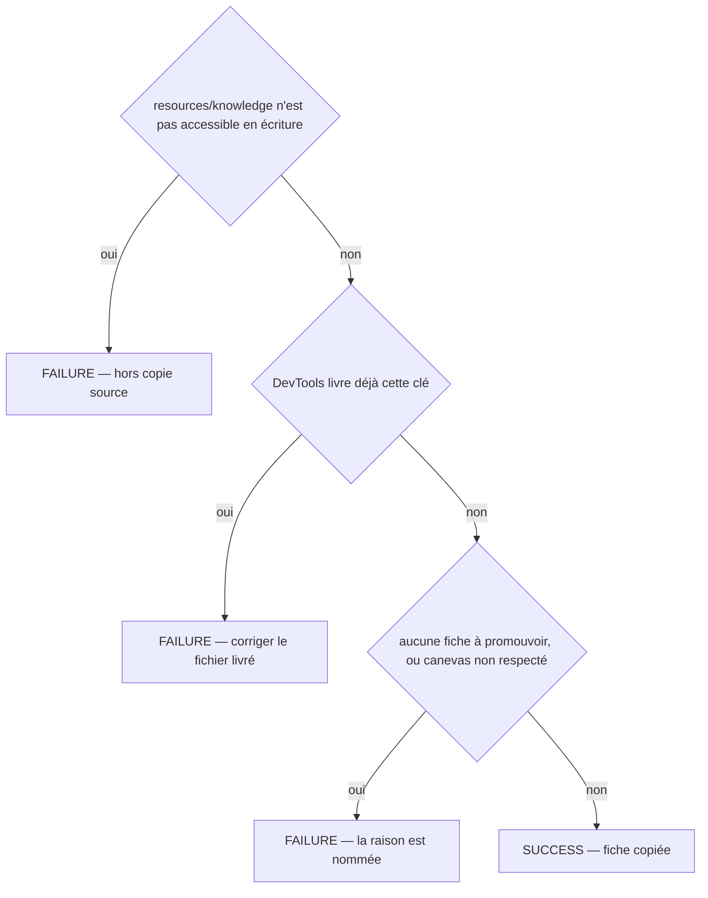
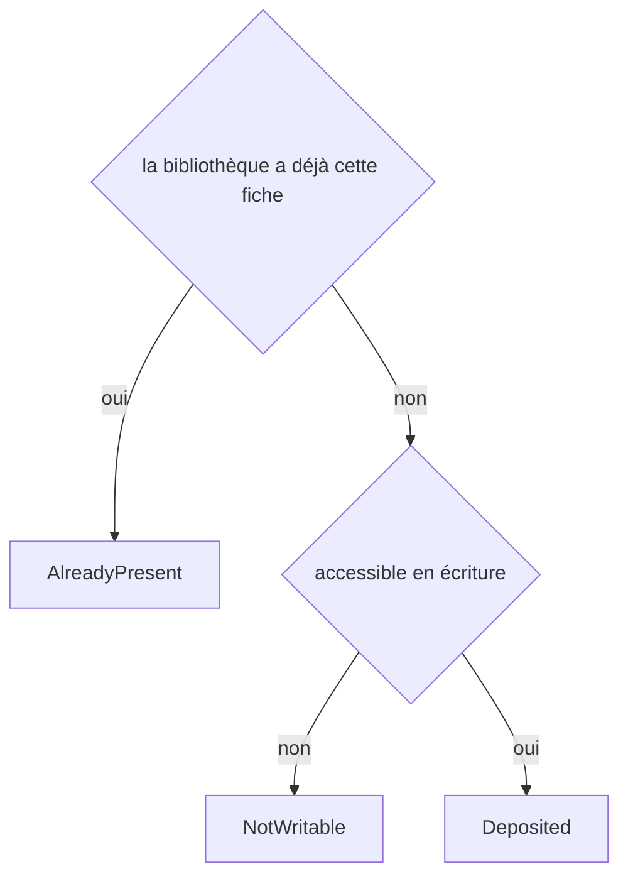
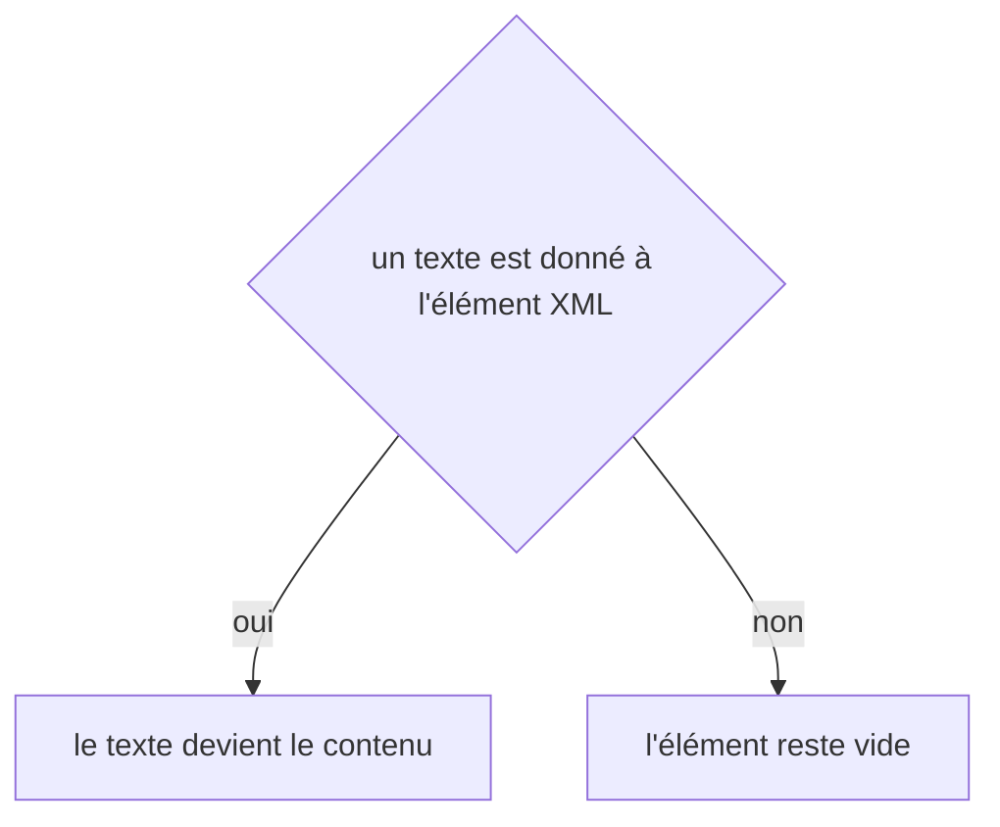

# knowledge:promote
`command.knowledge.promote` · type : commands · dernière mise à jour : 2026-09-19 · commit : d9d6b8f

## Résumé

Copie une fiche de connaissance — de la bibliothèque partagée, ou du `.devtools/knowledge/` d'un projet avec `--from` — dans `resources/knowledge/` de DevTools, pour qu'elle parte avec le paquet publié. Le dépôt dans la bibliothèque est automatique ; l'embarquer dans le paquet ne l'est pas : cette commande prépare la pull request, un humain la relit.

## Déclencheur

| Élément | Valeur |
|---|---|
| Point d'entrée | `knowledge:promote` (command) |
| Sécurité | — |
| Préconditions | DevTools tourne depuis une copie source, et la fiche existe quelque part. |

## Parcours

## Navigation / états

—

## Décisions

**`Jul6Art\DevTools\Command\KnowledgePromoteCommand::execute`**

**`Jul6Art\DevTools\Stack\Knowledge\KnowledgeLibrary::deposit`**

**`element::textContent`**

## Données

Lit une fiche Markdown et la configuration du projet ; écrit dans `resources/knowledge/` du paquet.

## Mécanismes transverses

Aucun.

## Points d'attention

La promotion ne vérifie que le canevas, pas la justesse : une fiche fausse promue fausse toutes les rédactions de la stack. C'est la relecture de la pull request qui tranche.

## Workflows liés

—

## Historique

| Date | Commit | Changement |
|---|---|---|
| 2026-09-18 | b8049a4 | rédaction initiale |
| 2026-09-19 | d9d6b8f | added test tests/Project/GitHooksTest.php |
