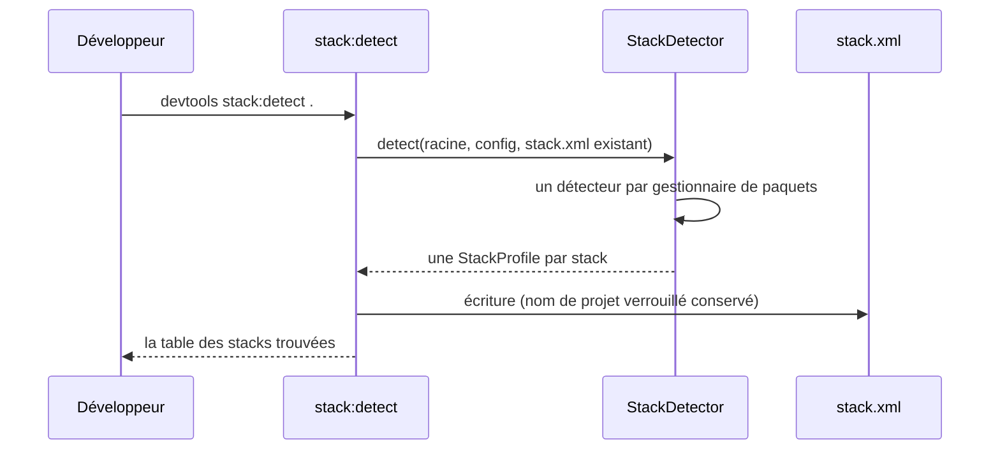
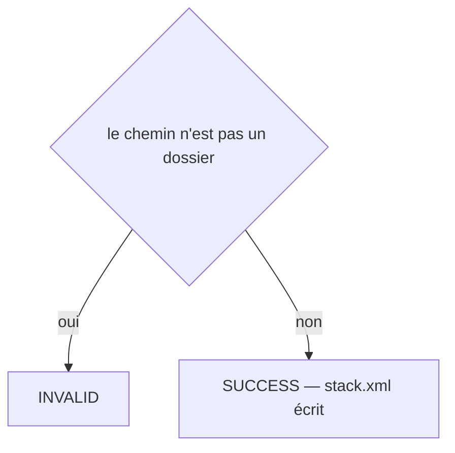
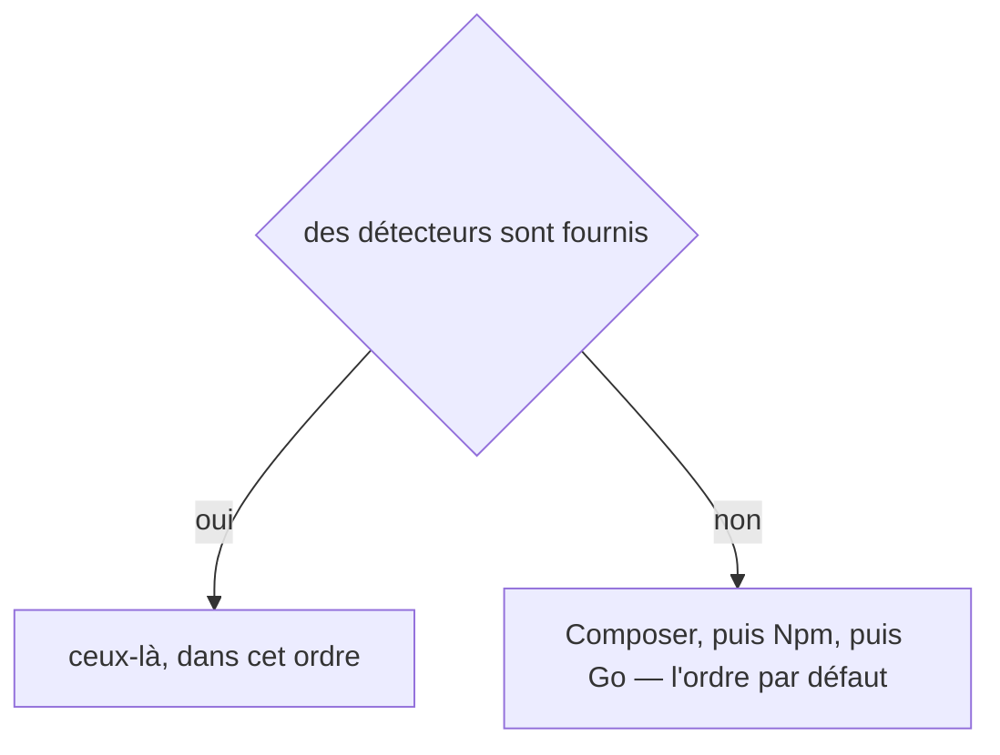
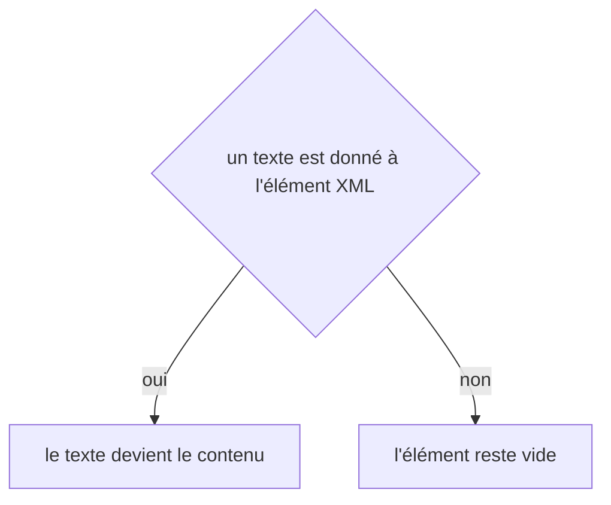

# stack:detect
`command.stack.detect` · type : commands · dernière mise à jour : 2026-09-19 · commit : d9d6b8f

## Résumé

Lit les manifestes d'un projet — `composer.json`, `package.json`, `go.mod`… — et écrit le fichier de stack : la langue, le framework et sa version majeure, le gestionnaire de paquets, l'adaptateur qui trouvera les points d'entrée, la clé de connaissance et les dossiers de sources. Un monorepo est reconnu en lisant la racine et ses sous-dossiers immédiats, jamais en parcourant l'arborescence.

## Déclencheur

| Élément | Valeur |
|---|---|
| Point d'entrée | `stack:detect` (command) |
| Sécurité | — |
| Préconditions | Le chemin donné est un dossier existant contenant au moins un manifeste reconnu. |

## Parcours

## Navigation / états

—

## Décisions

**`Jul6Art\DevTools\Command\StackDetectCommand::execute`**

**`Jul6Art\DevTools\Stack\StackDetector::detectors`**

**`element::textContent`**

## Données

Lit les manifestes et les verrous de dépendances ; écrit le fichier de stack, validé par son XSD.

## Mécanismes transverses

Aucun.

## Points d'attention

Un `package.json` sans framework à côté d'un projet Symfony est de l'outillage, pas une stack : sinon la voie Claude se lancerait sur les assets. Le nom du projet est verrouillable dans `stack.xml`, et une détection suivante ne l'écrase plus.

## Workflows liés

—

## Historique

| Date | Commit | Changement |
|---|---|---|
| 2026-09-18 | b8049a4 | rédaction initiale |
| 2026-09-19 | d9d6b8f | added test tests/Project/GitHooksTest.php |
