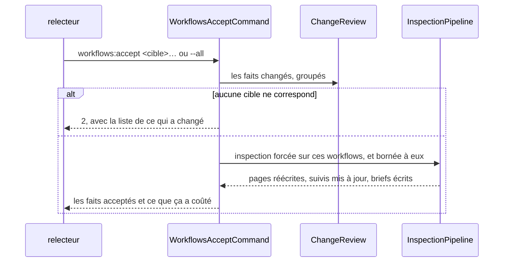
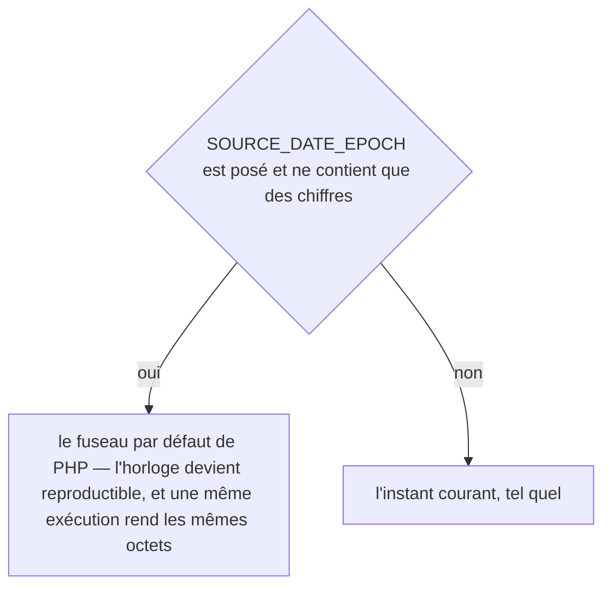
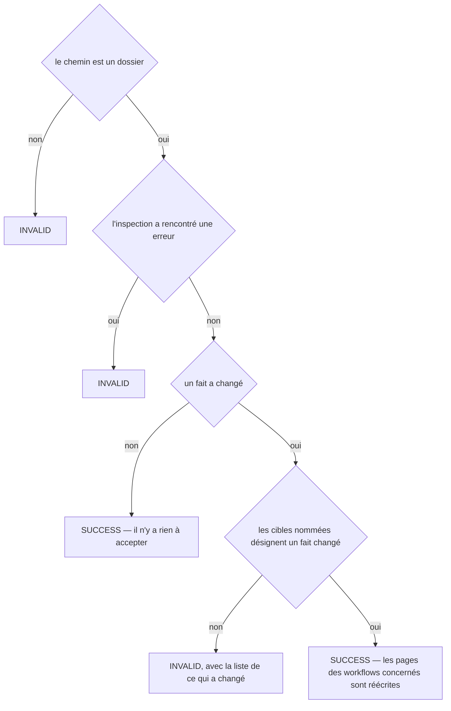
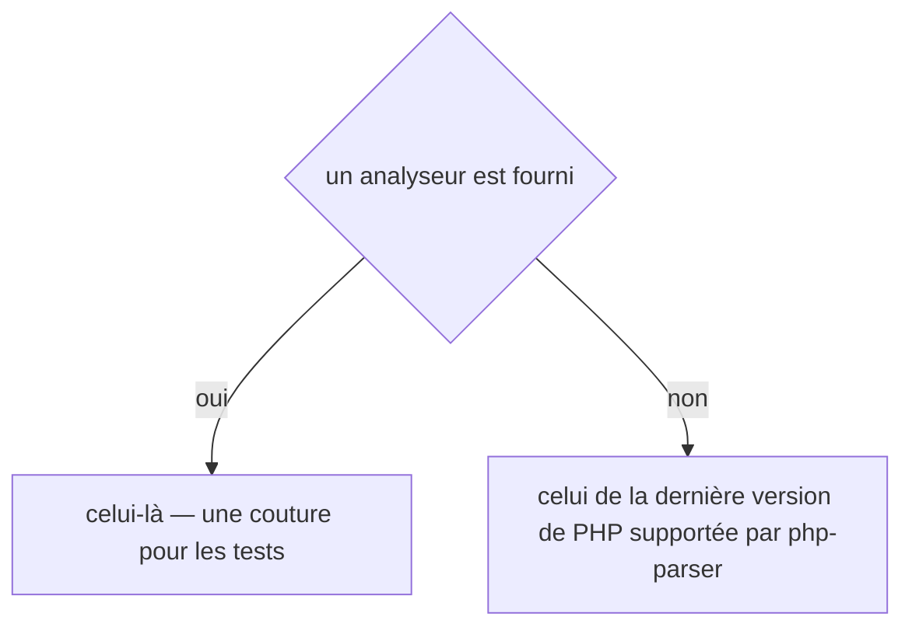
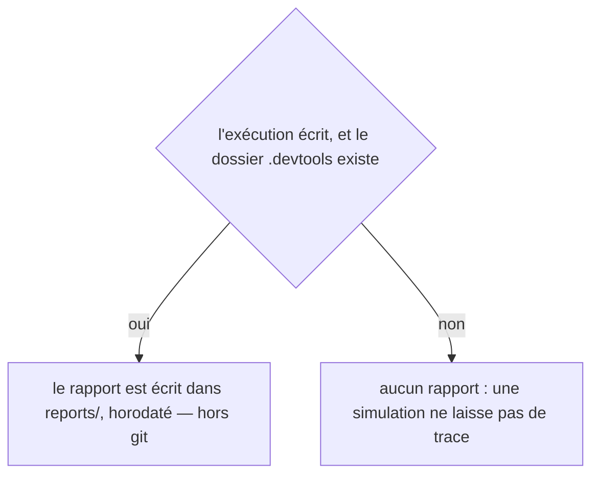
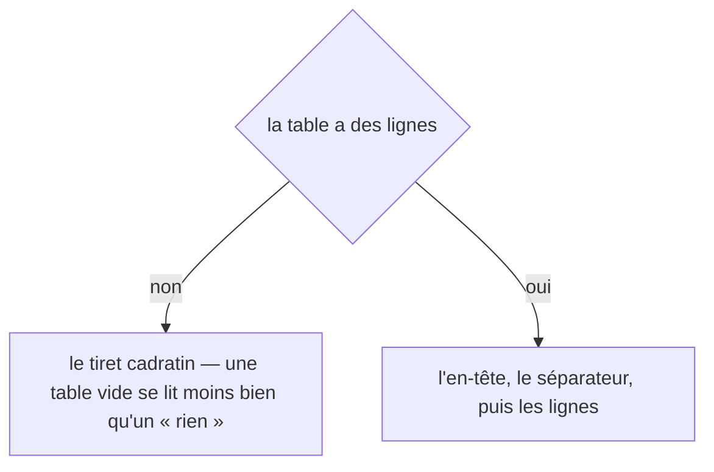
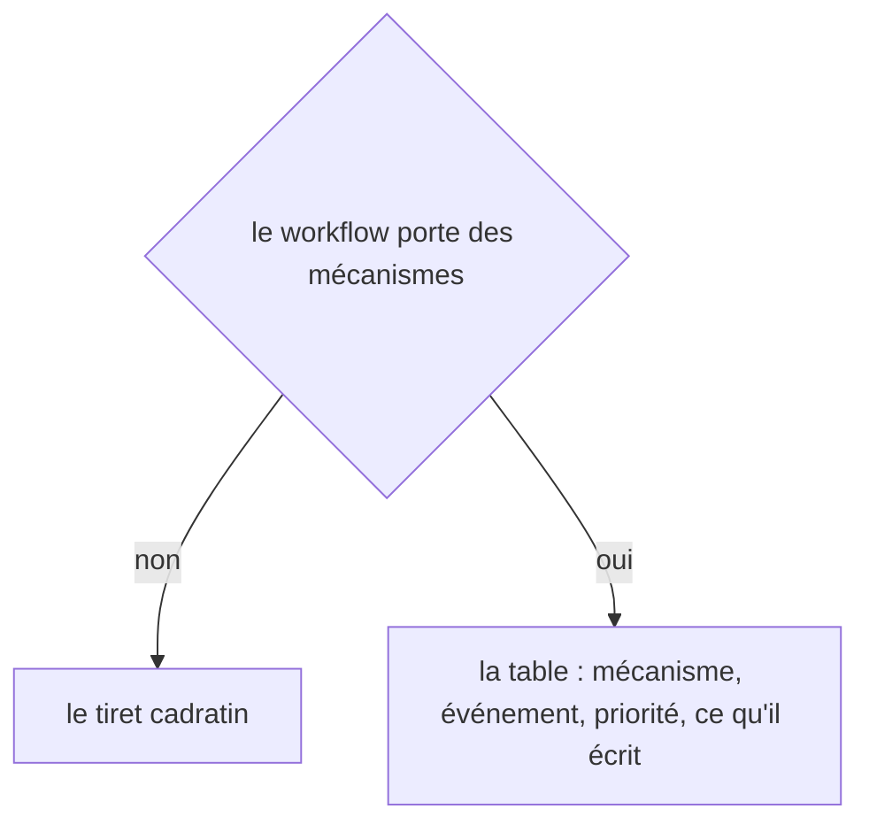
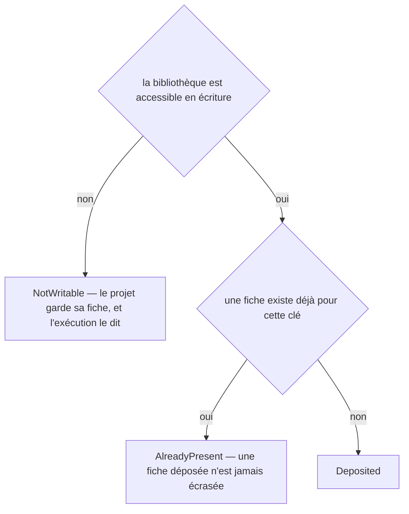
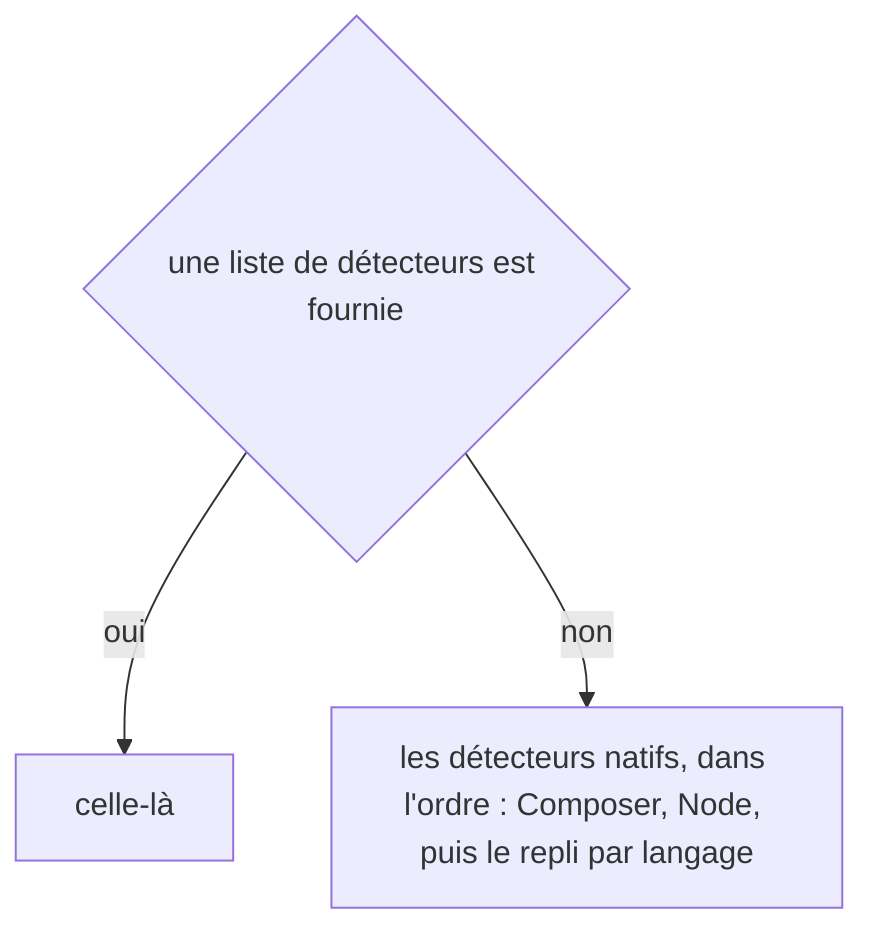

# workflows:accept
`command.workflows.accept` · type : commands · dernière mise à jour : 2026-09-20 · commit : 9e40da9

## Résumé

Le changement était voulu : la documentation suit. Les pages des workflows portant les faits acceptés sont réécrites — **et elles seules** —, leur historique nomme le fait plutôt que le fichier, et le brief de rédaction le porte aussi, pour que Claude relise là où il faut plutôt que partout.

## Déclencheur

| Élément | Valeur |
|---|---|
| Point d'entrée | `workflows:accept` (command) |
| Sécurité | — |
| Préconditions | Le projet porte un `.devtools/` déjà inspecté, et les cibles nommées désignent des faits qui ont changé. |

## Parcours

## Navigation / états

—

## Décisions

**`DateTimeImmutable::timezone`**

**`Jul6Art\DevTools\Command\WorkflowsAcceptCommand::execute`**

**`Jul6Art\DevTools\Inspection\Graph\PhpReferenceExtractor::parser`**

**`Jul6Art\DevTools\Inspection\InspectionReport::path`**

**`Jul6Art\DevTools\Rendering\MarkdownWriter::table`**

**`Jul6Art\DevTools\Rendering\PageRenderer::crossCutting`**

**`Jul6Art\DevTools\Stack\Knowledge\KnowledgeLibrary::deposit`**

**`Jul6Art\DevTools\Stack\StackDetector::detectors`**

## Données

Écriture : les pages, les suivis et les briefs des workflows portant les faits acceptés.

## Mécanismes transverses

—

## Points d'attention

- **`--force` seul ne suffisait pas** : il rend un workflow périmé, il n'empêche pas les autres de l'être. Sans la restriction, accepter la sécurité d'une route réécrivait les quatre autres du même contrôleur — vu sur un projet réel.
- **Ce qui n'est pas accepté reste en dérive** : son suivi n'est pas écrit, donc le contrôle continue de le signaler.
- **`--no-ai` accepte les faits sans demander la prose** : la page redevient juste tout de suite, sa rédaction attend.

## Workflows liés

—

## Historique

| Date | Commit | Changement |
|---|---|---|
| 2026-09-19 | d9d6b8f | Rédaction initiale. |
| 2026-09-20 | 9e40da9 | Aucun changement de fond : le pipeline d'inspection a bougé sur l'élagage et sur les écouteurs Doctrine, deux points que cette commande ne touche pas. La prose a été relue contre le code et tient. (files changed: src/Inspection/InspectionPipeline.php) |
