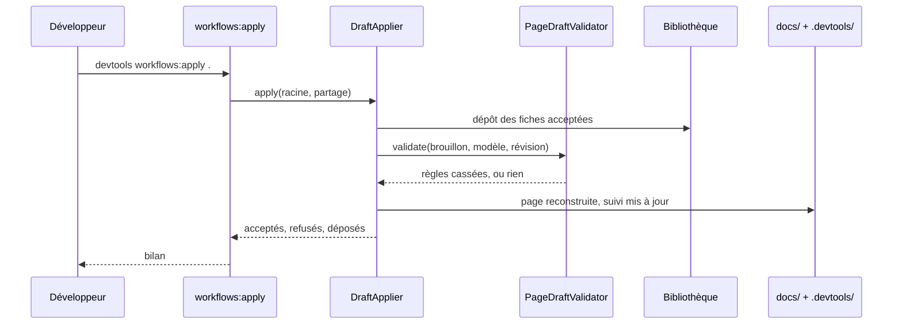
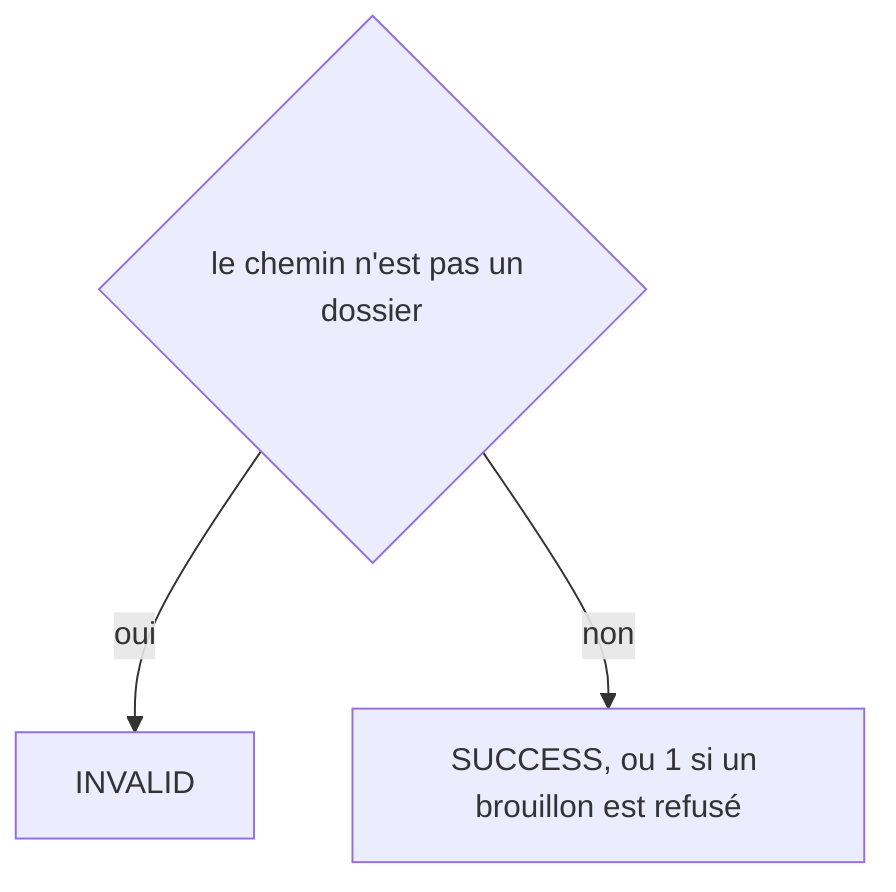
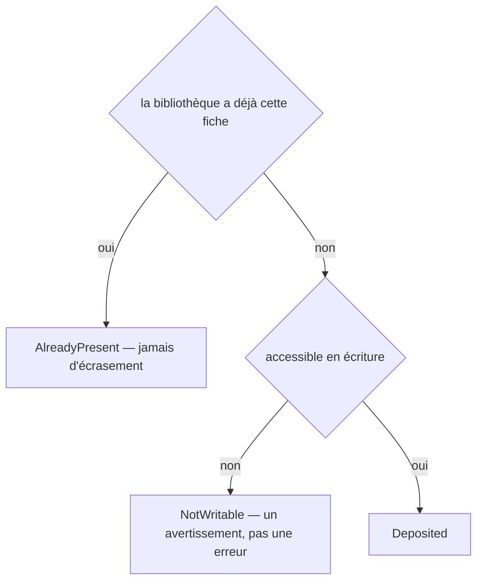
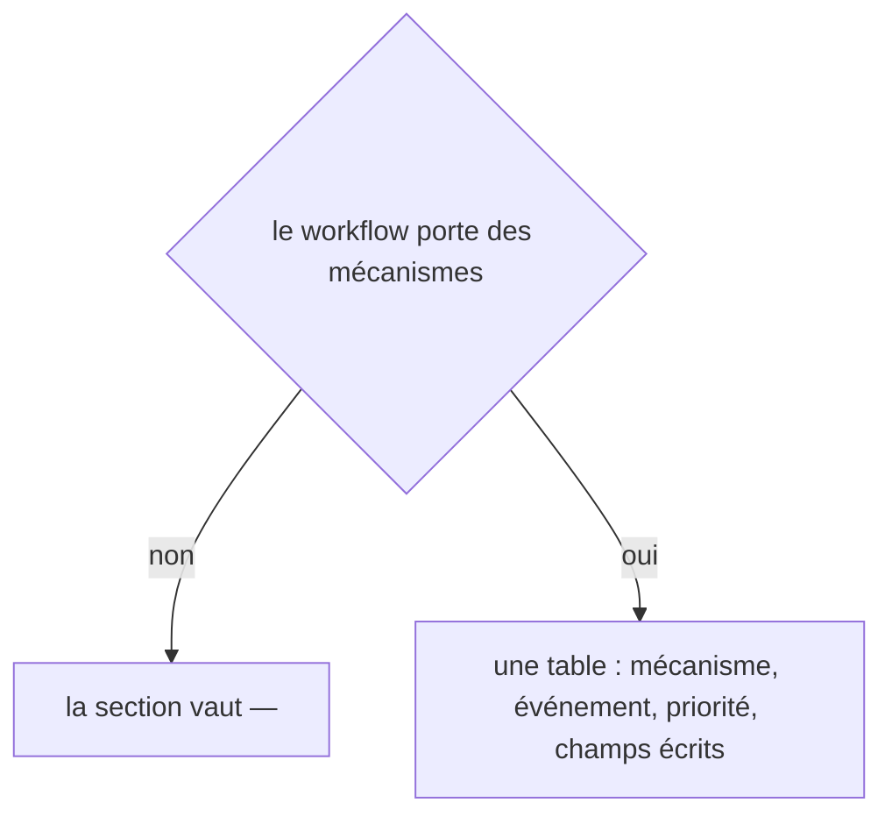
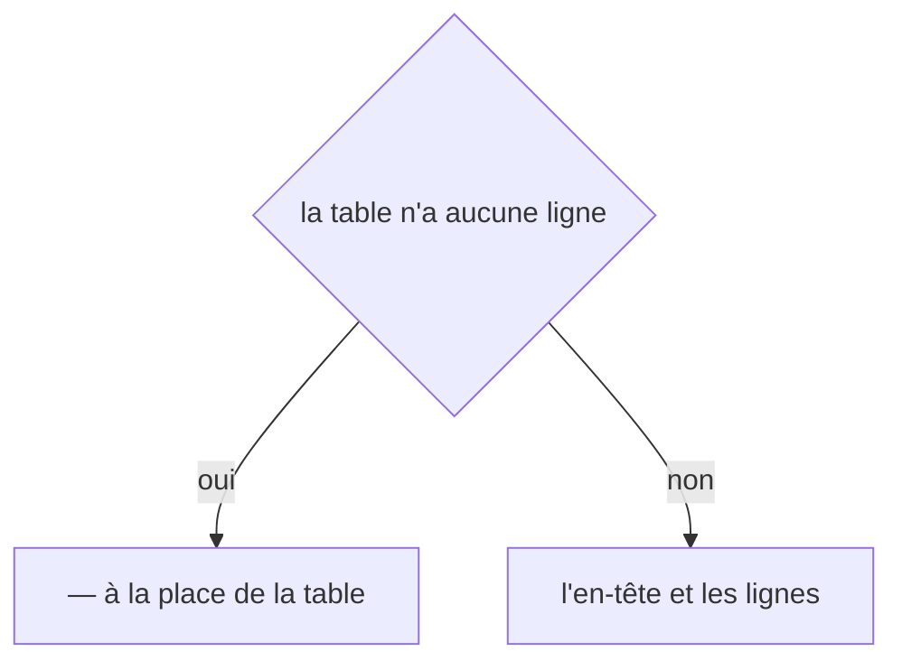
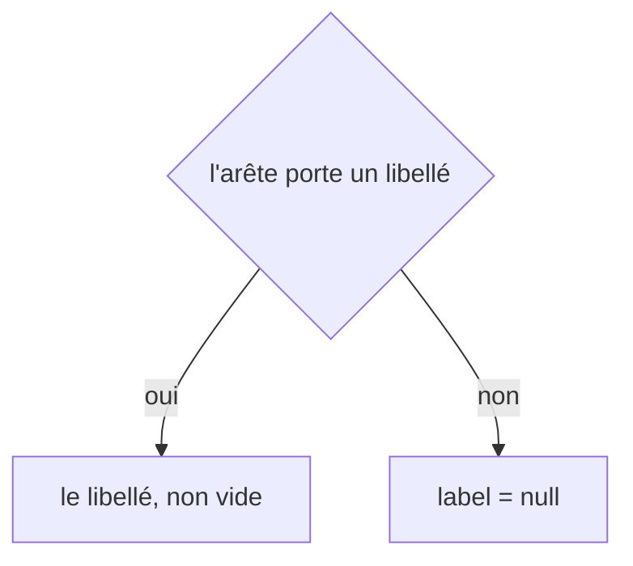
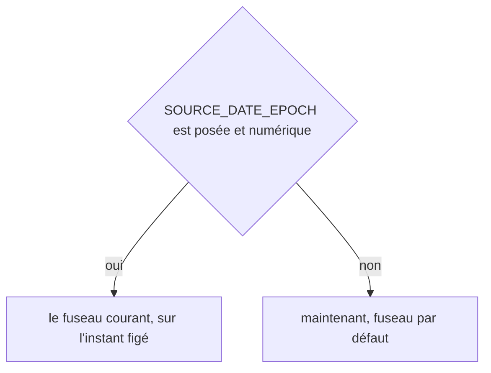

# workflows:apply
`command.workflows.apply` · type : commands · dernière mise à jour : 2026-09-18 · commit : b8049a4

## Résumé

Relit les brouillons que Claude a écrits dans `.devtools/pending/`, les refuse ou les applique, et reconstruit la page : les faits viennent du modèle, la prose du brouillon. Les connaissances passent d'abord — une page ne se rédige pas sans savoir comment la stack fonctionne — puis les découvertes, puis les pages. Une fiche de connaissance acceptée est déposée dans la bibliothèque partagée.

## Déclencheur

| Élément | Valeur |
|---|---|
| Point d'entrée | `workflows:apply` (command) |
| Sécurité | — |
| Préconditions | Une inspection a écrit des briefs, et Claude a répondu à au moins un. |

## Parcours

## Navigation / états

—

## Décisions

**`Jul6Art\DevTools\Command\WorkflowsApplyCommand::execute`**

**`Jul6Art\DevTools\Stack\Knowledge\KnowledgeLibrary::deposit`**

**`Jul6Art\DevTools\Rendering\PageRenderer::crossCutting`**

**`Jul6Art\DevTools\Rendering\MarkdownWriter::table`**

**`Jul6Art\DevTools\Inspection\Model\Edge::label`**

**`DateTimeImmutable::timezone`**

## Données

Lit les briefs, les modèles et les brouillons de `.devtools/pending/` ; écrit les pages, les fichiers de suivi, l'index, et dépose les fiches de connaissance.

## Mécanismes transverses

Aucun listener. Un brouillon est une donnée non fiable : chaque chemin qu'il cite doit être un fichier du modèle, et la révision doit être celle du brief.

## Points d'attention

Un brouillon refusé ne change rien et reste dans `pending/` pour être corrigé. Une page rédigée survit aux réécritures factuelles ultérieures : seuls les faits sont régénérés.

## Workflows liés

—

## Historique

| Date | Commit | Changement |
|---|---|---|
| 2026-09-18 | b8049a4 | rédaction initiale |
