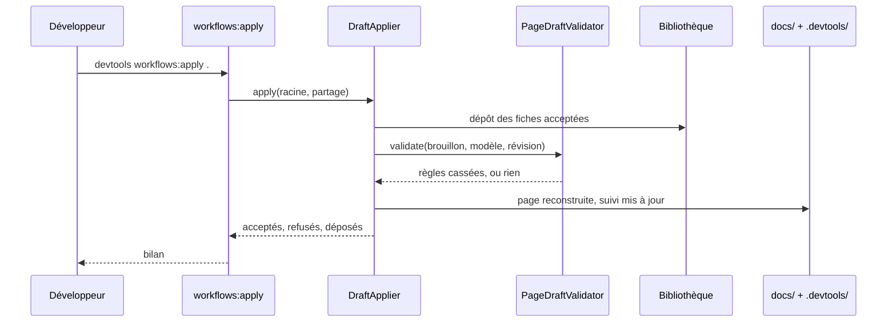
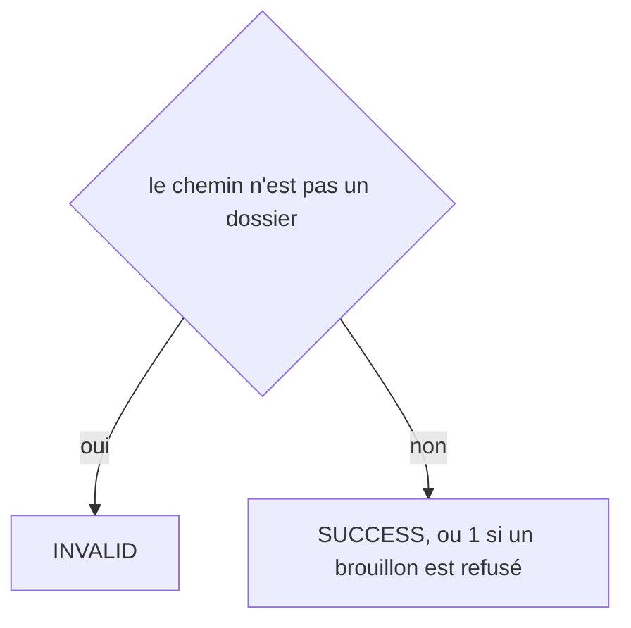
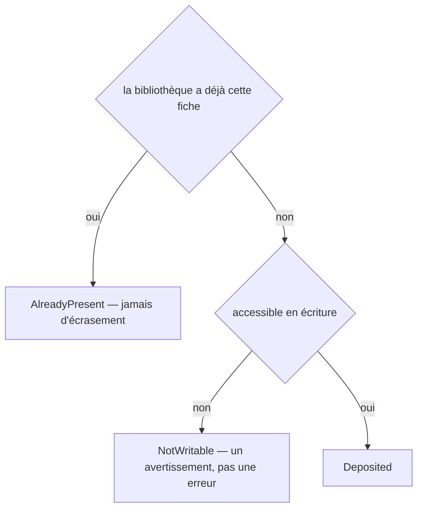
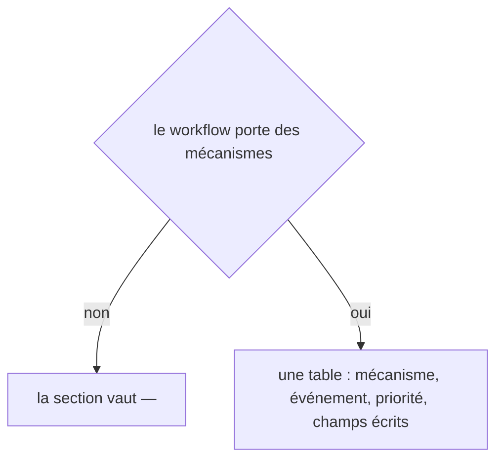
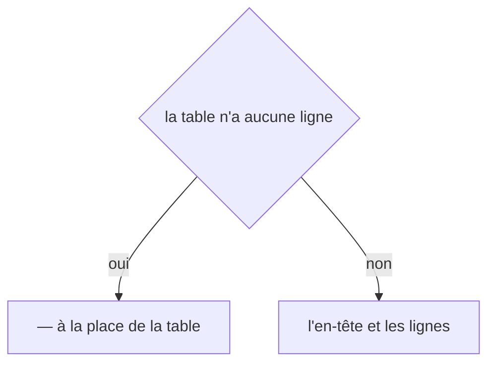
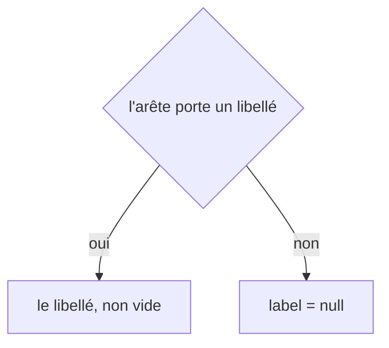
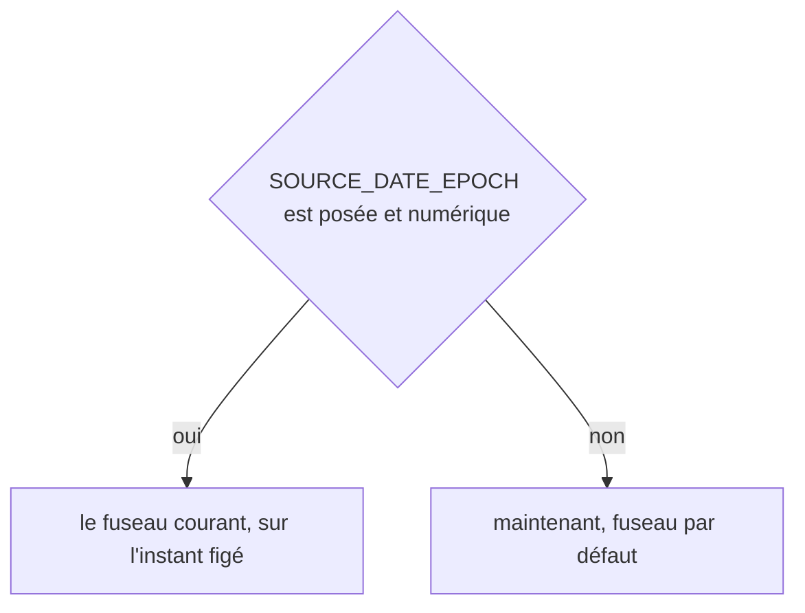

# workflows:apply
`command.workflows.apply` · type: commands · last updated: 2026-09-21 · commit: e5a6438

## Summary

Relit les brouillons que Claude a écrits dans `.devtools/pending/`, les refuse ou les applique, et reconstruit la page : les faits viennent du modèle, la prose du brouillon. Les connaissances passent d'abord — une page ne se rédige pas sans savoir comment la stack fonctionne — puis les découvertes, puis les pages. Une fiche de connaissance acceptée est déposée dans la bibliothèque partagée.

## Trigger

| Element | Value |
|---|---|
| Entry point | `workflows:apply` (command) |
| Security | — |
| Preconditions | Une inspection a écrit des briefs, et Claude a répondu à au moins un. |

## Journey

## Navigation / states

—

## Decisions

**`Jul6Art\DevTools\Command\WorkflowsApplyCommand::execute`**

**`Jul6Art\DevTools\Stack\Knowledge\KnowledgeLibrary::deposit`**

**`Jul6Art\DevTools\Rendering\PageRenderer::crossCutting`**

**`Jul6Art\DevTools\Rendering\MarkdownWriter::table`**

**`Jul6Art\DevTools\Inspection\Model\Edge::label`**

**`DateTimeImmutable::timezone`**

## Data

Lit les briefs, les modèles et les brouillons de `.devtools/pending/` ; écrit les pages, les fichiers de suivi, l'index, et dépose les fiches de connaissance.

## Cross-cutting mechanisms

Aucun listener. Un brouillon est une donnée non fiable : chaque chemin qu'il cite doit être un fichier du modèle, et la révision doit être celle du brief.

## Points of attention

Un brouillon refusé ne change rien et reste dans `pending/` pour être corrigé. Une page rédigée survit aux réécritures factuelles ultérieures : seuls les faits sont régénérés.

## Related workflows

—

## History

| Date | Commit | Change |
|---|---|---|
| 2026-09-18 | b8049a4 | rédaction initiale |
| 2026-09-19 | d9d6b8f | added test tests/Project/GitHooksTest.php |
| 2026-09-20 | 9e40da9 | Aucun changement de fond : seul un test s'est ajouté au périmètre du workflow. La prose a été relue contre le code et tient. (added test tests/Inspection/Adapter/Symfony/DoctrineListenersTest.php) |
| 2026-09-21 | e5a6438 | l'outil passe en anglais : ce que la commande écrit, et les titres des pages qu'elle produit (files changed: src/Ai/DraftApplier.php, src/Ai/PageDraft.php, src/Ai/PageDraftValidator.php, src/Console/SummaryRenderer.php, src/Rendering/GroupPageRenderer.php, src/Rendering/GroupPageSection.php, src/Rendering/PageRenderer.php, src/Rendering/PageSection.php, src/Rendering/ParsedPage.php, src/Stack/Knowledge/KnowledgeCanvas.php, src/Stack/Knowledge/XmlKnowledgeBriefStore.php, src/Tracking/TrackingStatus.php) |
| 2026-09-21 | e5a6438 | l'en-tête de l'historique passe en anglais, et une page restée sous un gabarit antérieur est remise à jour (files changed: src/Rendering/PageRenderer.php) |
