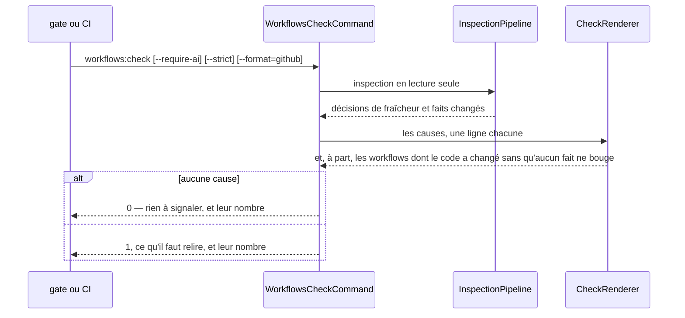
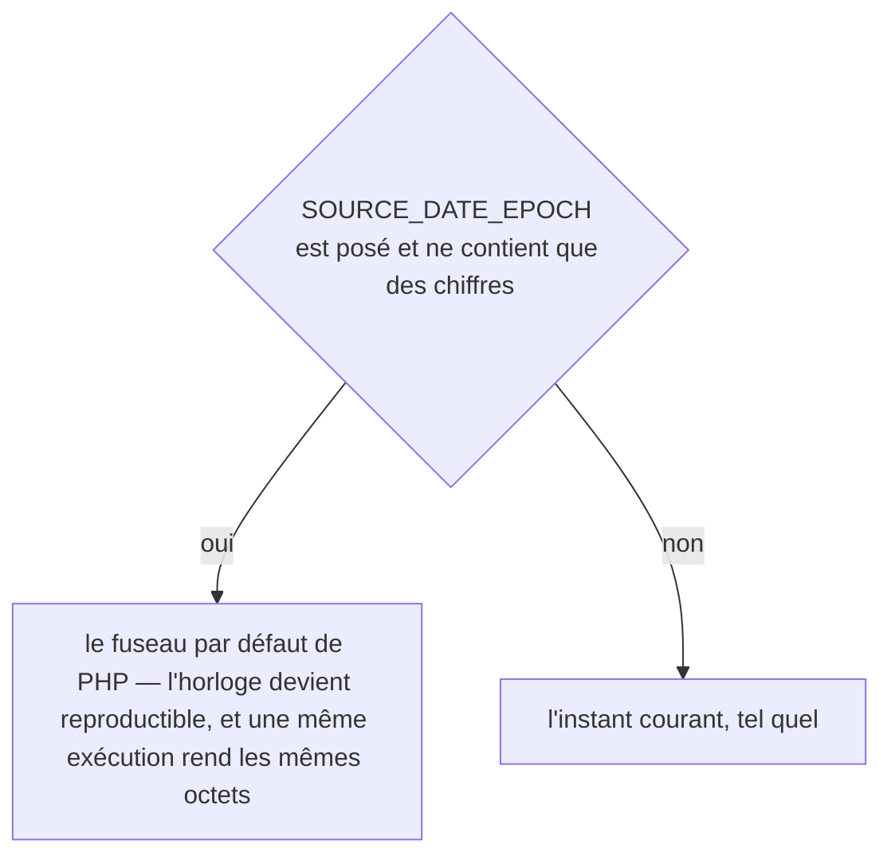
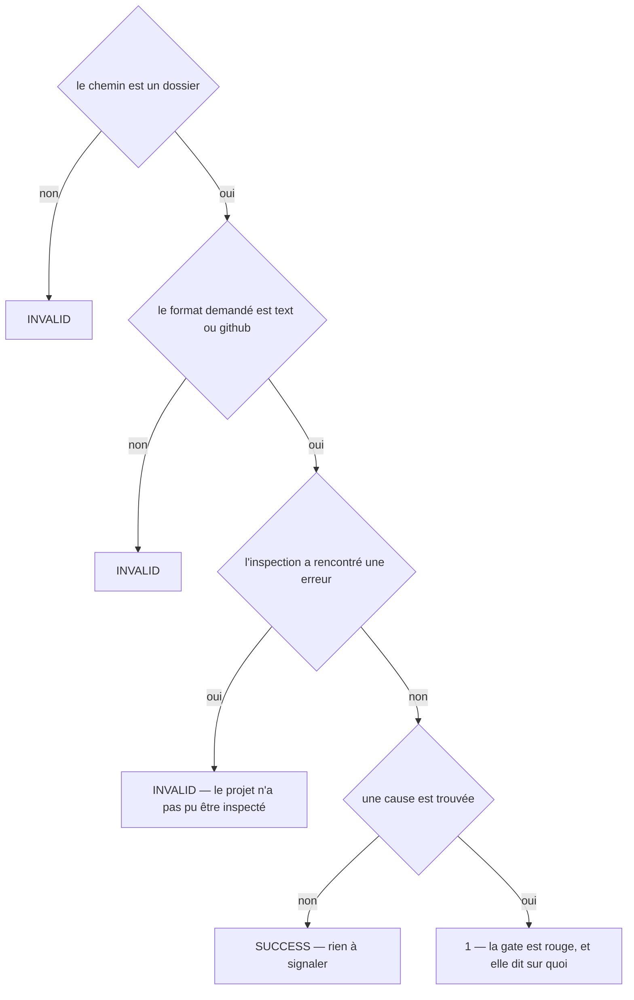
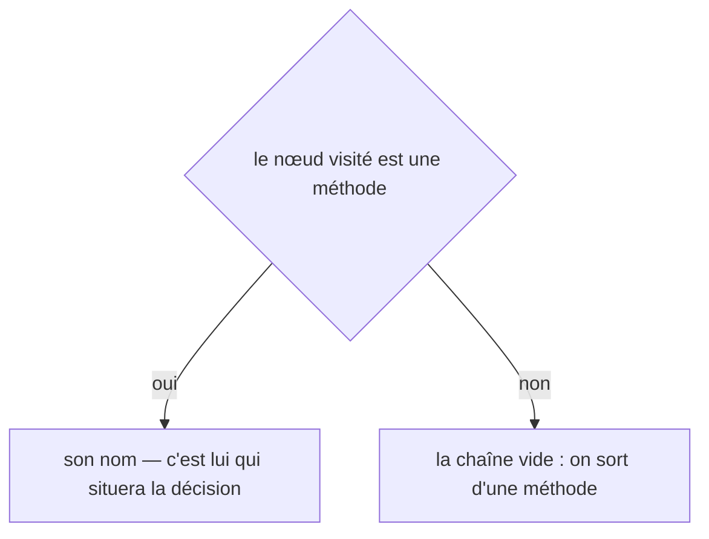
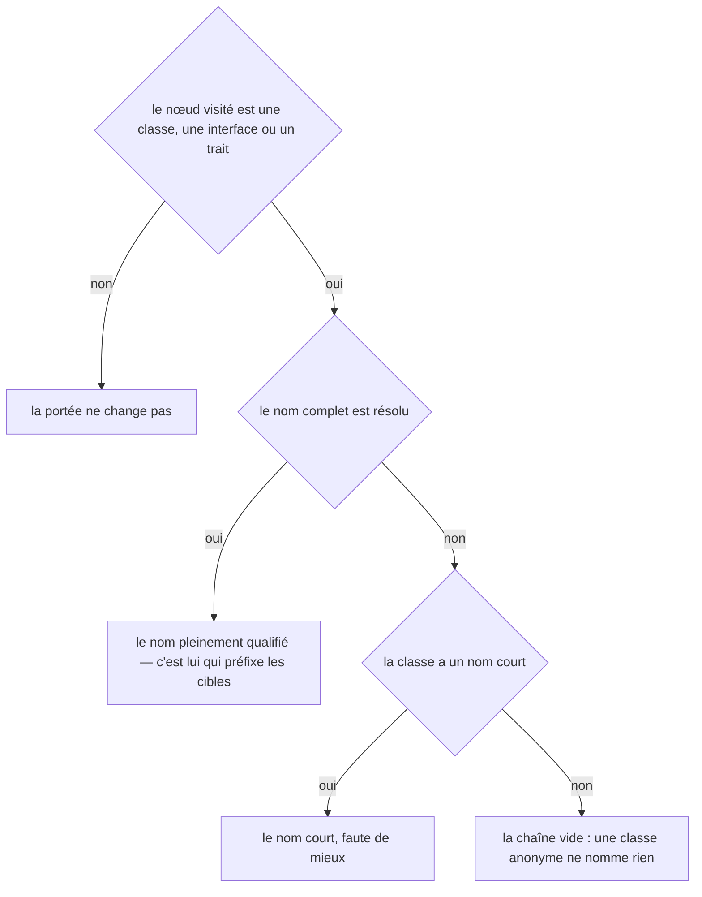
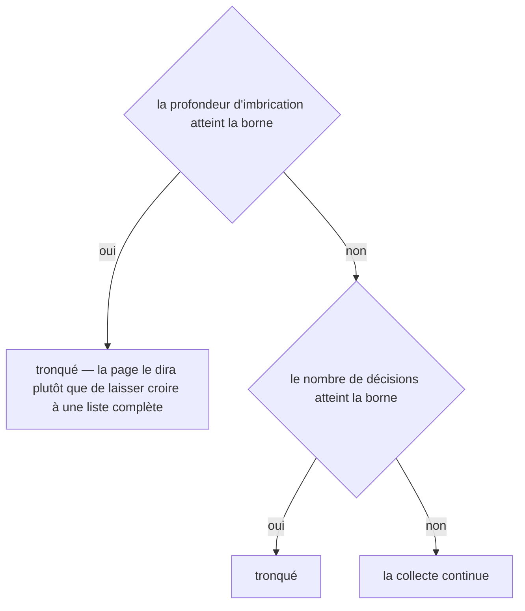
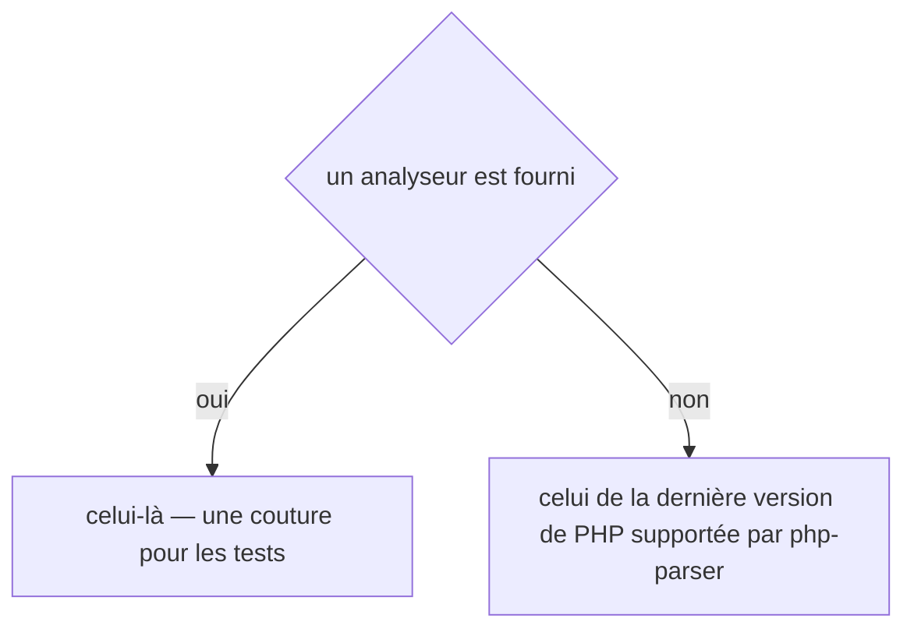
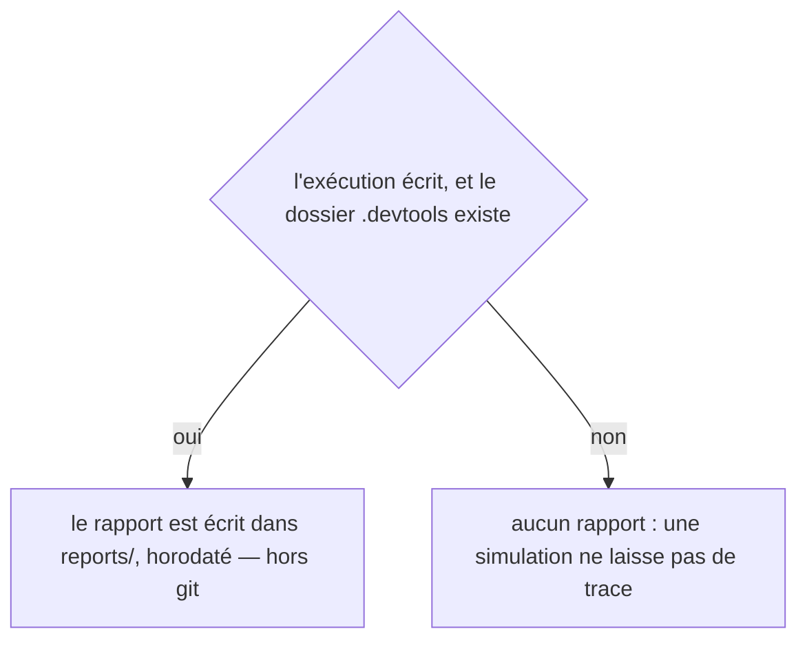
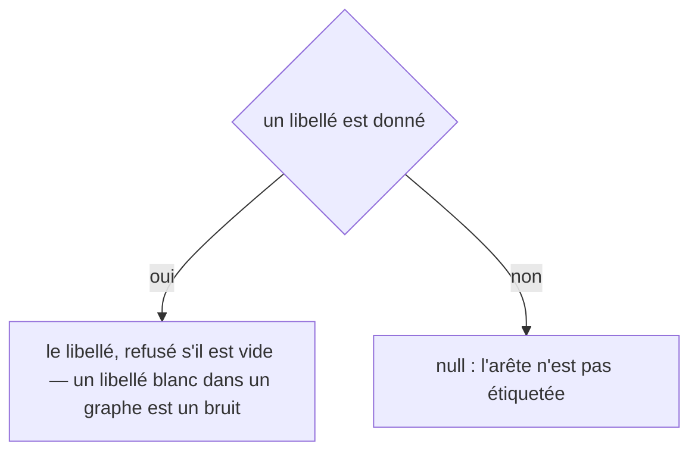

# workflows:check
`command.workflows.check` · type: commands · last updated: 2026-09-21 · commit: e5a6438

## Summary

La gate. Elle échoue quand la documentation ne correspond plus au code — un fait changé, un workflow sans page, une page sans workflow — et **elle n'écrit rien du tout**. La version qu'elle remplace régénérait les pages avant de prévenir : au moment où on lisait l'avertissement, il n'y avait plus rien à comparer.

## Trigger

| Element | Value |
|---|---|
| Entry point | `workflows:check` (command) |
| Security | — |
| Preconditions | Le projet porte un `.devtools/` déjà inspecté. |

## Journey

## Navigation / states

—

## Decisions

**`DateTimeImmutable::timezone`**

**`Jul6Art\DevTools\Command\WorkflowsCheckCommand::execute`**

**`Jul6Art\DevTools\Inspection\Graph\DecisionExtractor::method`**

**`Jul6Art\DevTools\Inspection\Graph\DecisionExtractor::scope`**

**`Jul6Art\DevTools\Inspection\Graph\DecisionExtractor::truncated`**

**`Jul6Art\DevTools\Inspection\Graph\PhpReferenceExtractor::parser`**

**`Jul6Art\DevTools\Inspection\InspectionReport::path`**

**`Jul6Art\DevTools\Inspection\Model\Edge::label`**

## Data

Lecture : les suivis et le code. Aucune écriture.

## Cross-cutting mechanisms

—

## Points of attention

- **Un fichier modifié sans fait changé n'est pas une cause** : c'est toute la différence avec la fraîcheur, et elle est délibérée — une gate qui réveille pour un commentaire ajouté est une gate qu'on désactive.
- **`--require-ai` est une exigence distincte** : une page qui ne porte que des faits est juste, mais elle n'explique rien ; les projets qui veulent la prose l'exigent explicitement.
- **Le format GitHub annote le fichier et la ligne**, pour que la pull request montre l'endroit plutôt qu'un résumé.
- **Un code changé sans fait changé est COMPTÉ, pas bloquant** : la gate dit combien de workflows sont dans ce cas, parce que leur prose peut être fausse — une condition réécrite dans une méthode, une constante renommée, une valeur par défaut inversée. `--strict` en fait une cause d'échec, pour les projets qui veulent relire à chaque fois.

## Related workflows

—

## History

| Date | Commit | Change |
|---|---|---|
| 2026-09-19 | d9d6b8f | Rédaction initiale. |
| 2026-09-20 | 9e40da9 | La commande gagne `--strict` et une ligne de compte. Ce qui était tu — un fichier modifié sans fait changé — est maintenant dit, sans faire échouer : la gate annonce le nombre, et `--strict` le transforme en cause. Le format GitHub porte la même annotation. (files changed: src/Command/WorkflowsCheckCommand.php, src/Console/CheckRenderer.php, src/Inspection/Adapter/Symfony/SymfonyAdapter.php, src/Inspection/InspectionPipeline.php) |
| 2026-09-21 | e5a6438 | l'outil passe en anglais : ce que la commande écrit, et les titres des pages qu'elle produit (files changed: src/Ai/PageDraft.php, src/Command/WorkflowsCheckCommand.php, src/Console/ChangeRenderer.php, src/Console/CheckRenderer.php, src/Inspection/InspectionPipeline.php, src/Rendering/GroupPageRenderer.php, src/Rendering/GroupPageSection.php, src/Rendering/Labels.php, src/Rendering/MenuRenderer.php, src/Rendering/PageRenderer.php, src/Rendering/PageSection.php, src/Rendering/ParsedPage.php, src/Stack/Knowledge/KnowledgeCanvas.php, src/Stack/Knowledge/XmlKnowledgeBriefStore.php, src/Tracking/TrackingStatus.php) |
| 2026-09-21 | e5a6438 | l'en-tête de l'historique passe en anglais, et une page restée sous un gabarit antérieur est remise à jour (files changed: src/Inspection/InspectionPipeline.php, src/Rendering/PageRenderer.php) |
