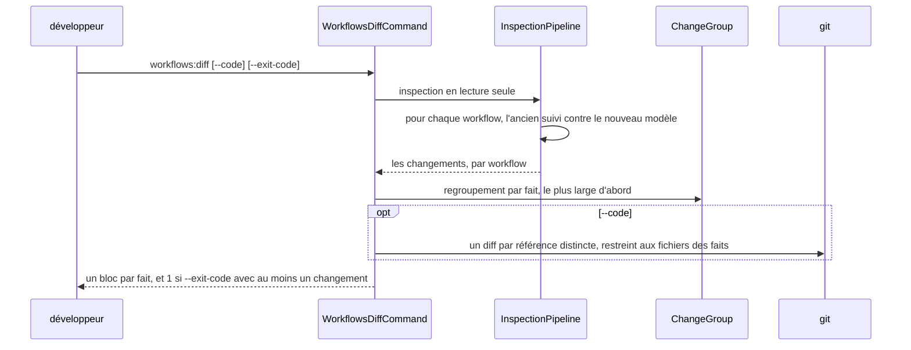
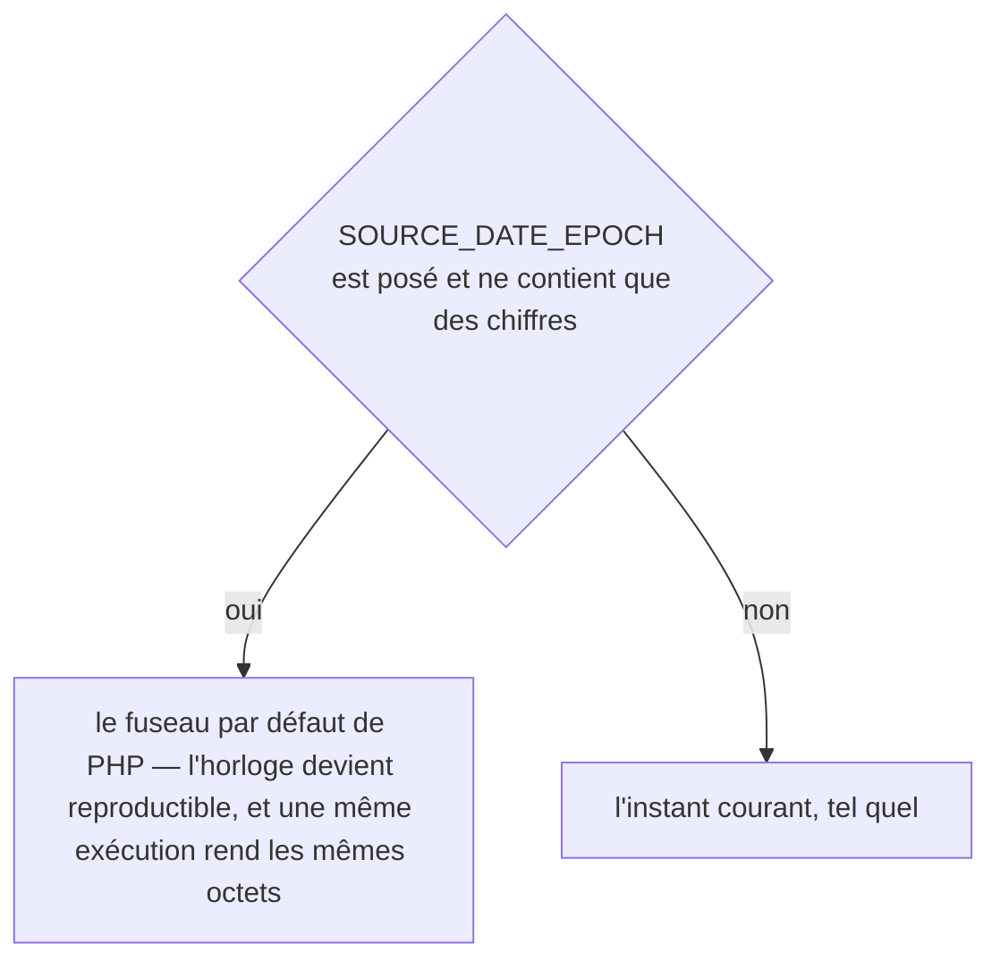
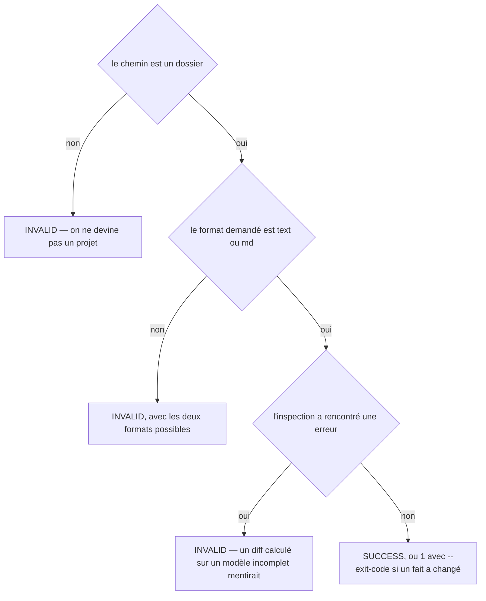
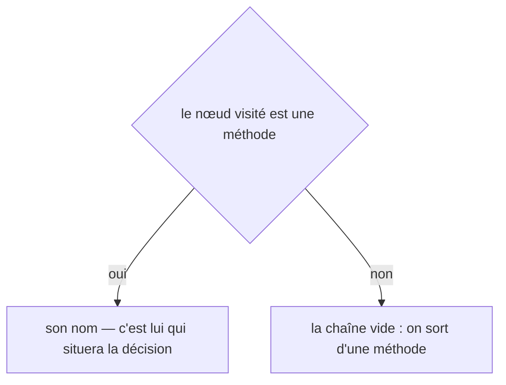
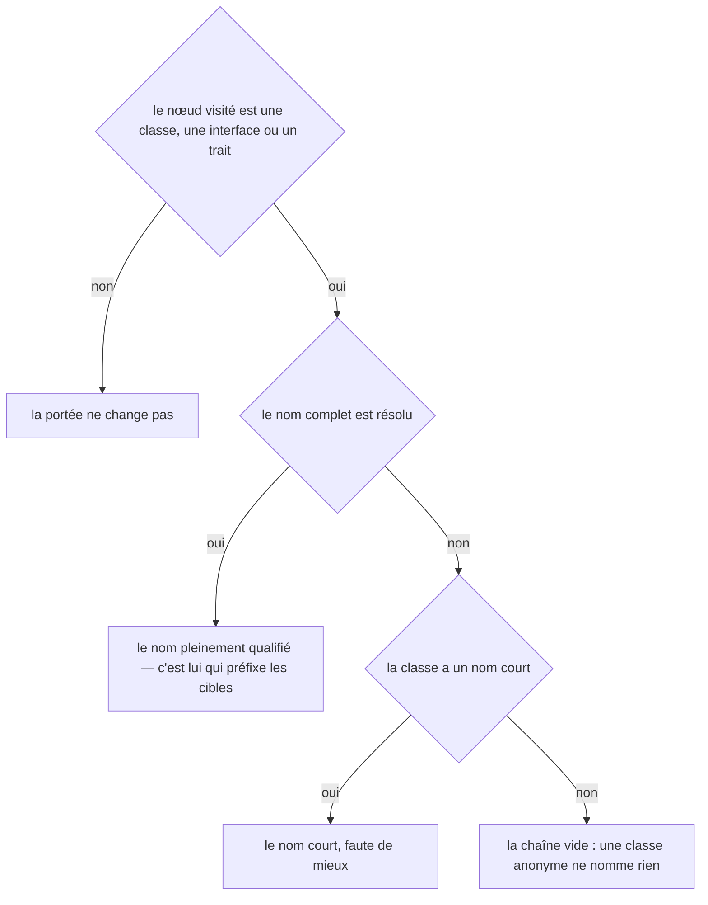
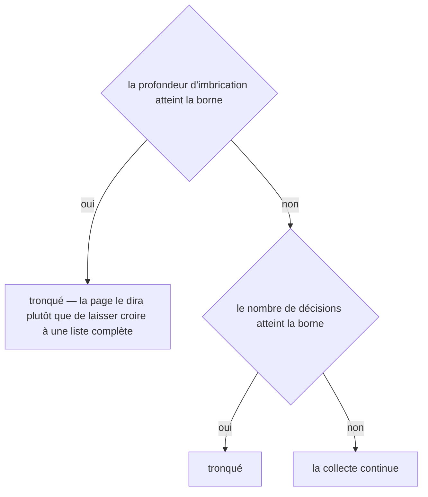
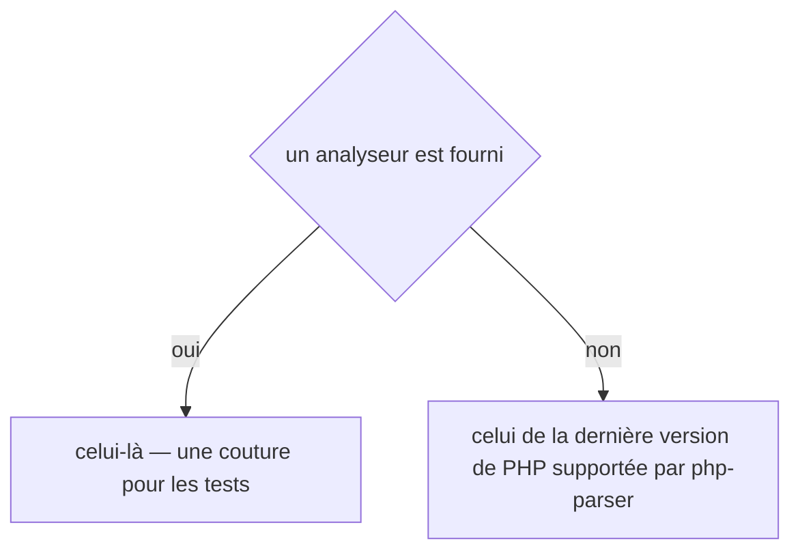
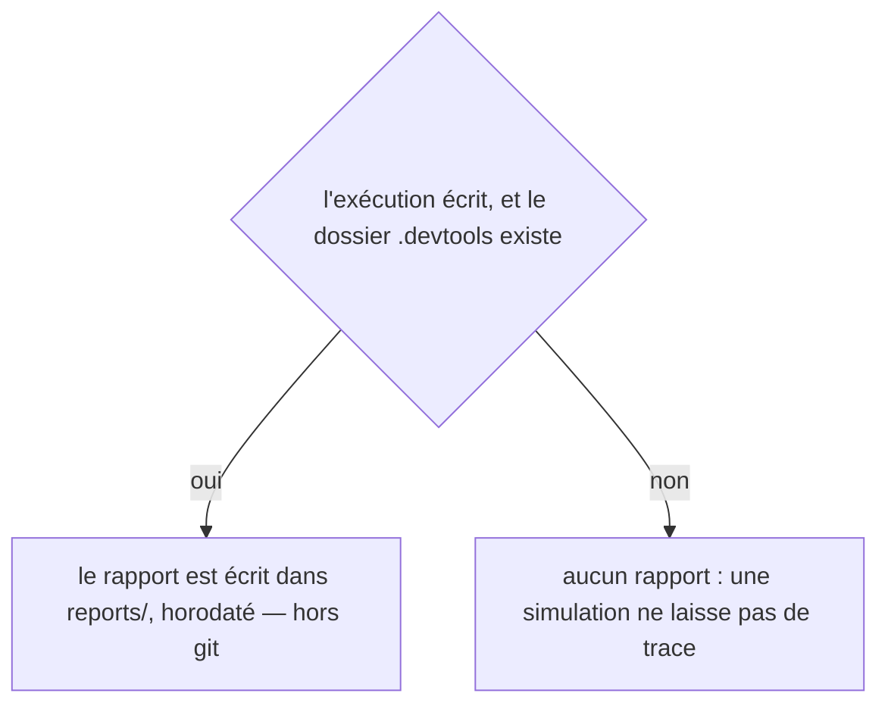
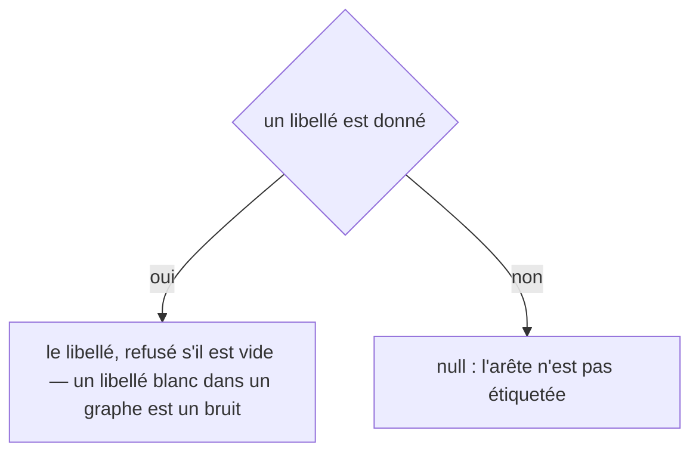

# workflows:diff
`command.workflows.diff` · type: commands · last updated: 2026-09-21 · commit: e5a6438

## Summary

Ce qui a changé **dans les workflows** depuis que leurs pages ont été écrites : un fait, sa valeur d'avant, celle d'après, et les workflows qu'il touche. La sortie groupe **par fait et jamais par workflow** — sur un projet réel, 233 des 259 workflows traversent la même entité, et une ligne changée dans un de ses mutateurs est une chose à lire, pas 233. La commande n'écrit rien : elle exécute le pipeline en lecture seule.

## Trigger

| Element | Value |
|---|---|
| Entry point | `workflows:diff` (command) |
| Security | — |
| Preconditions | Le projet porte un `.devtools/` déjà inspecté : le diff compare les suivis au modèle qu'il vient de reconstruire. |

## Journey

## Navigation / states

—

## Decisions

**`DateTimeImmutable::timezone`**

**`Jul6Art\DevTools\Command\WorkflowsDiffCommand::execute`**

**`Jul6Art\DevTools\Inspection\Graph\DecisionExtractor::method`**

**`Jul6Art\DevTools\Inspection\Graph\DecisionExtractor::scope`**

**`Jul6Art\DevTools\Inspection\Graph\DecisionExtractor::truncated`**

**`Jul6Art\DevTools\Inspection\Graph\PhpReferenceExtractor::parser`**

**`Jul6Art\DevTools\Inspection\InspectionReport::path`**

**`Jul6Art\DevTools\Inspection\Model\Edge::label`**

## Data

Lecture : les fichiers de suivi et le code du projet. Aucune écriture — pas même un rapport.

## Cross-cutting mechanisms

—

## Points of attention

- **Un fichier dont les octets changent sans qu'aucun fait ne bouge ne produit aucun changement** : c'est la règle qui rend l'outil utilisable après un refactoring, et `file:line` n'entre jamais dans l'identité d'un fait.
- **`--code` prend le commit dans le suivi** : chaque page sait de quel commit elle a été écrite, donc il n'y a rien à stocker pour retrouver le diff.
- **Le coût est celui d'une inspection** : la comparaison elle-même n'ajoute ni entrée-sortie ni processus, parce qu'elle a lieu là où les deux versions sont déjà en mémoire.

## Related workflows

—

## History

| Date | Commit | Change |
|---|---|---|
| 2026-09-19 | d9d6b8f | Rédaction initiale. |
| 2026-09-20 | 9e40da9 | Aucun changement de fond : l'adaptateur Symfony fusionne désormais deux sources de mécanismes, ce qui enrichit le modèle sans rien changer à la façon dont le diff le compare. La prose a été relue contre le code et tient. (files changed: src/Inspection/Adapter/Symfony/SymfonyAdapter.php, src/Inspection/InspectionPipeline.php) |
| 2026-09-21 | e5a6438 | l'outil passe en anglais : ce que la commande écrit, et les titres des pages qu'elle produit (files changed: src/Ai/PageDraft.php, src/Console/ChangeRenderer.php, src/Inspection/InspectionPipeline.php, src/Rendering/GroupPageRenderer.php, src/Rendering/GroupPageSection.php, src/Rendering/Labels.php, src/Rendering/MenuRenderer.php, src/Rendering/PageRenderer.php, src/Rendering/PageSection.php, src/Rendering/ParsedPage.php, src/Stack/Knowledge/KnowledgeCanvas.php, src/Stack/Knowledge/XmlKnowledgeBriefStore.php, src/Tracking/TrackingStatus.php) |
| 2026-09-21 | e5a6438 | l'en-tête de l'historique passe en anglais, et une page restée sous un gabarit antérieur est remise à jour (files changed: src/Inspection/InspectionPipeline.php, src/Rendering/PageRenderer.php) |
