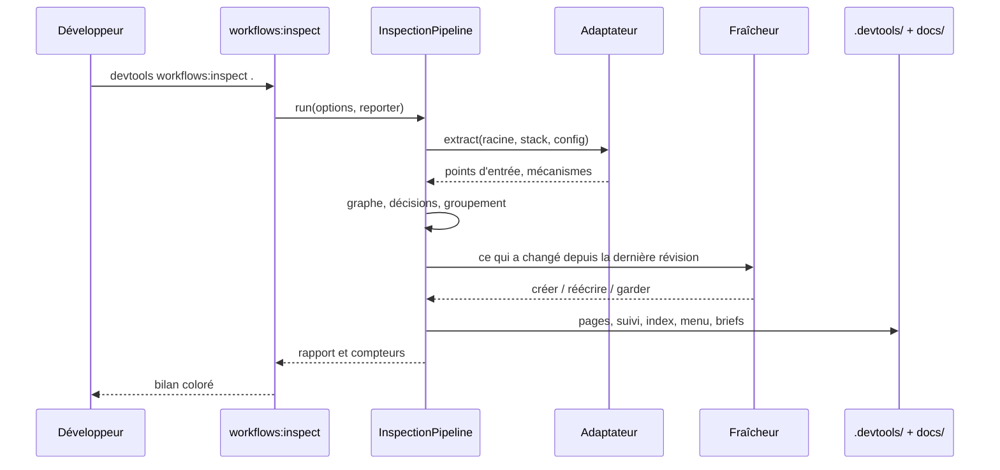
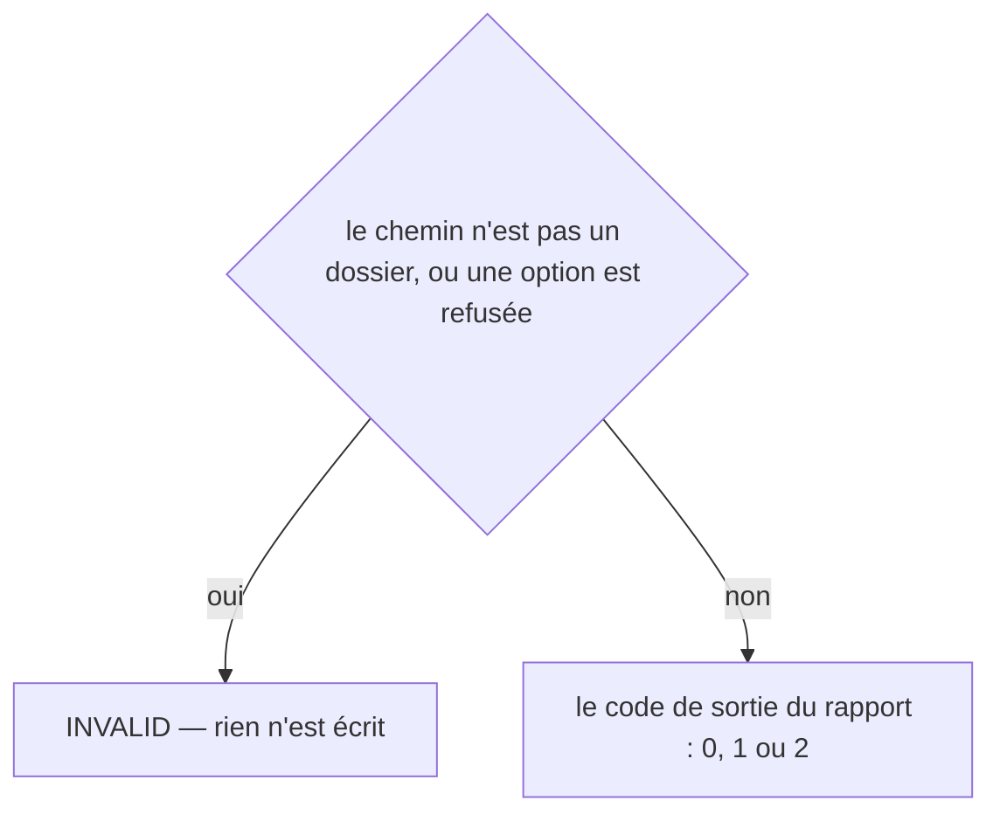
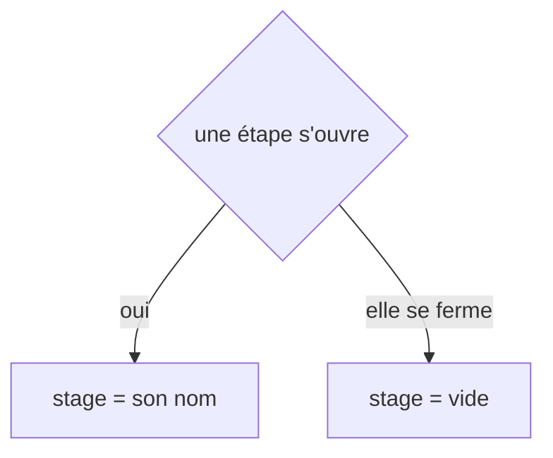
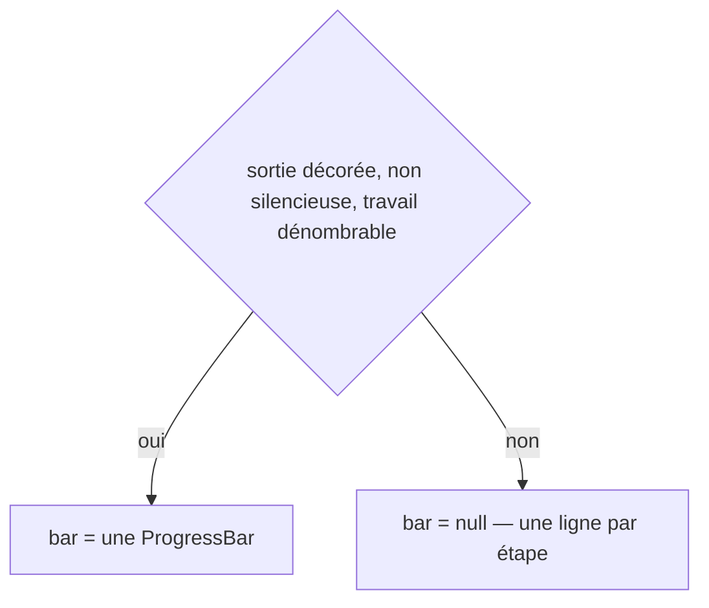
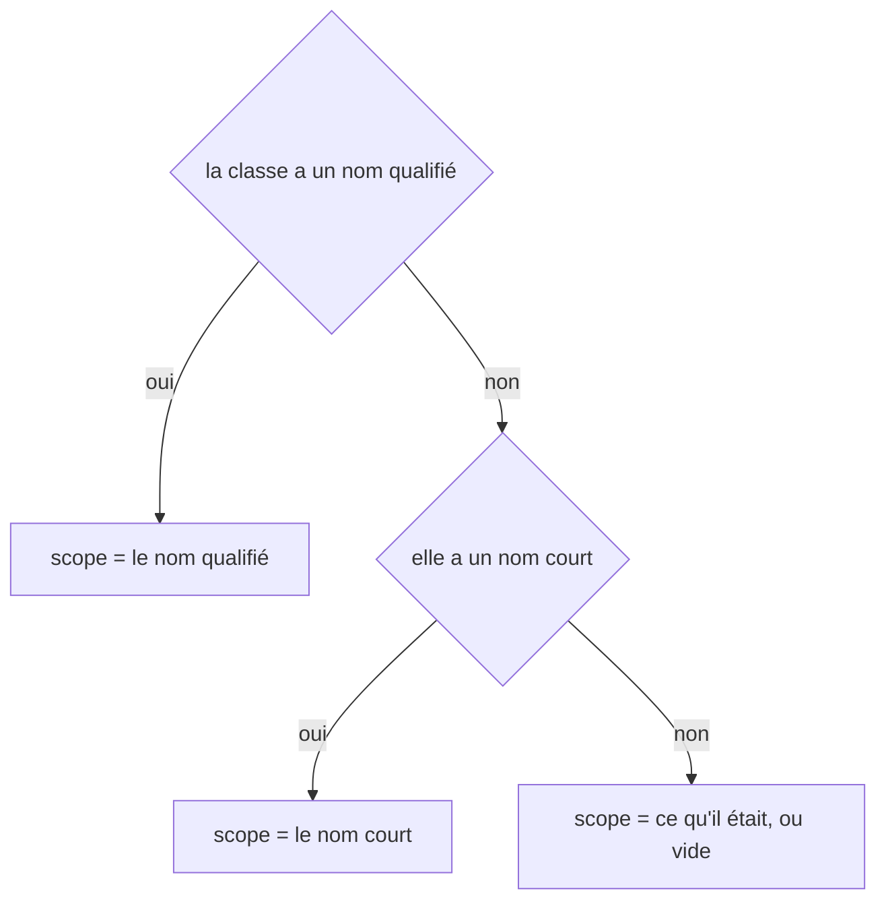
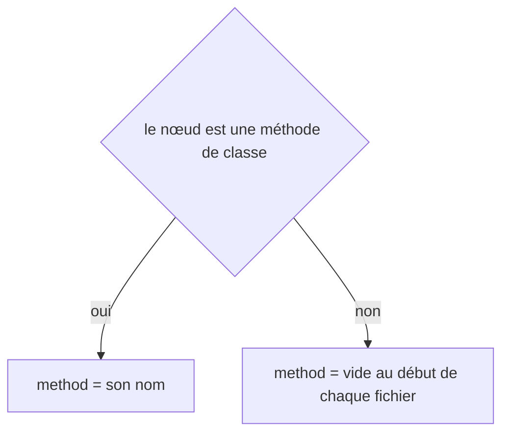
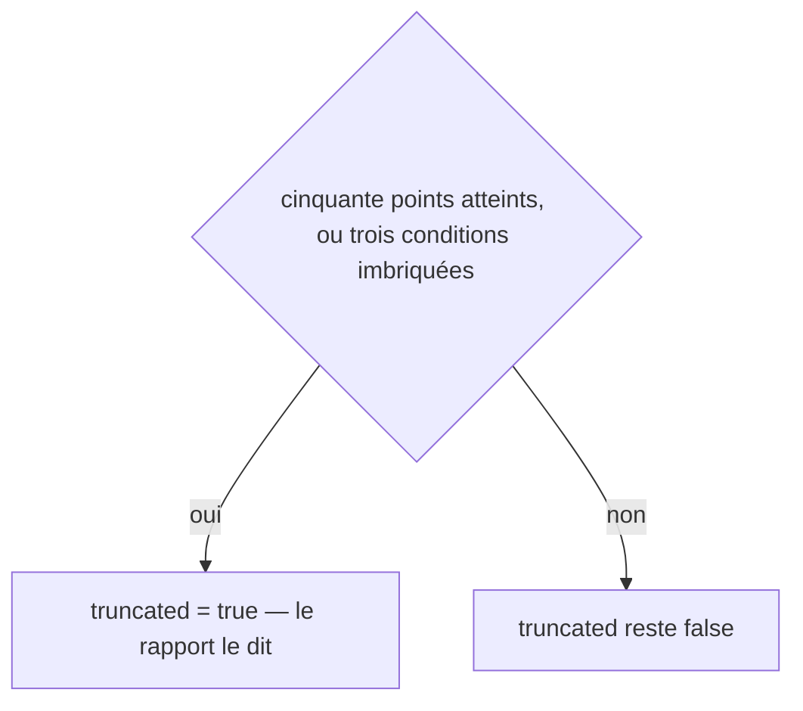
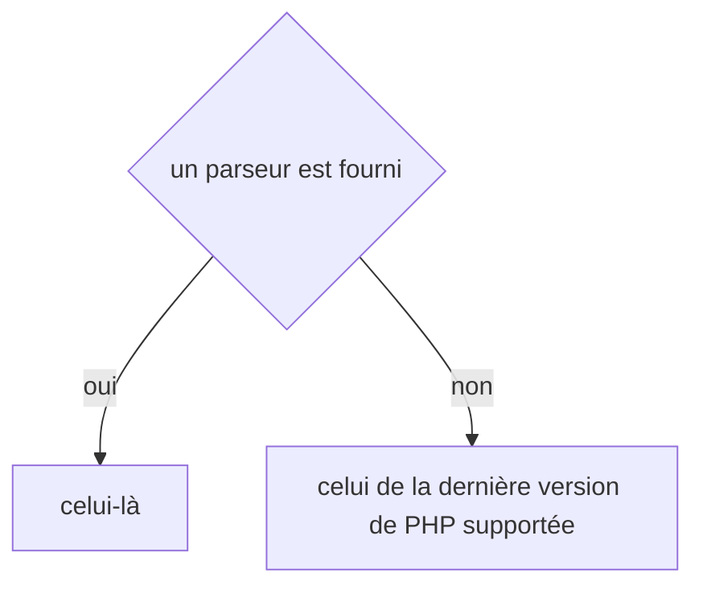
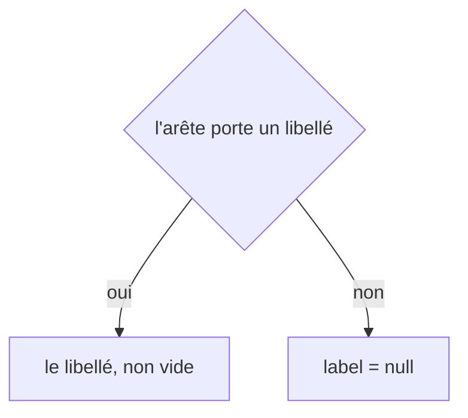

# workflows:inspect
`command.workflows.inspect` · type: commands · last updated: 2026-09-21 · commit: e5a6438

## Summary

Documente tous les workflows d'un projet : détection de stack, extraction des points d'entrée par l'adaptateur, graphe de dépendances, décision de fraîcheur, écriture des pages et des fichiers de suivi, index, menu et graphe d'ensemble. Une seconde exécution sur un projet inchangé ne modifie aucun fichier hors `reports/`. La commande annonce chaque étape et finit sur ce qu'elle a fait et ce que ça a coûté.

## Trigger

| Element | Value |
|---|---|
| Entry point | `workflows:inspect` (command) |
| Security | — |
| Preconditions | Le chemin donné est un dossier existant, et aucune autre inspection ne tourne sur ce projet. |

## Journey

## Navigation / states

—

## Decisions

**`Jul6Art\DevTools\Command\WorkflowsInspectCommand::execute`**

**`Jul6Art\DevTools\Console\ConsoleProgressReporter::stage`**

**`Jul6Art\DevTools\Console\ConsoleProgressReporter::bar`**

**`Jul6Art\DevTools\Inspection\Graph\DecisionExtractor::scope`**

**`Jul6Art\DevTools\Inspection\Graph\DecisionExtractor::method`**

**`Jul6Art\DevTools\Inspection\Graph\DecisionExtractor::truncated`**

**`Jul6Art\DevTools\Inspection\Graph\PhpReferenceExtractor::parser`**

**`Jul6Art\DevTools\Inspection\Model\Edge::label`**

## Data

Lit le code du projet sans jamais l'exécuter, ses manifestes et son dépôt git ; écrit `.devtools/` et le dossier de documentation, plus un rapport horodaté.

## Cross-cutting mechanisms

Aucun listener : c'est une commande console. Le verrou `ProjectLock` interdit deux inspections simultanées sur le même projet.

## Points of attention

Les champs décidés listés ici sont ceux de l'outil lui-même — `scope`, `method`, `truncated` sont des états internes de l'extracteur, pas du métier. C'est la limite de l'extraction : elle trouve toute la logique conditionnelle atteinte, sans savoir laquelle intéresse un lecteur. Sur un projet applicatif, ce sont les champs d'entités qui remontent.

- **`--prune` emporte le dossier avec le README** : un contrôleur dont la dernière route disparaît ne laisse plus derrière lui un répertoire vide qui ne liste rien. Les workflows élagués sont désormais passés aux pages de groupe au lieu d'être écartés en cours de boucle.
- **Les écouteurs Doctrine entrent dans les mécanismes** : ils vivent sur le gestionnaire d'événements de Doctrine et non sur le répartiteur, donc la console ne les mentionnait jamais. Les deux sources sont fusionnées, et un écouteur déclaré par attribut est résolu.
- **Une page écrite sous un gabarit antérieur est remise à jour, même quand rien n'a bougé.** La fraîcheur ne réécrit que ce qu'un fait touche ; une page dont le code ne change jamais gardait donc ses titres français indéfiniment. Le rendu est comparé au fichier — la décision étant « inchangé », les deux doivent coïncider — et l'écart est réécrit. Rien d'autre ne bouge : ni révision, ni mode, ni brief.

## Related workflows

—

## History

| Date | Commit | Change |
|---|---|---|
| 2026-09-18 | b8049a4 | rédaction initiale |
| 2026-09-19 | d9d6b8f | added test tests/Bridge/PHPStan/WorkflowDriftTest.php (+3) |
| 2026-09-20 | 9e40da9 | Deux trous comblés dans le pipeline, trouvés en passant le système à l'épreuve : l'élagage laissait derrière lui le dossier d'un groupe vidé, et les écouteurs Doctrine n'apparaissaient sur aucune page. Le reste de la commande est inchangé. (files changed: src/Inspection/Adapter/Symfony/SymfonyAdapter.php, src/Inspection/InspectionPipeline.php) |
| 2026-09-21 | e5a6438 | l'outil passe en anglais : ce que la commande écrit, et les titres des pages qu'elle produit (files changed: src/Ai/PageDraft.php, src/Console/SummaryRenderer.php, src/Inspection/InspectionPipeline.php, src/Rendering/GroupPageRenderer.php, src/Rendering/GroupPageSection.php, src/Rendering/Labels.php, src/Rendering/MenuRenderer.php, src/Rendering/PageRenderer.php, src/Rendering/PageSection.php, src/Rendering/ParsedPage.php, src/Stack/Knowledge/KnowledgeCanvas.php, src/Stack/Knowledge/XmlKnowledgeBriefStore.php, src/Tracking/TrackingStatus.php) |
| 2026-09-21 | e5a6438 | l'inspection remet une page restée sous un gabarit antérieur dans le gabarit courant (files changed: src/Inspection/InspectionPipeline.php, src/Rendering/PageRenderer.php) |
