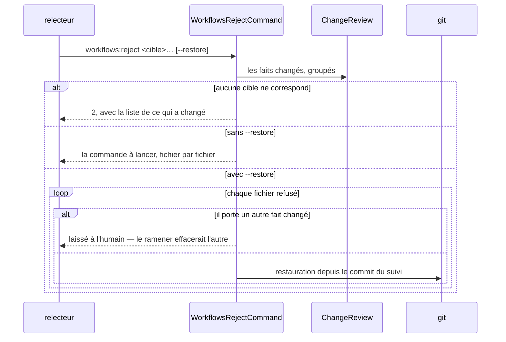
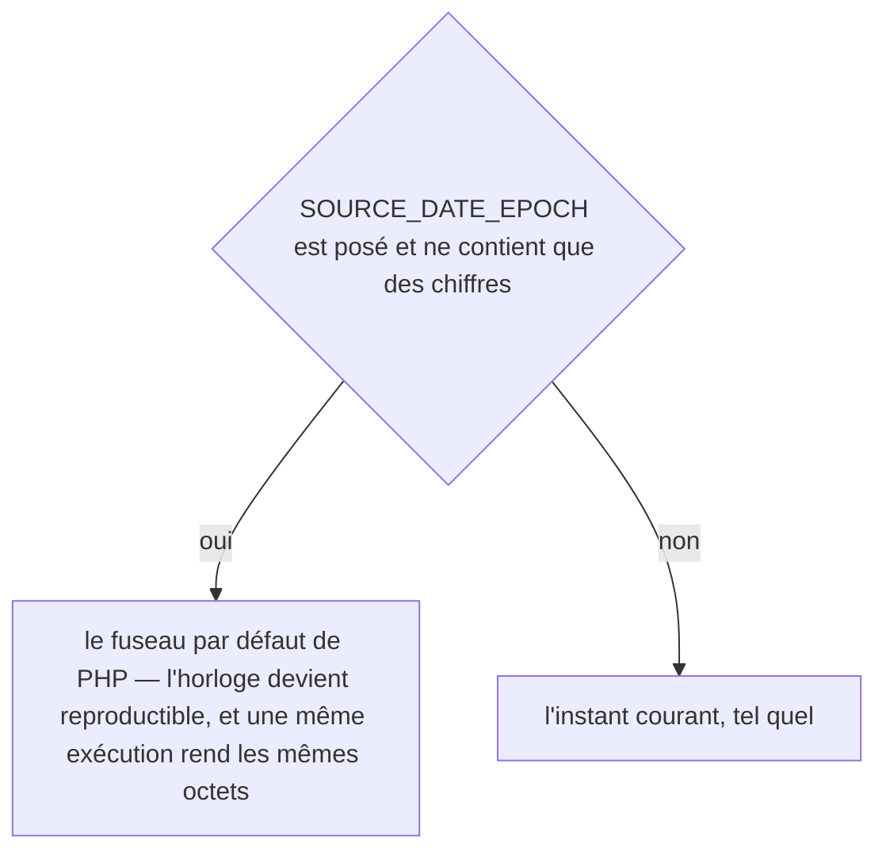
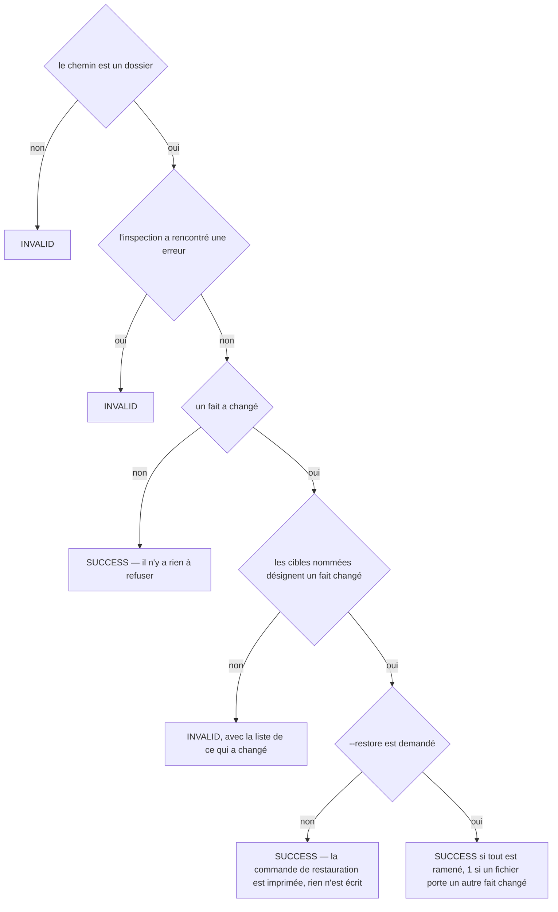
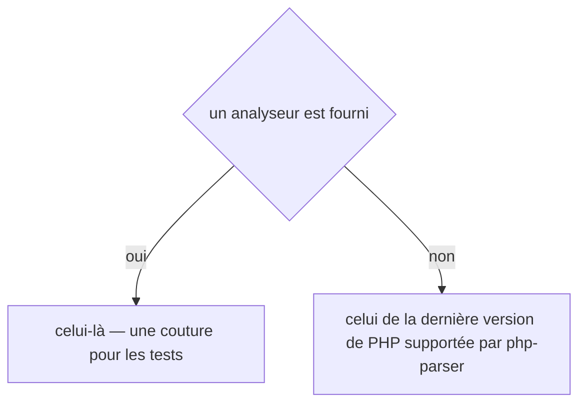
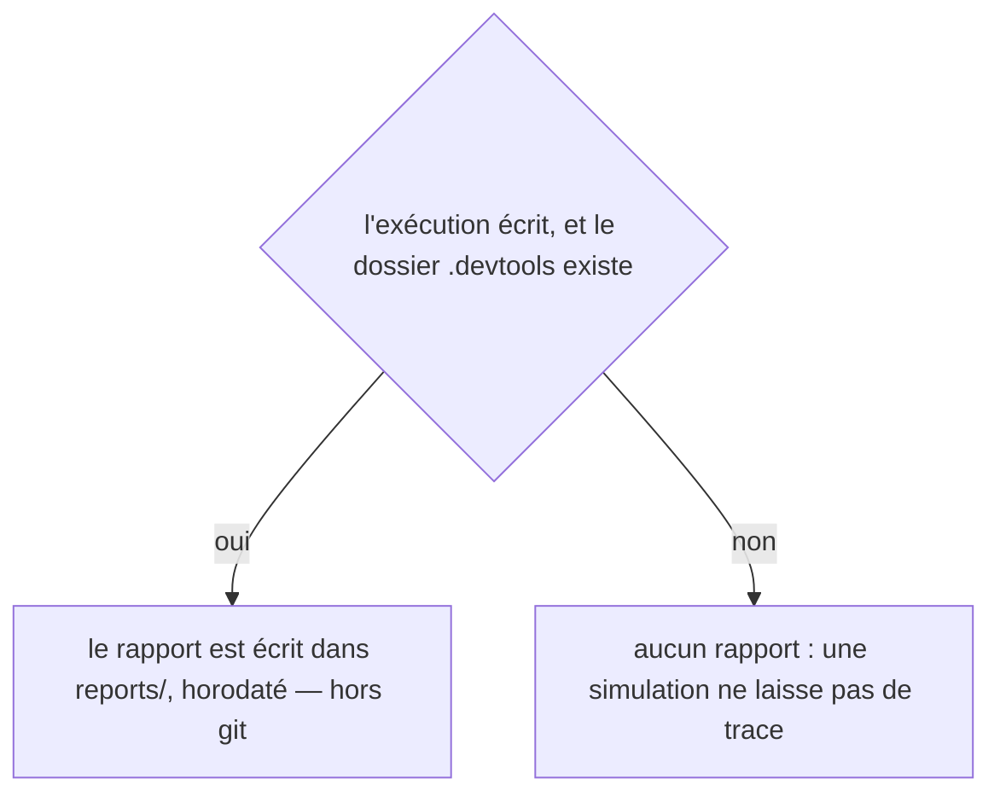
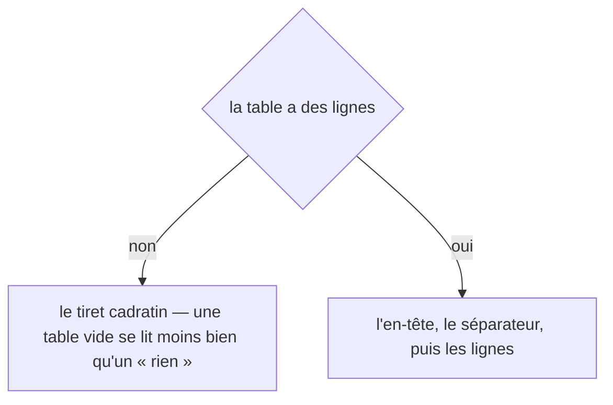
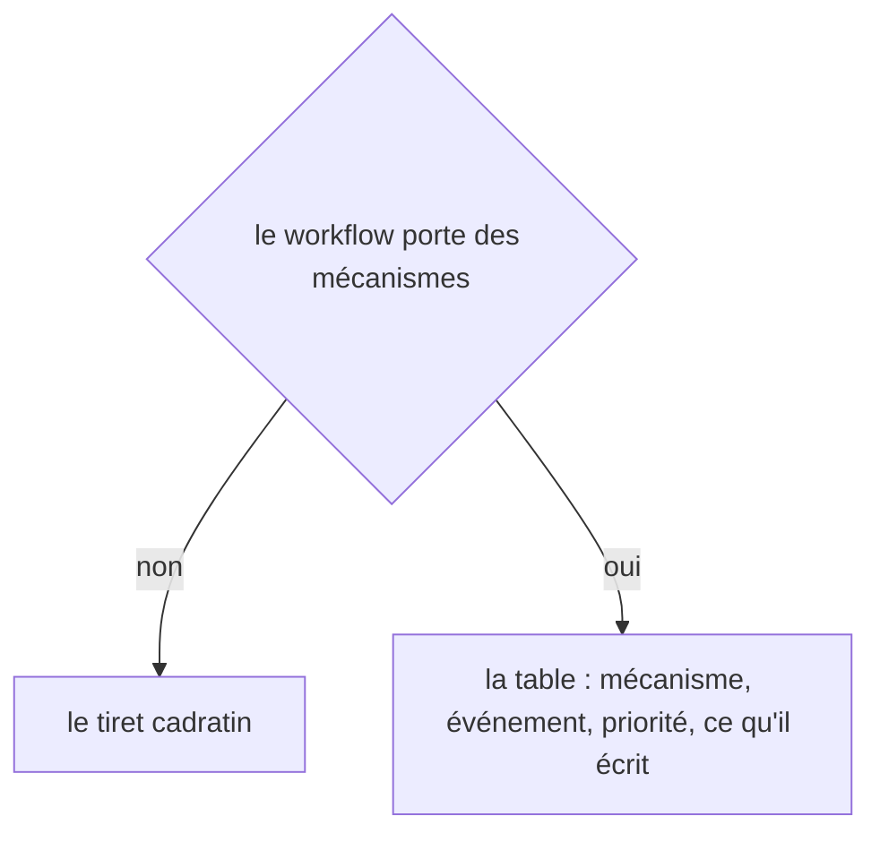
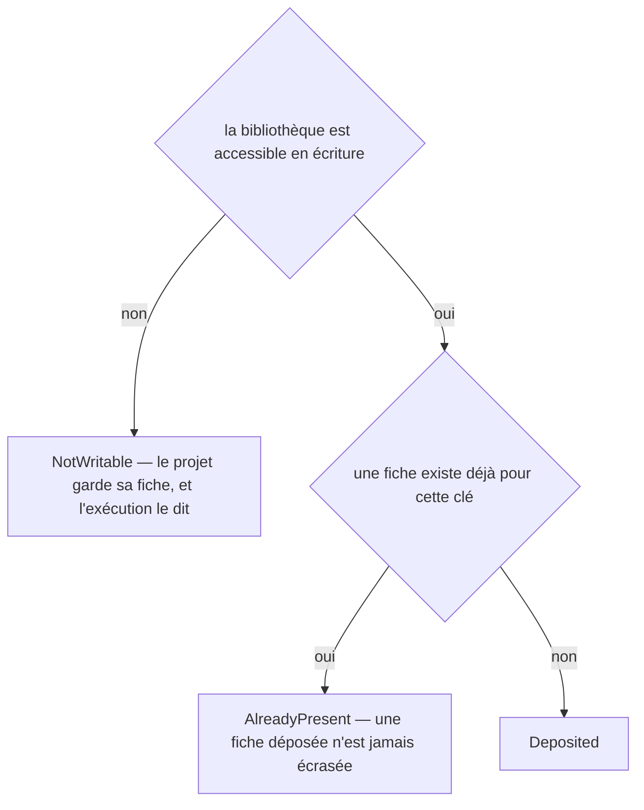
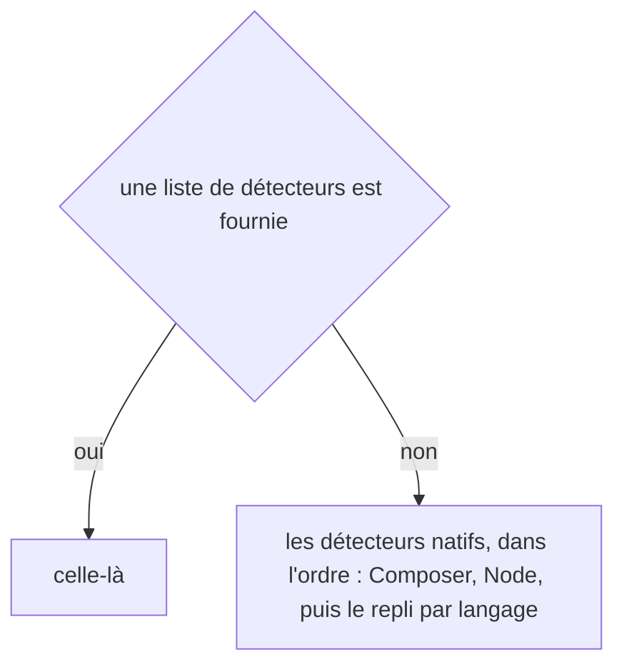

# workflows:reject
`command.workflows.reject` · type : commands · dernière mise à jour : 2026-09-19 · commit : d9d6b8f

## Résumé

Le changement n'était pas voulu : **la documentation ne bouge pas, et c'est le code qui revient**. Sans `--restore`, la commande n'écrit rien du tout — elle imprime le `git restore` qui ramène le fichier à l'état où la page a été écrite. Avec, elle l'exécute : c'est la seule chose de tout DevTools qui touche au code d'un projet.

## Déclencheur

| Élément | Valeur |
|---|---|
| Point d'entrée | `workflows:reject` (command) |
| Sécurité | — |
| Préconditions | Le projet porte un `.devtools/` déjà inspecté, et les cibles nommées désignent des faits qui ont changé. |

## Parcours

## Navigation / états

—

## Décisions

**`DateTimeImmutable::timezone`**

**`Jul6Art\DevTools\Command\WorkflowsRejectCommand::execute`**

**`Jul6Art\DevTools\Inspection\Graph\PhpReferenceExtractor::parser`**

**`Jul6Art\DevTools\Inspection\InspectionReport::path`**

**`Jul6Art\DevTools\Rendering\MarkdownWriter::table`**

**`Jul6Art\DevTools\Rendering\PageRenderer::crossCutting`**

**`Jul6Art\DevTools\Stack\Knowledge\KnowledgeLibrary::deposit`**

**`Jul6Art\DevTools\Stack\StackDetector::detectors`**

## Données

Aucune écriture dans la documentation. Avec `--restore`, le code des fichiers refusés revient à son état d'origine.

## Mécanismes transverses

—

## Points d'attention

- **Un fichier qui porte un autre fait changé n'est pas restauré** : le ramener effacerait en silence un changement que personne n'a refusé.
- **La restauration ramène le fichier entier**, au commit d'où la page a été écrite : un fait accepté mais non commité repart avec lui.
- **Refuser ne fait pas taire le contrôle** : tant que le code n'est pas revenu, la dérive reste visible — c'est ce qui distingue un refus d'un « ignore ».

## Workflows liés

—

## Historique

| Date | Commit | Changement |
|---|---|---|
| 2026-09-19 | d9d6b8f | Rédaction initiale. |
