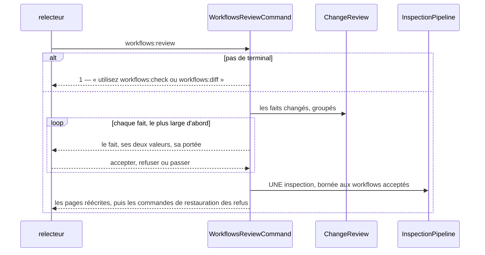
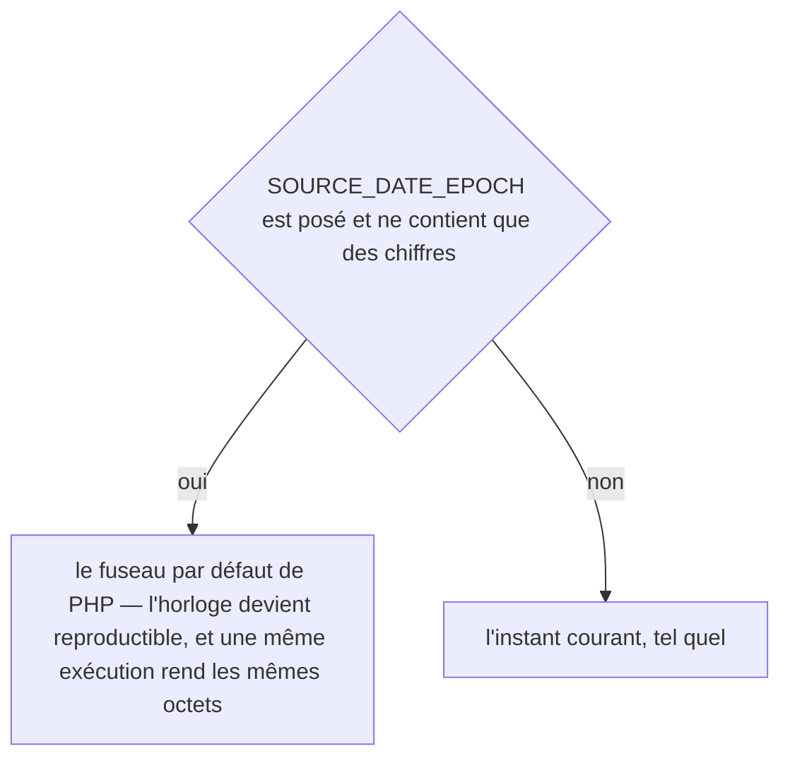
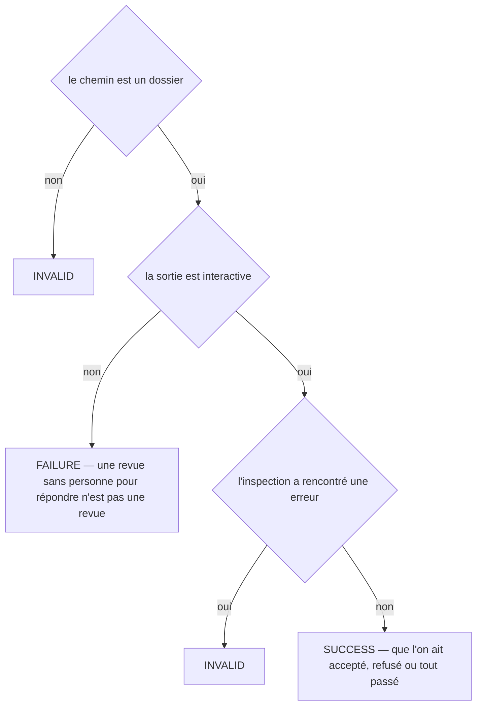
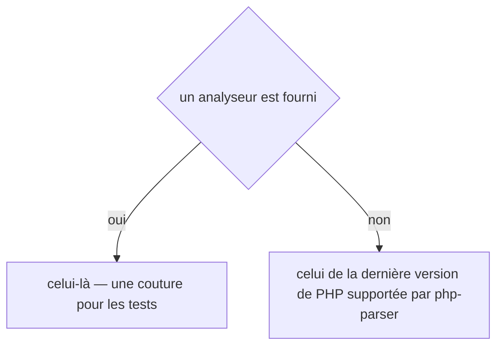
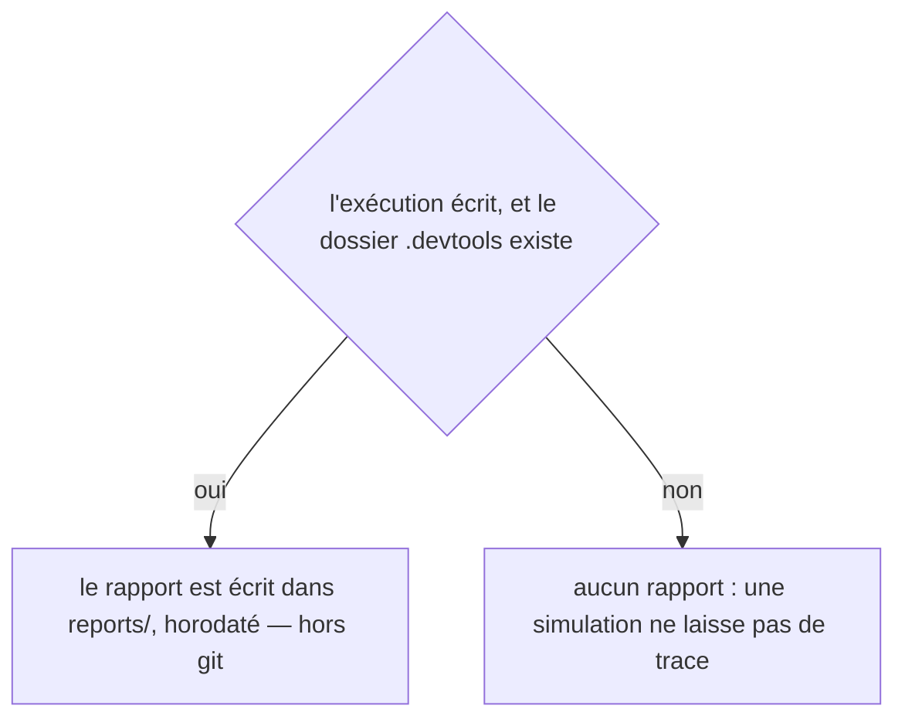
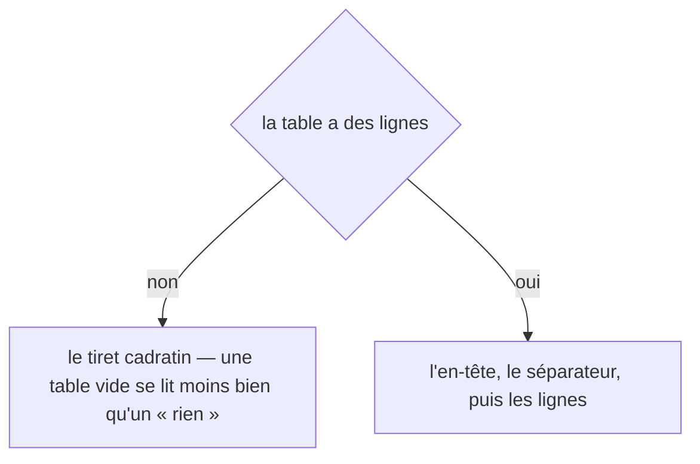
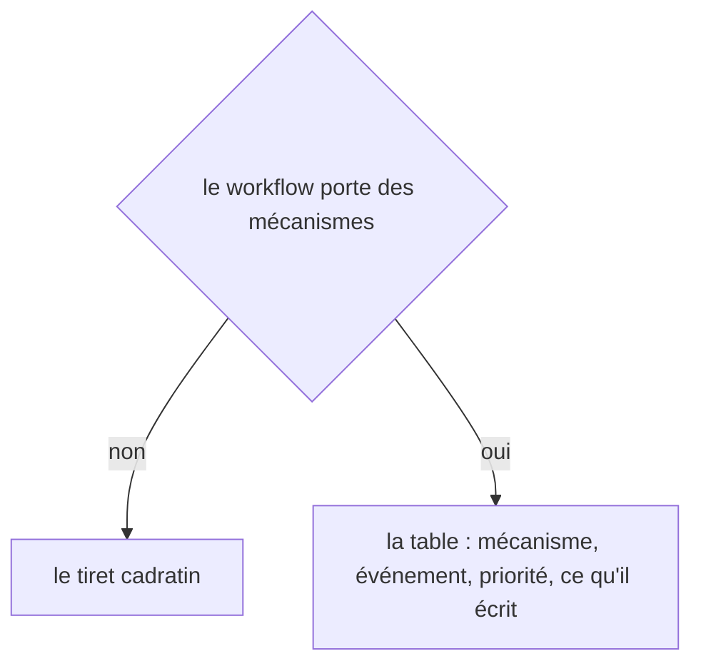
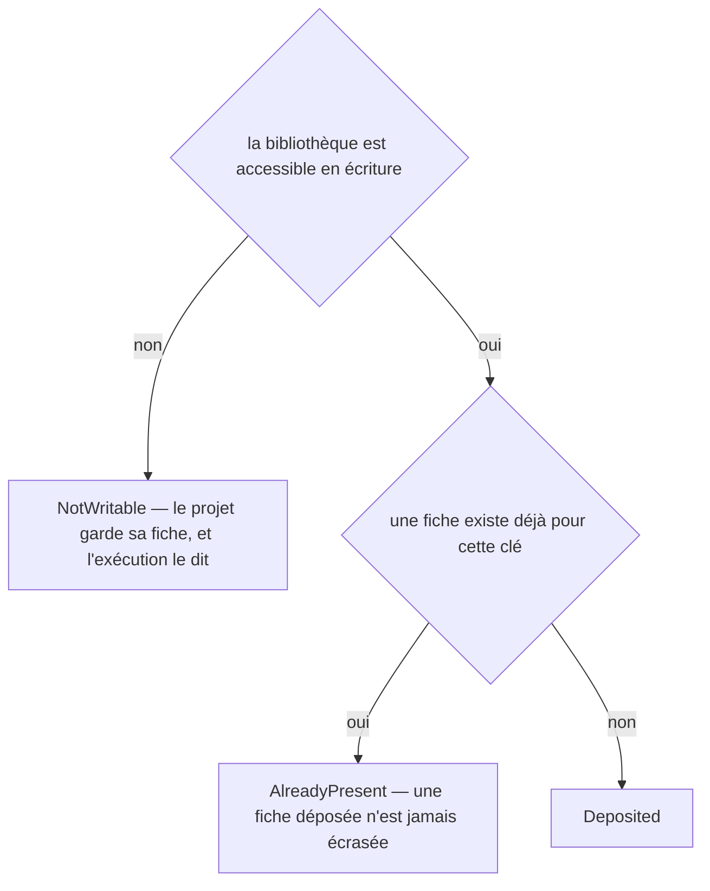
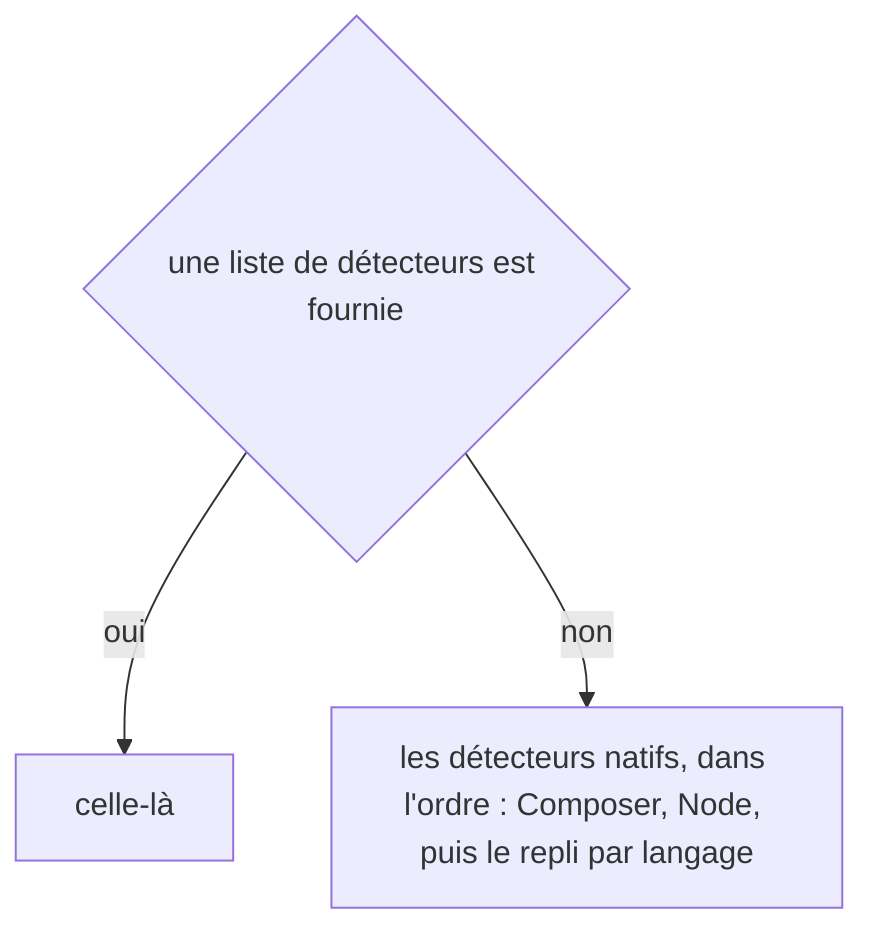

# workflows:review
`command.workflows.review` · type : commands · dernière mise à jour : 2026-09-19 · commit : d9d6b8f

## Résumé

La revue, fait par fait : le changement, son diff de code, et une question à trois réponses — accepter, refuser, passer. **Rien n'est écrit avant la dernière réponse** : une revue interrompue laisse le projet exactement comme il était. Sans terminal, la commande refuse de deviner et renvoie vers le contrôle.

## Déclencheur

| Élément | Valeur |
|---|---|
| Point d'entrée | `workflows:review` (command) |
| Sécurité | — |
| Préconditions | Le projet porte un `.devtools/` déjà inspecté, et la sortie est un terminal. |

## Parcours

## Navigation / états

—

## Décisions

**`DateTimeImmutable::timezone`**

**`Jul6Art\DevTools\Command\WorkflowsReviewCommand::execute`**

**`Jul6Art\DevTools\Inspection\Graph\PhpReferenceExtractor::parser`**

**`Jul6Art\DevTools\Inspection\InspectionReport::path`**

**`Jul6Art\DevTools\Rendering\MarkdownWriter::table`**

**`Jul6Art\DevTools\Rendering\PageRenderer::crossCutting`**

**`Jul6Art\DevTools\Stack\Knowledge\KnowledgeLibrary::deposit`**

**`Jul6Art\DevTools\Stack\StackDetector::detectors`**

## Données

Écriture, seulement pour les faits acceptés : les pages et les suivis des workflows qui les portent.

## Mécanismes transverses

—

## Points d'attention

- **Une seule inspection à la fin, quel que soit le nombre de faits acceptés** : deux passes ajouteraient deux révisions à la même page pour la même revue.
- **Refuser n'écrit rien ici non plus** : la commande imprime ce qu'il faut lancer, et c'est `workflows:reject --restore` qui exécute, jamais la revue.

## Workflows liés

—

## Historique

| Date | Commit | Changement |
|---|---|---|
| 2026-09-19 | d9d6b8f | Rédaction initiale. |
