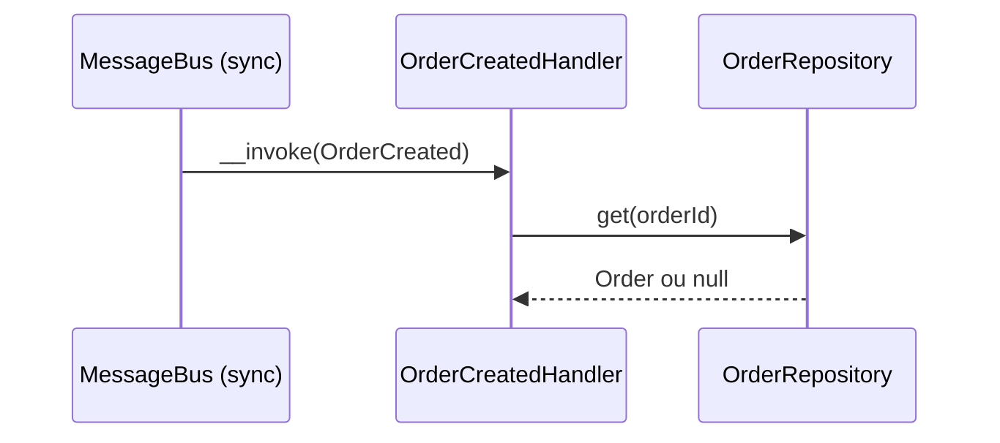

# OrderCreated
`async.order-created` · type : async · dernière mise à jour : 2026-09-16 · commit : —

## Résumé

Traite le message `OrderCreated` : le handler recharge la commande désignée par `orderId` depuis le dépôt.

## Déclencheur

| Élément | Valeur |
|---|---|
| Point d'entrée | `App\MessageHandler\OrderCreatedHandler` (message-handler) |
| Message | `App\Message\OrderCreated` |
| Sécurité | — |
| Préconditions | Un message OrderCreated est distribué sur le bus (transport sync). |

## Parcours

## Navigation / états

—

## Composants impliqués

| Rôle | Fichier | Notes |
|---|---|---|
| Configuration | `config/packages/framework.yaml` |  |
| Configuration | `config/services.yaml` |  |
| Entité | `src/Entity/Order.php` |  |
| Message | `src/Message/OrderCreated.php` |  |
| Handler | `src/MessageHandler/OrderCreatedHandler.php` | point d'entrée |
| Repository | `src/Repository/OrderRepository.php` |  |
| Autre | `src/ValueObject/Money.php` |  |

Paquets : `symfony/messenger` 8.1.7

## Données

Lit une `Order` dans `src/Repository/OrderRepository.php` ; le routage vers le transport `sync` est déclaré
dans `config/packages/framework.yaml`.

## Mécanismes transverses

—

## Points d'attention

Le handler ne fait rien du résultat, et aucun code du projet ne distribue `OrderCreated` : ce workflow n'est
aujourd'hui jamais déclenché.

## Tests existants

—

## Workflows liés

—

## Historique

| Date | Commit | Changement |
|---|---|---|
| 2026-09-16 | — | rédaction initiale |
