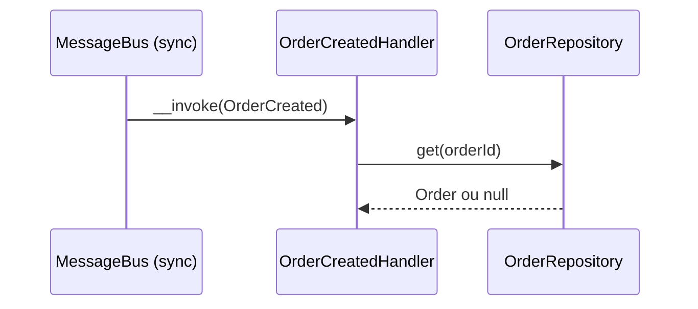
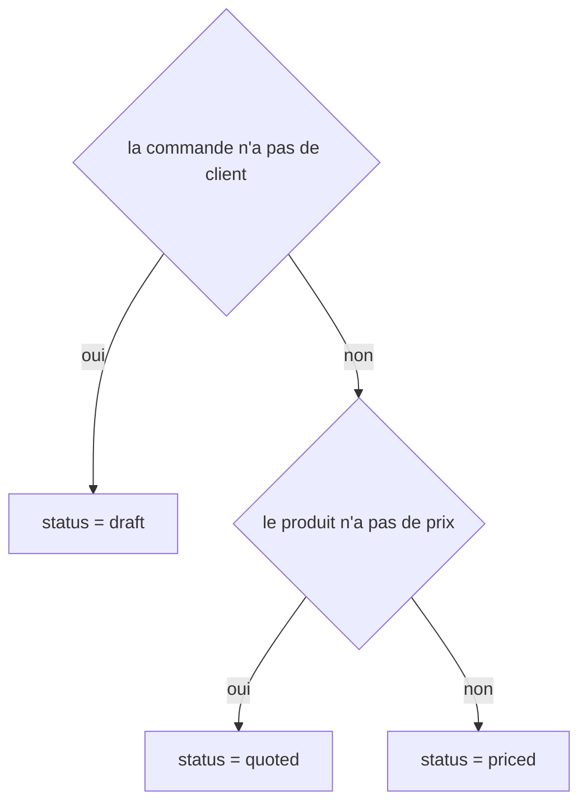
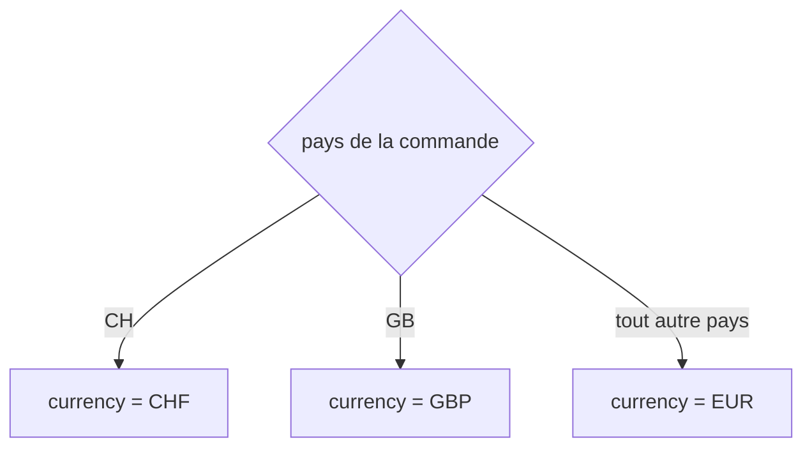

# OrderCreated
`async.order-created` · type: async · last updated: 2026-09-17 · commit: —

## Summary

Traite le message `OrderCreated` : le handler recharge la commande désignée par `orderId` depuis le dépôt.

## Trigger

| Element | Value |
|---|---|
| Entry point | `App\MessageHandler\NotifyOnOrderCreated` (message-handler) |
| Satellite | `App\MessageHandler\OrderCreatedHandler` (message-handler) |
| Message | `App\Message\OrderCreated` |
| Security | — |
| Preconditions | Un message OrderCreated est distribué sur le bus (transport sync). |

## Journey

## Navigation / states

—

## Decisions

**`App\Entity\Order::status`**

**`App\Entity\Order::currency`**

## Data

Lit une `Order` dans `src/Repository/OrderRepository.php` ; le routage vers le transport `sync` est déclaré
dans `config/packages/framework.yaml`.

## Cross-cutting mechanisms

—

## Points of attention

Le handler ne fait rien du résultat, et aucun code du projet ne distribue `OrderCreated` : ce workflow n'est
aujourd'hui jamais déclenché.

## Related workflows

—

## History

| Date | Commit | Changement |
|---|---|---|
| 2026-09-17 | — | rédaction initiale |
