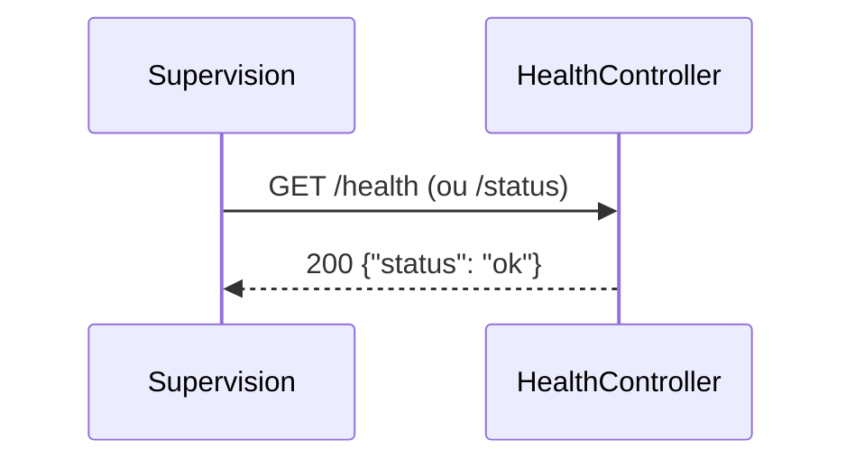

# GET /health
`route.health` · type: routes · last updated: 2026-09-17 · commit: —

## Summary

Point de santé de l'application, joignable sur `/health` et sur `/status` : répond `{"status": "ok"}` en JSON,
sans authentification, pour la supervision.

## Trigger

| Element | Value |
|---|---|
| Entry point | `GET /health` (`app_health`) |
| Satellite | `GET /status` (`app_status`) |
| Security | — |
| Preconditions | — |

## Journey

## Navigation / states

—

## Decisions

—

## Data

Aucune donnée lue ni écrite.

## Cross-cutting mechanisms

`LocaleListener` sur `kernel.request`, sans effet sur une réponse JSON ; aucune règle d'accès.

## Points of attention

Répond « ok » sans rien vérifier (ni dépendance, ni stockage) : il dit que PHP répond, pas que l'application
fonctionne.

## Related workflows

—

## History

| Date | Commit | Changement |
|---|---|---|
| 2026-09-17 | — | rédaction initiale |
