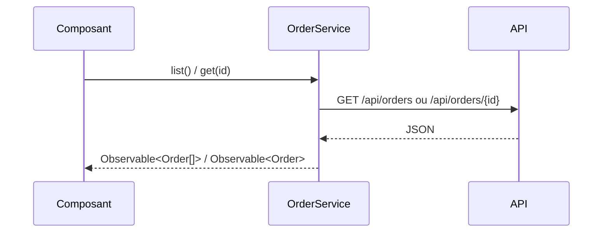

## Résumé

`OrderService` est le seul point d'accès aux commandes : un service Angular fourni à la racine qui
appelle l'API REST des commandes avec `HttpClient`.

## Préconditions

`HttpClient` est fourni à l'application (`provideHttpClient`).

## Parcours

## Décisions

—

## Données

Lit `Order` (`id: number`, `customer: string`) ; l'interface est déclarée dans le service.

## Mécanismes transverses

Aucun : ni intercepteur, ni cache, ni reprise sur erreur.

## Points d'attention

Les réponses ne sont pas validées : le typage `Order` est une promesse, pas un contrôle.

## Changement

rédaction initiale
