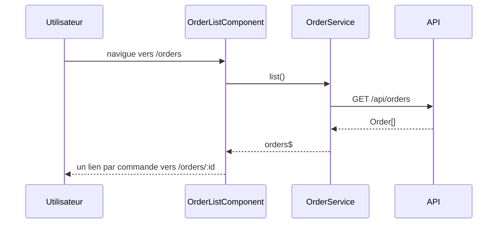

## Résumé

Liste les commandes : `OrderListComponent` charge toutes les commandes via `OrderService.list()` et
affiche pour chacune le nom du client, avec un lien vers sa fiche `/orders/:id`.

## Préconditions

L'API `/api/orders` est joignable depuis le navigateur (même origine ou proxy de développement).

## Parcours

## Décisions

—

## Données

Lit des `Order` (`id`, `customer`) depuis l'API HTTP ; aucune écriture.

## Mécanismes transverses

Aucun intercepteur HTTP ni garde de route n'est déclaré dans `src/app`.

## Points d'attention

Aucun état de chargement ni de gestion d'erreur : si l'API échoue, la liste reste vide sans message.

## Changement

rédaction initiale
