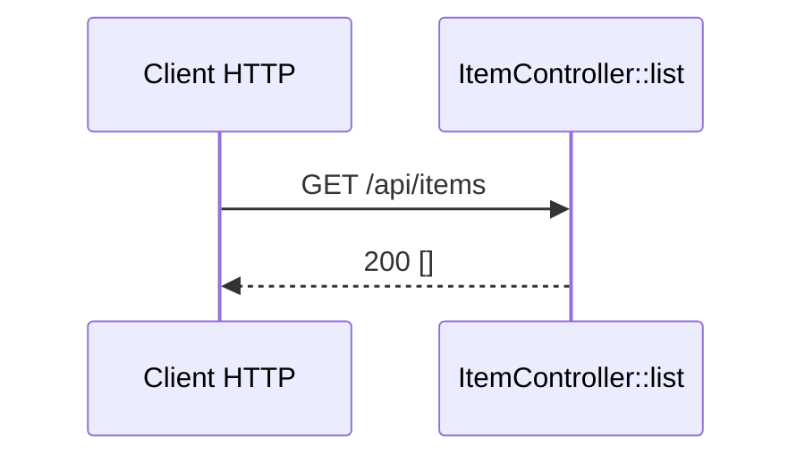

## Résumé

Point d'API `GET /api/items` de l'application `api` : `ItemController::list()` répond une liste JSON,
aujourd'hui toujours vide.

## Préconditions

—

## Parcours

## Décisions

—

## Données

Aucune : la réponse est un tableau vide construit en dur.

## Mécanismes transverses

Aucun listener ni règle de sécurité n'est déclaré dans `api/`.

## Points d'attention

Le front `/items` n'appelle pas encore ce point d'API : les deux côtés du monorepo ne sont pas reliés.

## Changement

rédaction initiale
