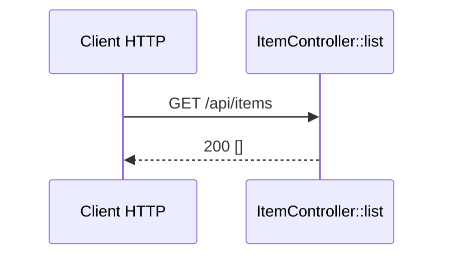

## Summary

Point d'API `GET /api/items` de l'application `api` : `ItemController::list()` répond une liste JSON,
aujourd'hui toujours vide.

## Preconditions

—

## Journey

## Decisions

—

## Data

Aucune : la réponse est un tableau vide construit en dur.

## Cross-cutting mechanisms

Aucun listener ni règle de sécurité n'est déclaré dans `api/`.

## Points of attention

Le front `/items` n'appelle pas encore ce point d'API : les deux côtés du monorepo ne sont pas reliés.

## Change

rédaction initiale
