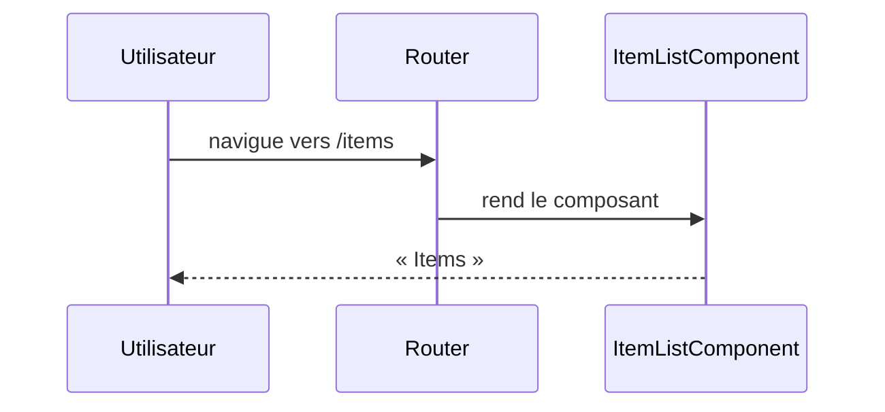

## Summary

Page `/items` du front Angular : la route rend `ItemListComponent`, qui n'affiche pour l'instant qu'un titre.

## Preconditions

—

## Journey

## Decisions

—

## Data

Aucune : le composant ne charge rien.

## Cross-cutting mechanisms

Aucun garde ni intercepteur n'est déclaré dans `front/src/app`.

## Points of attention

Le composant n'utilise pas `GET /api/items` de l'application `api` : la page est un squelette.

## Change

rédaction initiale
