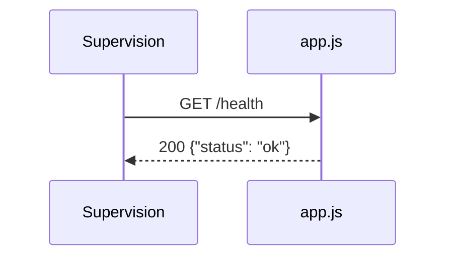

## Summary

`GET /health` répond `{"status": "ok"}` pour signaler que le processus tourne.

## Preconditions

—

## Journey

## Decisions

—

## Data

Aucune.

## Cross-cutting mechanisms

Déclarée directement sur `app`, hors de tout routeur.

## Points of attention

La réponse ne vérifie aucune dépendance : elle reste « ok » même si le service de commandes est cassé.

## Change

rédaction initiale
