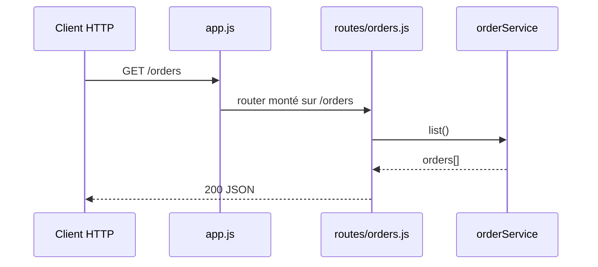

## Résumé

`GET /orders` renvoie en JSON toutes les commandes connues de `orderService`.

## Préconditions

—

## Parcours

## Données

Lit le tableau `orders` gardé en mémoire par `src/services/orderService.js`.

## Mécanismes transverses

`express.json()` est monté sur toute l'application avant les routeurs.

## Points d'attention

Le stockage est en mémoire : la liste est vide à chaque redémarrage et n'est pas partagée entre processus.

## Changement

rédaction initiale
