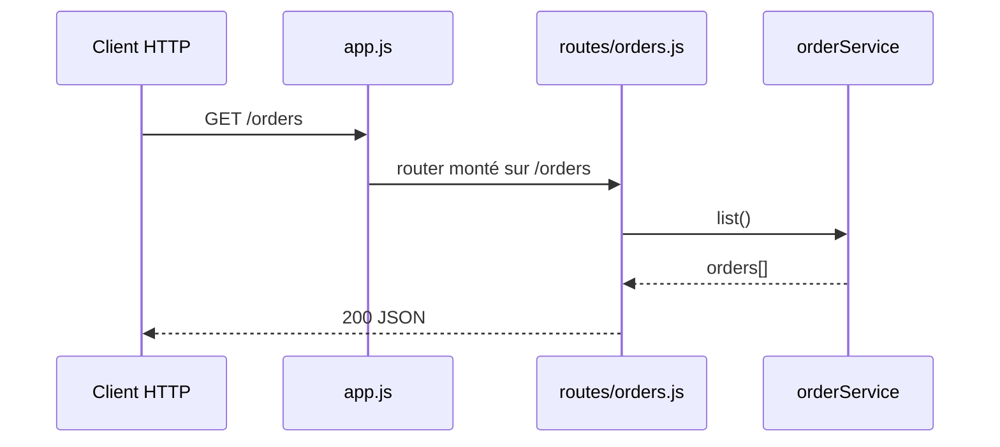

## Summary

`GET /orders` renvoie en JSON toutes les commandes connues de `orderService`.

## Preconditions

—

## Journey

## Decisions

—

## Data

Lit le tableau `orders` gardé en mémoire par `src/services/orderService.js`.

## Cross-cutting mechanisms

`express.json()` est monté sur toute l'application avant les routeurs.

## Points of attention

Le stockage est en mémoire : la liste est vide à chaque redémarrage et n'est pas partagée entre processus.

## Change

rédaction initiale
