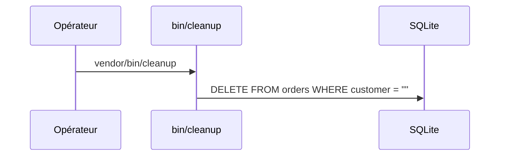

## Résumé

`bin/cleanup`, déclaré dans `bin` de `composer.json`, supprime les commandes dont le client est vide.

## Préconditions

La table `orders` existe.

## Parcours

## Décisions

—

## Données

Supprime des lignes de `orders`.

## Mécanismes transverses

`lib/db.php` fournit la connexion PDO.

## Points d'attention

La condition `customer = ""` utilise des guillemets doubles : SQLite les accepte comme chaîne par
tolérance, d'autres bases y verraient un nom de colonne. Rien n'est affiché ni journalisé.

## Changement

rédaction initiale
