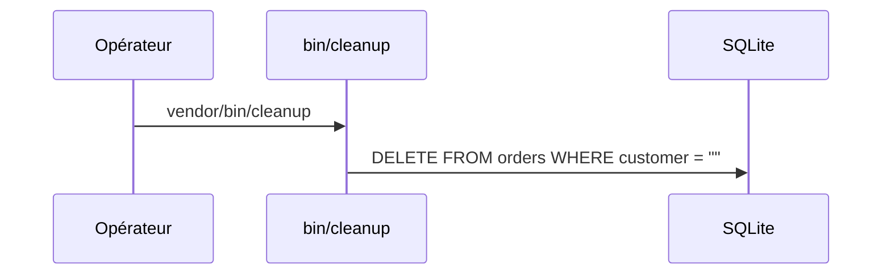

## Summary

`bin/cleanup`, déclaré dans `bin` de `composer.json`, supprime les commandes dont le client est vide.

## Preconditions

La table `orders` existe.

## Journey

## Decisions

—

## Data

Supprime des lignes de `orders`.

## Cross-cutting mechanisms

`lib/db.php` fournit la connexion PDO.

## Points of attention

La condition `customer = ""` utilise des guillemets doubles : SQLite les accepte comme chaîne par
tolérance, d'autres bases y verraient un nom de colonne. Rien n'est affiché ni journalisé.

## Change

rédaction initiale
