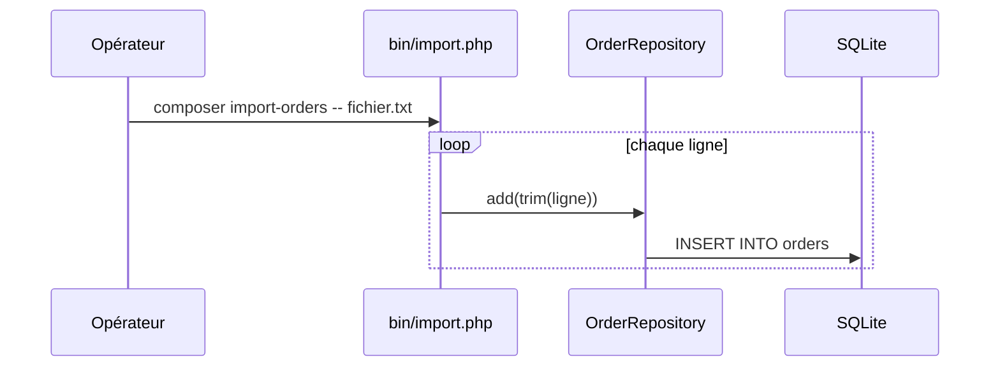

## Résumé

`composer import-orders` importe des commandes depuis un fichier texte, un client par ligne, ou depuis
l'entrée standard : chaque ligne devient une commande via `OrderRepository::add()`.

## Préconditions

La table `orders` existe ; le fichier passé en argument est lisible.

## Parcours

## Données

Écrit une ligne dans `orders` par ligne lue.

## Mécanismes transverses

`lib/db.php` fournit la connexion PDO.

## Points d'attention

Pas de transaction : une erreur au milieu du fichier laisse un import partiel. Les lignes vides deviennent
des commandes sans client.

## Changement

rédaction initiale
