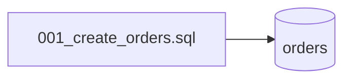

## Résumé

Schéma de la base : une seule migration SQL crée la table `orders` (`id`, `customer`).

## Préconditions

—

## Parcours

## Données

Table `orders` : `id INTEGER PRIMARY KEY`, `customer TEXT NOT NULL`.

## Mécanismes transverses

Aucun outil de migration : le fichier est exécuté à la main, et par `OrderRepositoryTest` sur une base en
mémoire.

## Points d'attention

Rien n'indique quelles migrations ont été jouées sur une base existante.

## Changement

rédaction initiale
