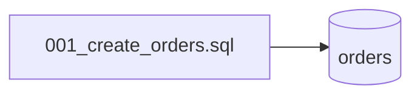

## Summary

Schéma de la base : une seule migration SQL crée la table `orders` (`id`, `customer`).

## Preconditions

—

## Journey

## Decisions

—

## Data

Table `orders` : `id INTEGER PRIMARY KEY`, `customer TEXT NOT NULL`.

## Cross-cutting mechanisms

Aucun outil de migration : le fichier est exécuté à la main, et par `OrderRepositoryTest` sur une base en
mémoire.

## Points of attention

Rien n'indique quelles migrations ont été jouées sur une base existante.

## Change

rédaction initiale
