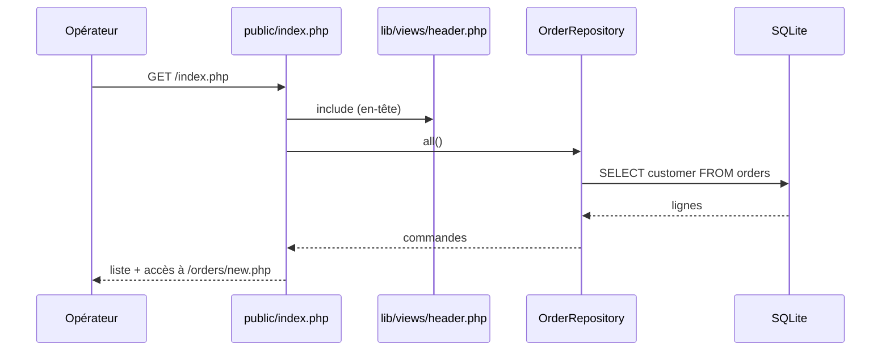

## Summary

Page d'accueil du back-office : liste le client de chaque commande, lue par `OrderRepository::all()`, et
propose de créer une commande (bouton de formulaire et lien vers `/orders/new.php`).

## Preconditions

La base SQLite var/app.sqlite existe et contient la table `orders` (migration `001_create_orders.sql`).

## Journey

## Decisions

—

## Data

Lit la colonne `customer` de la table `orders` ; aucune écriture.

## Cross-cutting mechanisms

`lib/db.php` fournit une connexion PDO unique par requête (variable statique de `db()`).

## Points of attention

La connexion vise var/app.sqlite en dur : aucune configuration par environnement. Aucune pagination ni
tri, et aucune authentification ne protège la page.

## Change

rédaction initiale
