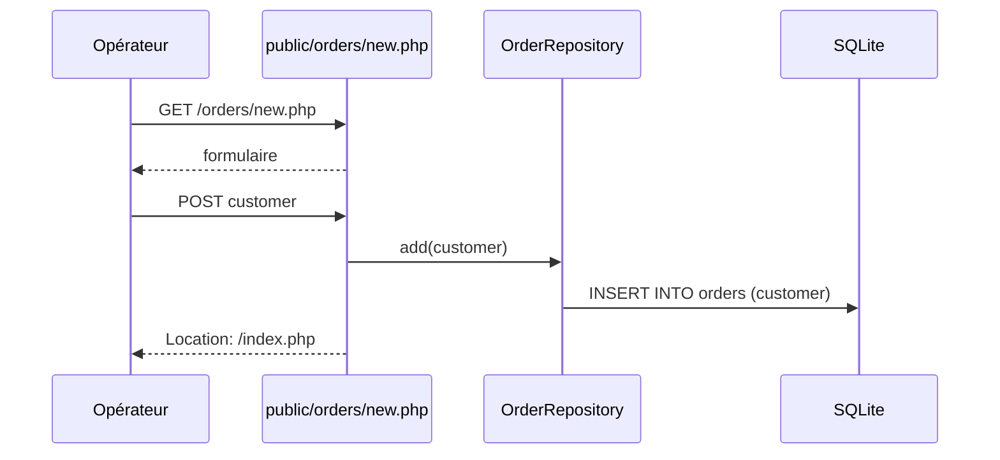

## Résumé

Crée une commande : en GET, affiche un formulaire avec le nom du client ; en POST, enregistre la commande par
`OrderRepository::add()` puis redirige vers `/index.php`.

## Préconditions

La table `orders` existe.

## Parcours

## Données

Écrit une ligne dans `orders` (colonne `customer`), par une requête préparée.

## Mécanismes transverses

`lib/db.php` fournit la connexion PDO.

## Points d'attention

Aucune validation : un nom vide est enregistré (c'est ce que `bin/cleanup` supprime ensuite), et aucun
jeton CSRF ne protège le formulaire.

## Changement

rédaction initiale
