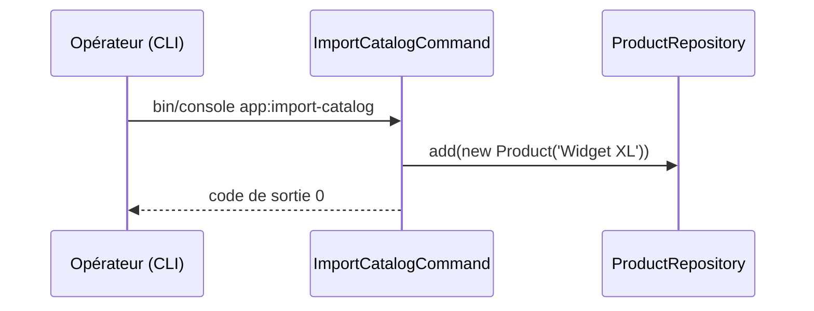

## Summary

Commande console d'import du catalogue : ajoute le produit « Widget XL » au dépôt des produits.

## Preconditions

—

## Journey

## Decisions

—

## Data

Écrit un `Product` dans `src/Repository/ProductRepository.php`, en mémoire.

## Cross-cutting mechanisms

—

## Points of attention

Le dépôt est en mémoire et vit le temps de la commande : l'import n'a aucun effet durable. Le produit est
écrit en dur ; aucun fichier de catalogue n'est lu.

## Change

rédaction initiale
