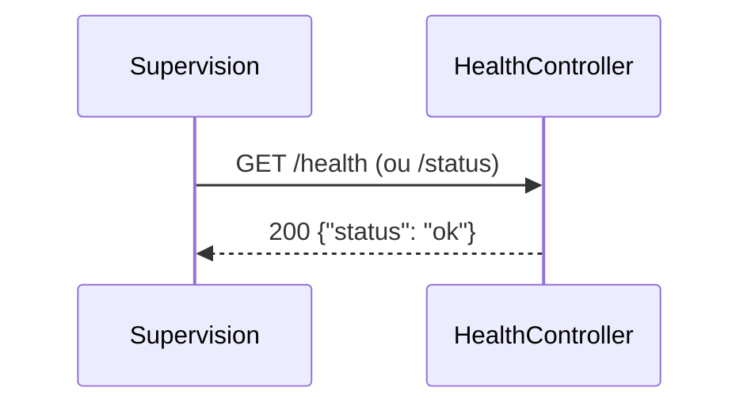

## Résumé

Point de santé de l'application, joignable sur `/health` et sur `/status` : répond `{"status": "ok"}` en JSON,
sans authentification, pour la supervision.

## Préconditions

—

## Parcours

## Décisions

—

## Données

Aucune donnée lue ni écrite.

## Mécanismes transverses

`LocaleListener` sur `kernel.request`, sans effet sur une réponse JSON ; aucune règle d'accès.

## Points d'attention

Répond « ok » sans rien vérifier (ni dépendance, ni stockage) : il dit que PHP répond, pas que l'application
fonctionne.

## Changement

rédaction initiale
