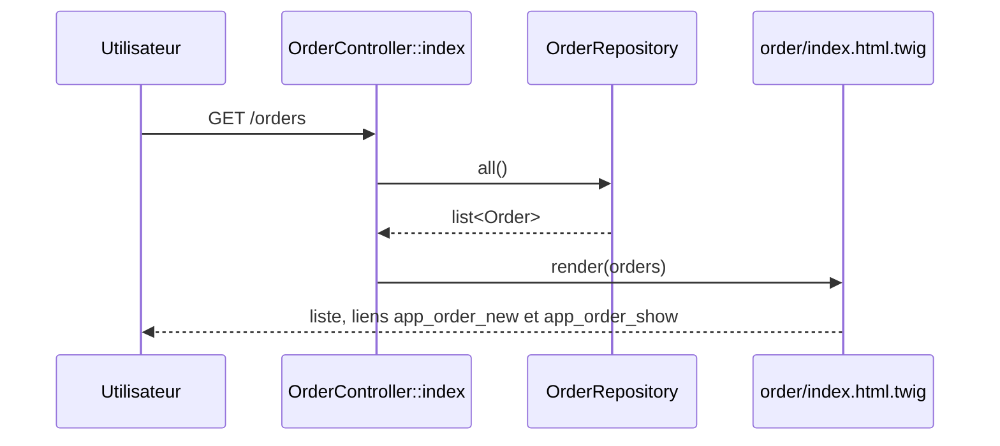

## Summary

Liste les commandes existantes. La page affiche le résumé du panier (composant live `CartSummary`), un lien de
création et, pour chaque commande, un lien vers sa fiche.

## Preconditions

Utilisateur authentifié (ROLE_USER, imposé par access_control sur ^/orders).

## Journey

## Decisions

—

## Data

Lit toutes les `Order` du dépôt en mémoire `src/Repository/OrderRepository.php`. N'écrit rien.

## Cross-cutting mechanisms

`LocaleListener` sur `kernel.request` ; access_control ROLE_USER sur `^/orders`.

## Points of attention

Pas de pagination : le dépôt renvoie toutes les commandes. Le composant `CartSummary` rendu dans la page a son
propre workflow (`ui.cart-summary`).

## Change

rédaction initiale
