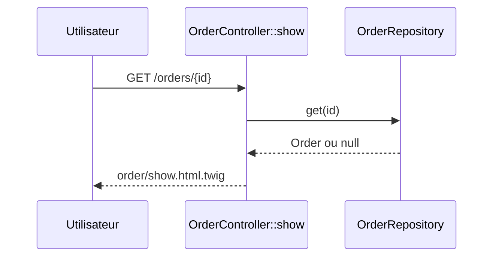

## Summary

Affiche la fiche d'une commande identifiée par son `id` : le client de la commande.

## Preconditions

Utilisateur authentifié (ROLE_USER).

## Journey

## Decisions

—

## Data

Lit une `Order` dans `src/Repository/OrderRepository.php`.

## Cross-cutting mechanisms

`LocaleListener` sur `kernel.request` ; access_control ROLE_USER sur `^/orders`.

## Points of attention

Un identifiant inconnu n'est pas traité : `get()` renvoie null et le template lit `order.customer` sur une
valeur nulle, au lieu d'une réponse 404.

## Change

rédaction initiale
