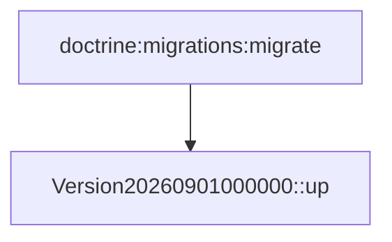

## Résumé

Migrations de la base : une seule version, `Version20260901000000`, dont la méthode `up()` est vide.

## Préconditions

—

## Parcours

## Données

Aucune modification de schéma.

## Mécanismes transverses

—

## Points d'attention

Le projet n'installe pas Doctrine Migrations : ce fichier n'est exécuté par rien. Il est documenté parce qu'il
se trouve dans `migrations/`.

## Changement

rédaction initiale
