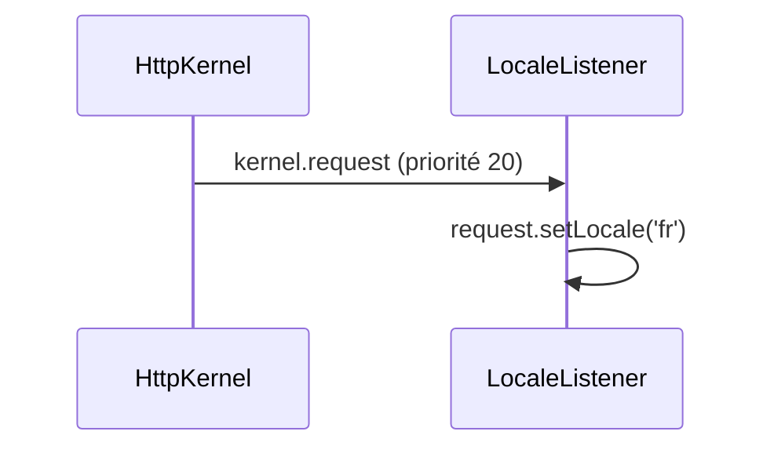

## Résumé

Listener global de `kernel.request` : fixe la locale de chaque requête à `fr`, avant la résolution du
contrôleur.

## Préconditions

—

## Parcours

## Données

Modifie la locale de la `Request` courante. Aucune donnée persistante.

## Mécanismes transverses

Enregistré par `#[AsEventListener]` avec la priorité 20, donc après le `LocaleListener` de Symfony (priorité
100) : la locale posée ici l'emporte sur celle de la route.

## Points d'attention

La locale est codée en dur : tout `_locale` de route ou préférence utilisateur est ignoré. Toutes les routes
dépendent de ce listener.

## Changement

rédaction initiale
