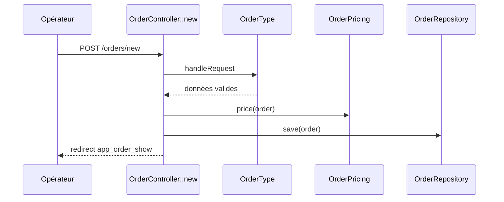

## Résumé

Crée une commande à partir du formulaire `OrderType` : un opérateur saisit le client et le produit, la
commande est tarifée par `OrderPricing` puis enregistrée, et l'opérateur est redirigé vers sa fiche.

## Préconditions

Le catalogue de produits est chargé.

## Parcours

## Données

Écrit une `Order` en mémoire via `src/Repository/OrderRepository.php` ; lit le prix des produits.

## Mécanismes transverses

`LocaleListener` fixe la locale à chaque requête avant le contrôleur.

## Points d'attention

Le prix vaut toujours 0 : `Product` crée son prix à zéro et rien ne le renseigne.

## Changement

rédaction initiale
