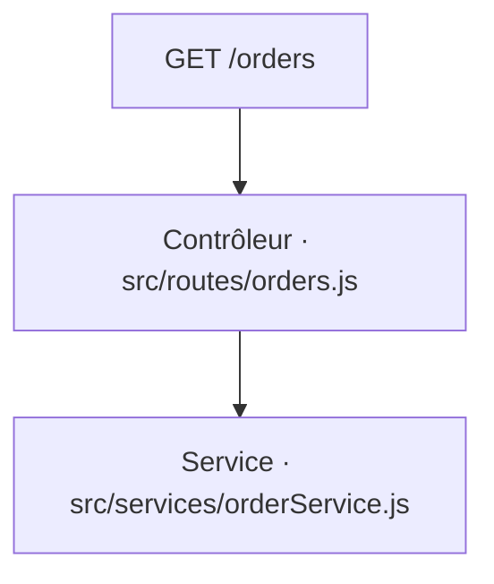

# GET /orders
`route.get-orders` · type : routes · dernière mise à jour : 2026-09-16 · commit : —

## Résumé

—

## Déclencheur

| Élément | Valeur |
|---|---|
| Point d'entrée | `GET /orders` (`GET /orders`) |
| Sécurité | — |
| Préconditions | — |

## Parcours

## Navigation / états

—

## Composants impliqués

| Rôle | Fichier | Notes |
|---|---|---|
| Configuration | `src/app.js` |  |
| Contrôleur | `src/routes/orders.js` | point d'entrée |
| Service | `src/services/orderService.js` |  |

## Données

—

## Mécanismes transverses

—

## Points d'attention

—

## Tests existants

| Test | Fichier | Couvre |
|---|---|---|
| orders.test.js | `test/orders.test.js` | — |

## Workflows liés

—

## Historique

| Date | Commit | Changement |
|---|---|---|
| 2026-09-16 | — | initial |
