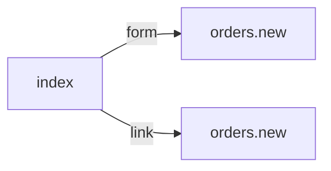

# /index.php
`route.index` · type : routes · dernière mise à jour : 2026-09-16 · commit : —

## Résumé

—

## Déclencheur

| Élément | Valeur |
|---|---|
| Point d'entrée | `/index.php` (`index`) |
| Sécurité | — |
| Préconditions | — |

## Parcours

—

## Navigation / états

## Décisions

—

## Données

—

## Mécanismes transverses

—

## Points d'attention

—

## Workflows liés

- [`route.orders.new`](orders.new.md) — navigation

## Historique

| Date | Commit | Changement |
|---|---|---|
| 2026-09-16 | — | initial |
