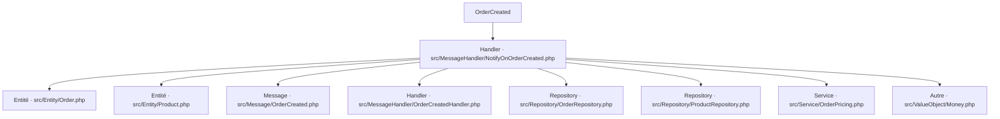

# OrderCreated
`async.order-created` · type : async · dernière mise à jour : 2026-09-16 · commit : —

## Résumé

—

## Déclencheur

| Élément | Valeur |
|---|---|
| Point d'entrée | `App\MessageHandler\NotifyOnOrderCreated` (message-handler) |
| Satellite | `App\MessageHandler\OrderCreatedHandler` (message-handler) |
| Message | `App\Message\OrderCreated` |
| Sécurité | — |
| Préconditions | — |

## Parcours

## Navigation / états

—

## Composants impliqués

| Rôle | Fichier | Notes |
|---|---|---|
| Configuration | `config/packages/framework.yaml` |  |
| Configuration | `config/services.yaml` |  |
| Entité | `src/Entity/Order.php` |  |
| Entité | `src/Entity/Product.php` |  |
| Message | `src/Message/OrderCreated.php` |  |
| Handler | `src/MessageHandler/NotifyOnOrderCreated.php` | point d'entrée |
| Handler | `src/MessageHandler/OrderCreatedHandler.php` |  |
| Repository | `src/Repository/OrderRepository.php` |  |
| Repository | `src/Repository/ProductRepository.php` |  |
| Service | `src/Service/OrderPricing.php` |  |
| Autre | `src/ValueObject/Money.php` |  |

Paquets : `symfony/messenger` 8.1.7

## Données

—

## Mécanismes transverses

—

## Points d'attention

—

## Tests existants

| Test | Fichier | Couvre |
|---|---|---|
| OrderPricingTest | `tests/Service/OrderPricingTest.php` | — |

## Workflows liés

—

## Historique

| Date | Commit | Changement |
|---|---|---|
| 2026-09-16 | — | initial |
