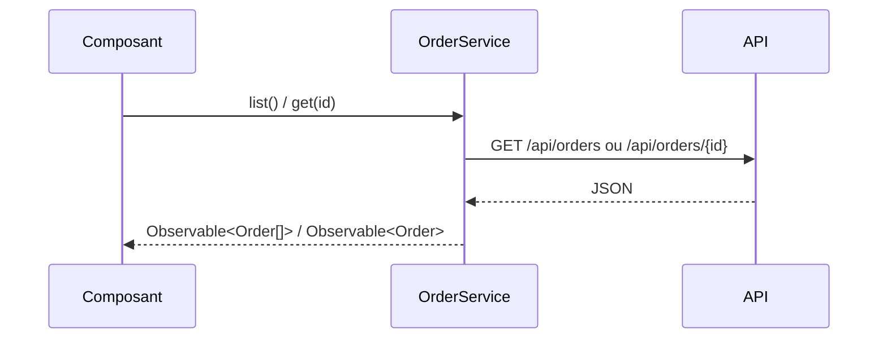

# OrderService → /api/orders
`integration.orderservice` · type: integrations · last updated: 2026-09-16 · commit: 973d403

## Summary

`OrderService` est le seul point d'accès aux commandes : un service Angular fourni à la racine qui
appelle l'API REST des commandes avec `HttpClient`.

## Trigger

| Element | Value |
|---|---|
| Entry point | `OrderService` (integration) |
| Calls | `GET /api/orders, GET /api/orders/{id}` |
| Security | — |
| Preconditions | `HttpClient` est fourni à l'application (`provideHttpClient`). |

## Journey

## Navigation / states

—

## Decisions

—

## Data

Lit `Order` (`id: number`, `customer: string`) ; l'interface est déclarée dans le service.

## Cross-cutting mechanisms

Aucun : ni intercepteur, ni cache, ni reprise sur erreur.

## Points of attention

Les réponses ne sont pas validées : le typage `Order` est une promesse, pas un contrôle.

## Related workflows

—

## History

| Date | Commit | Changement |
|---|---|---|
| 2026-09-16 | 973d403 | rédaction initiale |
