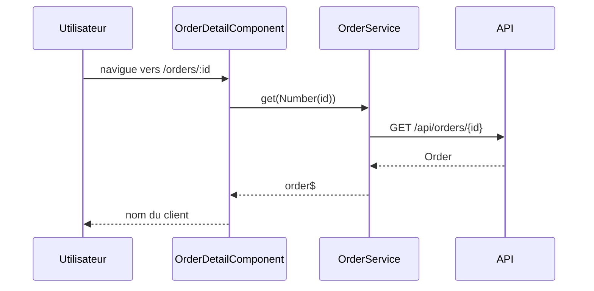

# /orders/:id — fiche d'une commande
`route.orders-id` · type: routes · last updated: 2026-09-16 · commit: 973d403

## Summary

Affiche une commande : `OrderDetailComponent` lit l'identifiant dans l'URL et charge la commande via
`OrderService.get(id)`, puis affiche le nom du client.

## Trigger

| Element | Value |
|---|---|
| Entry point | `/orders/:id` (`orders/:id`) |
| Security | — |
| Preconditions | La commande existe côté API ; on arrive en général depuis la liste `/orders`. |

## Journey

## Navigation / states

—

## Decisions

—

## Data

Lit une `Order` (`id`, `customer`) depuis l'API HTTP ; aucune écriture.

## Cross-cutting mechanisms

Aucun intercepteur HTTP ni garde de route n'est déclaré dans `src/app`.

## Points of attention

L'identifiant est lu dans le snapshot de la route : naviguer d'une fiche à une autre sans recréer le
composant n'actualise pas la commande. Un identifiant non numérique donne `NaN` et appelle `/api/orders/NaN`.

## Related workflows

—

## History

| Date | Commit | Changement |
|---|---|---|
| 2026-09-16 | 973d403 | rédaction initiale |
